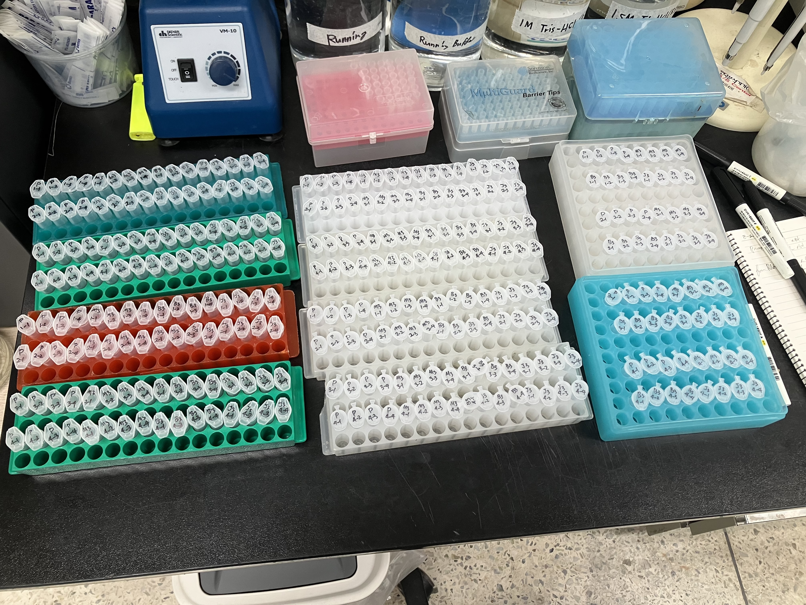
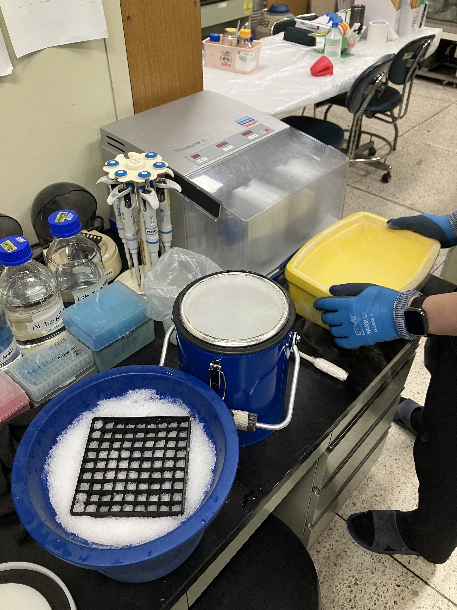
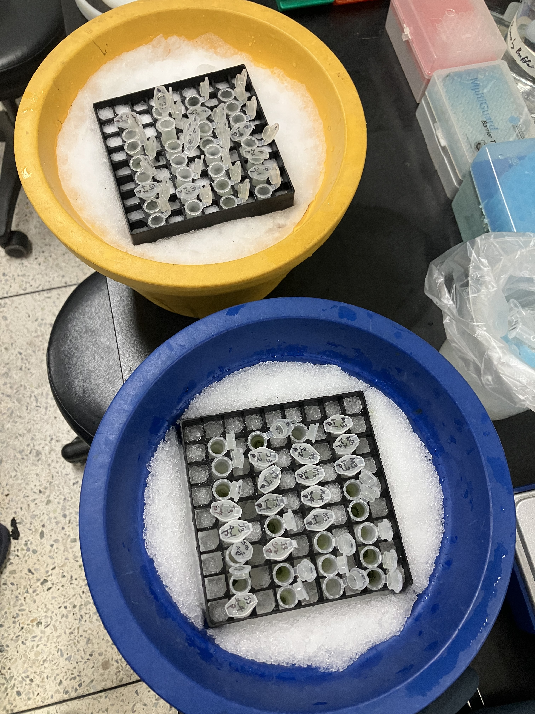

# Tomato Protein Extraction Log (2026-05-28)

### Background & Project Narrative
This project investigates the phenotypic variations observed in tomato plants grown across different soil environments, focusing on differences in Shoot Length (SL), Root Length (RL), Fresh Weight (FW), and Dry Weight (DW). Clear phenotypic differences were identified in plants grown in Gyeongju (GJ) soil (increased overall volume) and Gijang B (GB) soil (accelerated ripening). 

To track the transgenerational effects of these soil microbiomes/epigenetic factors, multi-generation cultivation was conducted:
* **Parent generation (P):** Treated with GB or GJ soil.
* **F1 & F2 generations:** Cultivated under continuous treatment with their respective soils (GB or GJ).
* **F3 generation:** Cultivated without any soil treatments to evaluate inherited phenotypic memory.

### Experimental Design
Protein extraction was performed using leaf samples from the Parent (P) and F3 generations, categorized by the following experimental groups:
* **M3:** MES Buffer control (F3 generation)
* **B3:** Gijang B soil group (F3 generation)
* **J3:** Gyeongju soil group (F3 generation)
* **P:** Untreated control (Parent generation)

**Sample Grid:** 
Each experimental group consists of 4 biological replicates across 4 distinct sets (e.g., P group contains replicates P 1-1 through P 4-4). 1 complete experimental set comprises 4 distinct samples (P, M3, J3, B3).

---

## Protocol & Notes

### Reference Protocol

#### 1. Buffer Formulation Reference

| Component | Stock Conc. | Vol. for 1 mL | Final Conc. | Vol. for 10 mL | Vol. for 50 mL | Function |
| :--- | :---: | :---: | :---: | :---: | :---: | :--- |
| **Tris-HCl (pH 7.5)** | 1 M | 20 µL | 20 mM | 200 µL | 1 mL | Buffer (stabilizes protein structure) |
| **EDTA (pH 8.0)** | 0.5 M | 2 µL | 1 mM | 20 µL | 100 µL | Assists protease inhibitors |
| **NaCl** | 1 M | 150 µL | 150 mM | 1.5 mL | 7.5 mL | Salt for protein stability |
| **Triton X-100** | — | 1 µL | 0.1% (v/v) | 10 µL | 50 µL | Detergent (breaks down cell wall/membrane) |
| **DTT** | 1 M | 5 µL | 5 mM | 50 µL | 250 µL | Reducing agent (prevents disulfide bonding) |
| **10% SDS** | 0.1 g/mL | 10 µL | 0.1% (w/v) | 100 µL | 500 µL | Detergent (denatures protein 2nd & 3rd structures) |
| **DW (Distilled Water)** | — | 312 µL | — | 3.12 mL | 15.6 mL | Solvent / Vehicle |
| **Protease Inhibitor** | 2X | 500 µL | 1X | 5 mL | 25 mL | Protects proteins from degradation |
| **Total Volume** | — | **1 mL** | — | **10 mL** | **50 mL** | — |

#### 2. Protein Extraction Standard Operating Procedure (SOP)
* **1-1)** Transfer the sample powder into a tube and add 300 µL of extraction buffer.
    * *Note 1-1-1:* Alternatively, you can add the buffer to the tube first, then add the sample and grind it.
    * *Note 1-1-2:* Keep the ratio of powder to solution close to 1:1.
* **1-2)** Vortex thoroughly to ensure the sample dissolves completely in the buffer.
* **1-3)** Centrifuge at 13,000 rpm for 20 minutes at 4°C. (Up to 30 minutes is acceptable).
* **1-4)** Transfer 200 µL of the supernatant into a new microcentrifuge tube (e-tube).
    * *Note 1-4-1:* Aliquot 200 µL twice into PCR tubes per sample type and store (done to ensure sufficient sample volume for Western blot practice and in case target protein expression is high).
* **1-5)** Measure the protein concentration, normalize the samples to equal concentrations, aliquot into 20 µL working volumes for Western blotting, and store at -20°C.

---

### Bench Execution Log & Deviations

1. **Tube Preparation and Labeling**
   * Prepared 64 × 1.5 mL microcentrifuge tubes and 64 × 2.0 mL microcentrifuge tubes.
   * Labeled each tube clearly with the sample ID followed by a suffix **'p'** to distinguish them from the RNA extraction sets (e.g., `P 1-1 p`, `M3 3-2 p`).
   * Placed a single small, circular glass bead into each of the 64 labeled 2.0 mL tubes for subsequent tissue homogenization.

   

2. **Protein Extraction Buffer (Cocktail) Preparation**
   * Formulated a master extraction stock buffer based on the 1 mL and 50 mL baseline recipes below:

   | Chemical Components | Stock Conc. | Vol. per 1 mL | Vol. per 50 mL |
   | :--- | :--- | :--- | :--- |
   | **Tris-HCl (pH 7.5)** | 1 M | 20 µL | 1.0 mL |
   | **EDTA (pH 8.0)** | 0.5 M | 2 µL | 100 µL |
   | **NaCl** | 1 M | 150 µL | 7.5 mL |
   | **Triton X-100** | Pure | 1 µL | 50 µL |
   | **SDS** | 10% (0.1 g/mL) | 10 µL | 500 µL |
   | **Distilled Water (DW)** | - | 312 µL | 15.6 mL |
   | **DTT** *(Added last)* | 1 M | 5 µL | 250 µL |
   | **Protease Inhibitor** *(Added last)* | 2X Liquid | 500 µL | 25.0 mL |

   * **Working Cocktail Formulation (10 mL Total):**
     * Prepared a stable base mixture containing **Tris-HCl, EDTA, NaCl, Triton X-100, SDS, and DW**.
     * To protect chemically sensitive active components, **DTT** and the **Protease Inhibitor** were omitted from the stock and added immediately prior to use.
     * Combined **4.95 mL** of the prepared base mixture with **50 µL of 1 M DTT** and **5.0 mL of pre-made 2X liquid stock Protease Inhibitor** to yield a final volume of **10.0 mL**. 
     * *Note:* Total volume was scaled to 10 mL to provide excess volume over the required 6.4 mL (64 samples × 100 µL per sample).

3. **Sample Collection and Flash Freezing**
   * Prepared ice buckets filled with liquid nitrogen ($LN_2$).
   * Randomly selected tomato plants from the designated experimental groups for sampling.
   * Harvested leaf tissue by cutting the edges of the leaves once, immediately transferring the tissue sections into the pre-labeled 2.0 mL tubes containing the glass beads.
   * **Safety Warning:** Ensured all tube caps were locked and sealed tightly prior to immersion to prevent $LN_2$ from entering the tubes, which poses a severe explosion risk upon warming.
   * Immediately submerged the closed tubes into the liquid nitrogen bucket to flash-freeze the tissue and preserve protein integrity.

4. **Tissue Homogenization (TissueLyser)**
   * Utilized a TissueLyser for high-throughput homogenization due to the large sample size ($n = 64$), utilizing cryo-protective gloves and ice buckets throughout the process.
   * Pre-chilled both TissueLyser adapter sets (pallets) by completely submerging them in liquid nitrogen ($LN_2$) to maintain cryogenic temperatures.
   * To ensure samples remained frozen, the 64 samples were processed in 4 separate batches of 16 tubes each, handling only one pre-chilled adapter set at a time.
   * **Homogenization Cycle (per batch):**
     * Loaded 16 tubes into the pre-chilled adapter, assembled the block inside the $LN_2$ bath, and mounted it securely onto the TissueLyser arm.
     * Tightened the locking knob completely and ran the first disruption cycle at **30 Hz (frequency) for 20 seconds**.
     * Removed the adapter block, submerged/showered it in $LN_2$ to re-chill, remounted it, and ran a second cycle at **30 Hz for 20 seconds**.
     * Immediately removed the homogenized sample tubes and transferred them directly into an ice bucket.
   * Repeated the cycle for the remaining 3 batches.
   

5. **Buffer Addition and Venting**
   * **Immediately** dispensed 100 µL of the pre-made Protein Extraction Cocktail into each pulverized sample tube straight out of the TissueLyser while the tissue was completely frozen, ensuring efficient protein extraction upon thawing.
   * *Note on Volume Optimization:* While the standard protocol typically requires 100–150 µL of extraction buffer, the volume was strictly limited to 100 µL here due to the relatively small size of the starting tissue samples, maximizing final protein concentration.
   * *Critical Step:* Left the tube caps slightly loose or cracked open while resting in the ice bucket. This allowed venting to prevent caps from popping open violently due to pressure differentials caused by the extreme temperature shift between the liquid nitrogen and the ice.
   

6. **Vortexing and Multi-Step Clarification (Centrifugation)**
   * Thoroughly vortexed each sample for 10+ seconds to ensure complete suspension and optimal protein lysis.
   * Processed the 64 samples in sequential batches (Batch 1: 24 samples, Batch 2: 24 samples, Batch 3: 16 samples) to ensure precise timing. 
   * *Note:* All pending samples waited on ice submerged in the extraction buffer until their respective batch was processed to prevent protein degradation.
   * **Centrifugation Protocol (Per Batch):**
     * **First Centrifugation:** Spun the 2.0 mL tubes at **13,000 RPM at 4°C for 10 minutes** to pellet cell debris and the glass beads.
     * **First Transfer:** Carefully collected the supernatant without disturbing the pellet and transferred it into the corresponding pre-labeled 1.5 mL tubes.
     * *Note:* The original 2.0 mL tubes containing the glass beads were set aside to collect and wash the beads for future recycling.
     * **Second Centrifugation:** Spun the 1.5 mL tubes at **13,000 RPM at 4°C for 5 minutes** to clear any remaining residual debris or precipitates.
     * **Final Transfer:** Carefully collected the highly cleared supernatant and transferred it into 8-strip PCR tubes for compact, organized storage.
   * Maintained all tubes strictly in ice buckets during any handling intervals between centrifugation steps.

7. **Sample Pooling (By Set)**
   * Performed sample pooling across biological replicates to create representative composite samples for each set.
   * Combined **10 µL** of supernatant from each of the 4 biological replicates within a set into a fresh tube to generate a **40 µL pooled sample** (e.g., 10 µL each from P 1-1, 1-2, 1-3, and 1-4 were combined into a single tube labeled `P1`).
   * This consolidation reduced the active sample set down to the main pooled groups: `P1~P4`, `M1~M4`, `B1~B4`, and `J1~J4`.
   * Maintained all tubes on ice throughout the pooling process.

8. **Protein Quantification (NanoDrop Spec)**
   * Utilized a NanoDrop spectrophotometer to measure protein concentration ($A_{280}$) for downstream sample normalization prior to Western blotting.
   * **Instrument Preparation:** Cleaned the optical pedestal and sampling interface thoroughly using a laboratory wipe moistened with 70% ethanol.
   * **Blanking:** Performed a blank measurement using **1 µL** of the exact pre-made Protein Extraction Cocktail buffer to calibrate the baseline.
   * **Measurement Workflow:** 
     * Loaded **1 µL** of each pooled sample (`P1~P4`, `M1~M4`, `J1~J4`, `B1~B4`) onto the pedestal.
     * Measured each sample in **triplicate (3 independent readings)** to calculate an average concentration and ensure data reproducibility.
     * Cleaned the pedestal between individual samples to prevent cross-contamination.