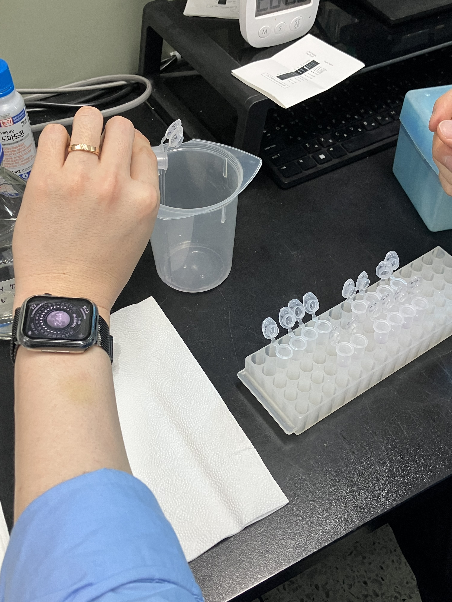
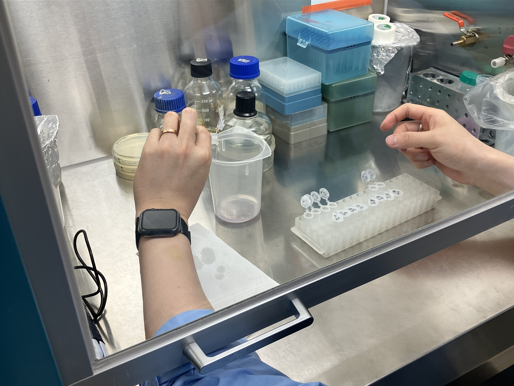
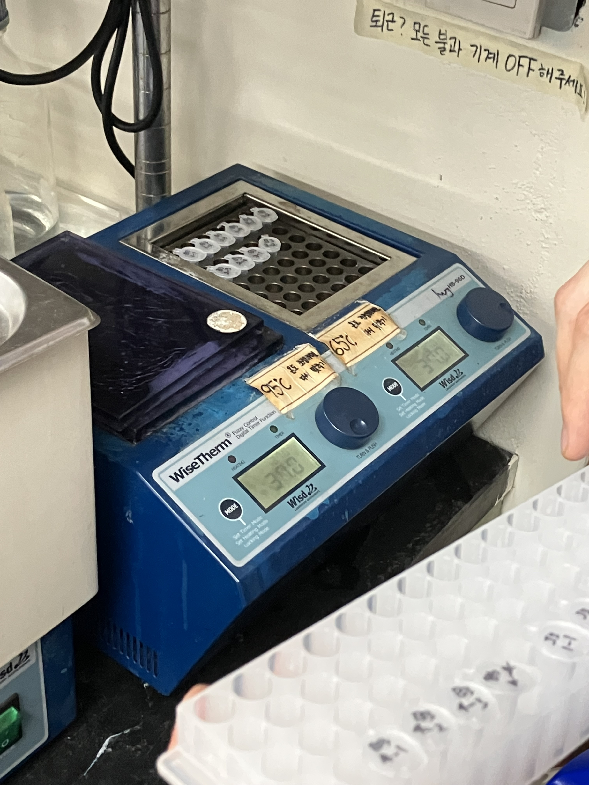
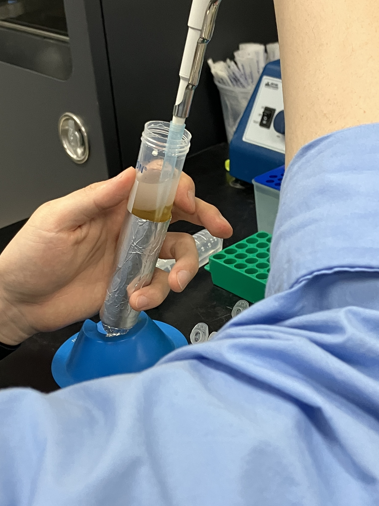
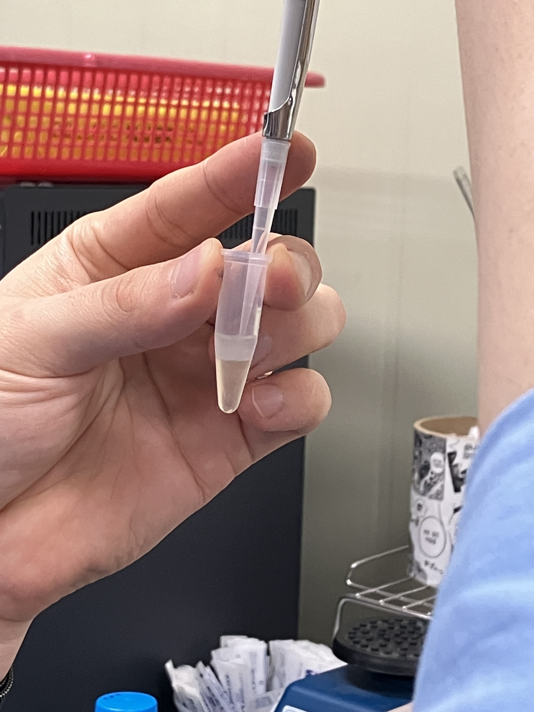

# Tomato RNA Extraction Log (2026-05-29)

### Background & Project Narrative
This project investigates the phenotypic variations observed in tomato plants grown across different soil environments, focusing on differences in Shoot Length (SL), Root Length (RL), Fresh Weight (FW), and Dry Weight (DW). Clear phenotypic differences were identified in plants grown in Gyeongju (GJ) soil (increased overall volume) and Gijang B (GB) soil (accelerated ripening). 

To track the transgenerational effects of these soil microbiomes/epigenetic factors, multi-generation cultivation was conducted:
* **Parent generation (P):** Treated with GB or GJ soil.
* **F1 & F2 generations:** Cultivated under continuous treatment with their respective soils (GB or GJ).
* **F3 generation:** Cultivated without any soil treatments to evaluate inherited phenotypic memory.

### Experimental Design
RNA extraction was performed using leaf samples from the Parent (P) and F3 generations, categorized by the following experimental groups:
* **M3:** MES Buffer control (F3 generation)
* **B3:** Gijang B soil group (F3 generation)
* **J3:** Gyeongju soil group (F3 generation)
* **P:** Untreated control (Parent generation)

**Sample Grid:** 
Each experimental group consists of 4 biological replicates across 4 distinct sets (e.g., P group contains replicates P 1-1 through P 4-4). 1 complete experimental set comprises 4 distinct samples (P, M3, J3, B3).

---

## Protocol & Notes

### Reference Protocol

#### 1. Tomato RNA Extraction Protocol

* **1)** Grind 0.1 g of the sample using liquid nitrogen ($LN_2$).
    * *Note:* All reagents and equipment must be treated with DEPC for at least 2 days and then autoclaved before use. (DEPC preparation: Add 1 mL of DEPC to 1 L of Distilled Water, allow it to dissolve for at least 2 days, then autoclave).
* **2)** Add the ground sample to a 2 mL tube containing 1 mL of TRIzol, vortex thoroughly, and incubate at room temperature (RT) for 5 minutes.
    * *Note 2-1 (Mechanism):* TRIzol consists of phenol, guanidinium, and thiocyanate. Phenol denatures proteins, dissolves lipids, disrupts cell walls, and denatures DNA.
* **3)** Centrifuge at 13,000 rpm for 15 minutes at 4°C.
* **4)** Transfer the supernatant (~1 mL) to a new DEPC-treated microcentrifuge tube (e-tube) and incubate at RT for 5 minutes.
* **5)** Add 200 µL of chloroform, mix by inverting, and incubate at RT for 2 minutes.
    * *Note 5-1 (Mechanism):* Chloroform separates the phases containing proteins and other materials dissolved in TRIzol, facilitating cleaner RNA isolation.
* **6)** Centrifuge at 13,000 rpm for 15 minutes at 4°C.
* **7)** Transfer the supernatant (~500 µL) to a new microcentrifuge tube and add 500 µL of Isopropanol.
    * *Note 7-1 (Mechanism):* Isopropanol exploits the low solubility of nucleic acids in alcohol to efficiently precipitate the RNA.
* **8)** Incubate for 5 minutes, then centrifuge at 13,000 rpm for 15 minutes at 4°C.
* **9)** Discard the supernatant and add 1 mL of 75% DEPC-treated ethanol.
* **10)** Incubate at -20°C for 2 hours OR overnight.
* **11)** Centrifuge at 13,000 rpm for 15 minutes at 4°C.
* **12)** Discard the supernatant, air-dry the pellet completely until the ethanol evaporates (do not exceed 30 minutes), and resuspend by adding 50 µL of DEPC-treated Distilled Water (D.W.).
* **13)** Store at -80°C.

#### 2. DNase Treatment

##### Reaction Mixture

| Component | Volume |
| :--- | :---: |
| 10X Reaction Buffer (Salt) | 3 µL |
| 10X TURBO DNase | 2 µL |
| Total RNA | 25 µL |
| **Total Volume** | **30 µL** |

##### Protocol

* **1)** Mix gently by pipetting, then incubate at 37°C for 30 minutes.
* **2)** Add 270 µL of DEPC-treated Distilled Water (D.W.) to bring the total volume up to 300 µL.
* **3)** Add 300 µL of PCI (Phenol:Chloroform:Isoamyl Alcohol = 25:24:1) (equal to the total volume) and mix by inverting.
* **4)** Centrifuge at 13,000 rpm for 15 minutes at 4°C.
* **5)** Transfer 200 µL of the supernatant into a new 1.5 mL tube, then add the following precipitation reagents:

| Precipitation Component | Volume |
| :--- | :---: |
| 3 M Sodium Acetate (pH 5.2, RNA grade) | 20 µL |
| Glycogen (10 mg/mL) | 1 µL |
| Absolute Ethanol (100%) | 500 µL |

* Mix thoroughly by inverting and incubate at -20°C overnight.
* **6)** Centrifuge at 13,000 rpm for 15 minutes at 4°C.
* **7)** Carefully remove the supernatant without disturbing the pellet, add 1 mL of 70% DEPC-treated ethanol, and centrifuge for 1 minute.
* **8)** Repeat step 7 (the ethanol wash step) once more.
* **9)** Air-dry the ethanol pellet, resuspend in 50 µL of DEPC-treated Distilled Water (D.W.), and store at -20°C.

---

## Bench Execution Log & Deviations

1. **Tube Preparation and Contamination Control**
   * Prepared 64 × 2.0 mL microcentrifuge tubes and 128 × 1.5 mL microcentrifuge tubes.
   * Labeled each tube clearly with the sample ID corresponding to its experimental group and biological replicate block (`P 1-1` through `P 4-4`, `M3 1-1` through `M3 4-4`, `B3 1-1` through `B3 4-4`, and `J3 1-1` through `J3 4-4`).
   * Placed a single small, circular glass bead into each of the 64 labeled 2.0 mL tubes for tissue homogenization.
   * *Critical Quality Control:* Confirmed that all plasticware (1.5 mL tubes, 2.0 mL tubes, and pipette tips) had been pre-treated with DEPC for at least 2 days and autoclaved prior to use to ensure a complete RNase-free environment.

2. **Sample Collection, Flash Freezing, and Tissue Homogenization**
   * Prepared ice buckets filled with liquid nitrogen ($LN_2$).
   * Harvested leaf tissue sections from the designated tomato plants and immediately transferred them into the pre-labeled, DEPC-treated 2.0 mL tubes containing the glass beads.
   * **Safety Warning:** Verified that all tube caps were tightly sealed before immersion to prevent $LN_2$ infiltration, eliminating explosion hazards upon thawing.
   * Submerged the tubes into liquid nitrogen to flash-freeze the tissue and preserve RNA integrity.
   * Pre-chilled both TissueLyser adapter sets by completely submerging them in $LN_2$.
   * To prevent tissue thawing and RNA degradation, processed the 64 samples in 4 separate batches of 16 tubes.
   * **Homogenization Cycle (per batch):**
     * Loaded 16 tubes into the pre-chilled adapter block, assembled it inside the $LN_2$ bath, and mounted it securely.
     * Ran the first disruption cycle at **30 Hz for 20 seconds**.
     * Removed the adapter, re-chilled it completely by submerging it in $LN_2$, and ran a second cycle at **30 Hz for 20 seconds**.
     * Immediately transferred the pulverized sample tubes back into an ice bucket.

3. **TRIzol Addition, Lysis, and Incubation**
   * Immediately added 1.0 mL of TRIzol reagent to each tube containing the pulverized, frozen leaf tissue straight out of the TissueLyser.
   * Thoroughly vortexed each sample for approximately 10 seconds to ensure complete tissue homogenization and full suspension within the lysis buffer.
   * Incubated the samples at room temperature (RT) for 5 minutes to allow complete denaturation of cellular proteins, dissolution of lipids, and full dissociation of nucleoprotein complexes.
   * Centrifuged all 64 samples at **13,000 RPM for 15 minutes at 4°C** to separate the insoluble material and plant cell debris from the homogenate.

4. **Supernatant Transfer and Incubation (With Volume Deviation)**
   * Carefully transferred the supernatant from the 2.0 mL tubes into the first set of fresh, pre-labeled, DEPC-treated 1.5 mL tubes.
   * **Protocol Deviation:** Due to lower overall starting material and lower liquid yield from the tomato leaf samples, a reduced volume of **800 µL** of supernatant was recovered and transferred per sample, rather than the standard 1.0 mL specified in the reference protocol.
   * Incubated the transferred supernatant at room temperature (RT) for 5 minutes.

5. **Chloroform Phase Separation and Centrifugation**
   * Added 200 µL of chloroform directly into each 1.5 mL tube containing the recovered supernatant.
   * Thoroughly mixed the solution by inverting the tubes repeatedly to ensure full emulsification.
   * Incubated the mixture at room temperature (RT) for 2 minutes to allow the organic and aqueous phases to begin partitioning.
   * Centrifuged the samples at **13,000 RPM for 15 minutes at 4°C** to complete phase separation, dividing the mixture into a lower organic phase, an interphase containing DNA/proteins, and an upper clear aqueous phase containing the RNA.

6. **Aqueous Phase Recovery and Handling**
   * Prepared a second set of 64 fresh, pre-labeled, DEPC-treated 1.5 mL tubes.
   * Following centrifugation, distinct layers formed in the tubes: a lower organic phase, a white interphase, and an upper clear aqueous phase containing the RNA.
   * **Pipetting Technique Control:** Carefully aspirated the supernatant by lowering the pipette tip progressively from the top surface downward, ensuring the lower interphase was completely undisturbed.
   * **Contamination Avoidance:** Positioned the pipette tip strictly in the physical center of the tube while descending to avoid touching organic debris or materials that adhere to the inner walls of the tube.
   * **Protocol Deviation:** While the reference protocol suggests a standard recovery of ~500 µL, exactly **450 µL** of highly clear aqueous supernatant was extracted per sample and transferred into the new 1.5 mL tubes to prioritize purity over volume.

7. **Isopropanol Addition and Extended Precipitation**
   * Added exactly **450 µL** of Isopropanol to each tube to maintain a precise 1:1 volumetric ratio relative to the 450 µL of recovered aqueous supernatant.
   * Thoroughly mixed the solution by inverting the tubes to initiate nucleic acid precipitation.
   * **Protocol Deviation:** Rather than performing the standard 5-minute room temperature incubation and immediate centrifugation specified in the reference protocol, the samples were incubated at **-20°C overnight**. This modification was implemented to accommodate the laboratory schedule and to enhance the total precipitation yield of the RNA from the lower-volume samples.

8. **Isopropanol Pelleting, Supernatant Removal, and Ethanol Wash**
   * Processed the 64 samples in sequential batches (Batch 1: 24 samples, Batch 2: 24 samples, Batch 3: 16 samples) to ensure precise timing and temperature control.
   * Centrifuged the tubes at **13,000 RPM for 15 minutes at 4°C** to pellet the precipitated RNA.
   * Decanted the supernatant smoothly and carefully from each tube to avoid disturbing the newly formed RNA pellet.
   * **Moisture Removal Technique:** Gently dabbed the rim/tip of each inverted microcentrifuge tube onto a clean laboratory wipe to remove residual liquid film without contacting the pellet itself.
   * Added 1.0 mL of 75% DEPC-treated ethanol to each sample to wash the pellet and remove residual salts.
   * Centrifuged the washed samples again at **13,000 RPM for 15 minutes at 4°C** to re-pellet the RNA.

9. **Ethanol Removal and Secondary Technical Spin**
   * Decanted the ethanol supernatant gently and smoothly from each tube, taking caution not to dislodge the RNA pellet.
   * Dabbed the rim of each inverted tube carefully onto a clean laboratory wipe to pull away the remaining liquid droplets.
   * **Protocol Optimization:** Performed an additional technical centrifugation step at **13,000 RPM for 2 minutes at 4°C** to bring down any remaining residual ethanol film from the inner walls of the tube to the bottom.
   * Carefully removed the final microliter volumes of pooled ethanol using a fine pipette tip to maximize downstream drying efficiency.

10. **Clean Bench Transfer, Residual Ethanol Removal, and Air-Drying**
    * Transferred all tubes to a sterile clean bench (laminar flow hood) to prevent any environmental airborne contamination during the critical drying phase.
    * Used a fine pipette tip to carefully remove the last remaining microliter traces of ethanol that had aggregated at the bottom of the tubes after the 2-minute technical spin.
    * Left the tube caps open and allowed the RNA pellets to air-dry inside the clean bench for **5 minutes at room temperature (RT)** until the ethanol completely evaporated.
    * *Quality Control Check:* Verified that the pellets turned semi-translucent, confirming full evaporation of ethanol without over-drying, which would make the RNA difficult to resuspend.

11. **RNA Resuspension and Cold Storage**
    * Added exactly **30 µL** of standard Distilled Water (DW) to each dried RNA pellet to achieve a higher final concentration for downstream applications.
    * **Protocol Deviation & Lab Specific Optimization:** Standard (non-DEPC-treated) autoclaved distilled water was utilized for resuspension instead of the DEPC-treated water specified in the reference protocol. This modification was implemented because historical instrument data within this laboratory demonstrates that the local NanoDrop spectrophotometer yields significantly more stable, clean, and reproducible baseline curves when measuring RNA samples dissolved in standard DW.
    * Transferred all resuspended RNA samples to a 4°C refrigerator for short-term storage.

12. **Mechanical Dissolution and Quality Control**
    * Fully dissolved the RNA pellets by performing thorough mechanical pipetting, averaging approximately 100 pipet strokes per sample. 
    * This high-repetition pipetting was executed gently to ensure complete visual and physical dissolution of the concentrated pellets without introducing excessive shear stress to the genomic RNA strands.
    * Once completely homogeneous, the tubes were placed into the 4°C refrigerator for overnight stabilization.

13. **DNase Treatment Master Mix Preparation and Sample Setup**
    * Prepared a fresh set of 64 pre-labeled, DEPC-treated 1.5 mL tubes.
    * Aliquoted exactly 25 µL of each concentrated RNA sample into its corresponding new tube.
    * **Master Mix Formulation (with Excess Overhead):** Formulated a combined DNase master mix inside a separate, sterile DEPC-treated 1.5 mL tube to streamline the high-throughput workflow for the 64 samples:
      * **10X Reaction Buffer (Salt):** 210 µL (Gently vortexed prior to pipetting to ensure uniform salt distribution).
      * **10X TURBO DNase Enzyme:** 140 µL (Maintained strictly inside the ice bucket throughout handling to preserve enzymatic activity and prevent thermal degradation).
      * **Total Master Mix Volume:** 350 µL.
    * **Aliquoting and Volumetric Precision:** Added exactly 5 µL of this prepared master mix to each 25 µL RNA sample, achieving the mandatory final reaction volume of 30 µL per sample.
    * **Manual Mixing Control:** Immediately following the addition of the master mix, the solution was "gently mixed" by physically stirring the fluid with the pipette tip throughout the sample volume rather than aggressive pipetting, preventing any mechanical shearing of the components.

14. **DNase Incubation and Enzymatic Digestion**
    * Transferred all 64 reaction tubes to a pre-heated WiseThem HB-96D digital dry bath block heater.
    * Incubated the samples at **37°C for exactly 30 minutes** to allow the TURBO DNase enzyme to efficiently digest and clear any contaminating genomic DNA from the RNA preparations.

15. **Reaction Dilution, PCI Phase Separation, and Centrifugation**
    * Added 270 µL of DEPC-treated Distilled Water (DW) to each tube, bringing the total working reaction volume from 30 µL up to 300 µL.
    * Prepared to add 300 µL of PCI (Phenol:Chloroform:Isoamyl Alcohol = 25:24:1) to match the total aqueous volume, resulting in a 600 µL mixture per tube.
    * **PCI Liquid Handling Technique:** Since the PCI solution maintains an upper protective aqueous layer, the pipette tip was submerged deep into the lower organic phase to collect the reagent cleanly. The tip was then withdrawn slowly and steadily out of the upper layer to prevent dripping or cross-phase contamination.
    * Inverted the tubes repeatedly and thoroughly to mix the organic solvent with the diluted RNA sample.
    * Transferred the tubes immediately into the centrifuge and spun them at **13,000 RPM for 15 minutes at 4°C** to separate the protein-denaturing organic phase from the purified aqueous RNA phase.

16. **Precipitation Reagent Assembly and Supernatant Transfer**
    * Prepared a final set of 64 fresh, pre-labeled, DEPC-treated 1.5 mL tubes.
    * **Precipitation Reagent Base:** Dispensed exactly 500 µL of Absolute Ethanol (100%) into each of the 64 new tubes.
    * **Salt-Carrier Master Mix Formulation:** Prepared a concentrated salt and carrier carrier matrix to streamline the precipitation step. Combined the following reagents in duplicate across two separate tubes (Mix 1 and Mix 2) to ensure sufficient total volume for the entire sample set:
      * **3 M Sodium Acetate (pH 5.2, RNA grade):** 800 µL
      * **Glycogen (10 mg/mL):** 40 µL
    * **Supernatant Extraction:** Recovered exactly 200 µL of the highly clear aqueous supernatant from the post-PCI centrifugation tubes and transferred it into the new tubes containing the absolute ethanol.
    * **Pipetting Technique Control:** Maintained the identical surface-downward, dead-center pipetting protocol established in Step 6 to guarantee that the lower organic interface and its concentrated debris floor remained entirely undisturbed during extraction.
    * **Precipitation Assembly:** Added exactly 21 µL of the prepared Sodium Acetate/Glycogen mixture to each sample tube (now containing 200 µL supernatant + 500 µL absolute ethanol), yielding a final precipitation mixture.

17. **Precipitation Mixing and Overnight Storage**
    * Inverted the fully assembled precipitation tubes repeatedly to ensure a completely homogeneous mixture of the RNA supernatant, absolute ethanol, sodium acetate, and glycogen carrier.
    * Transferred all 64 samples into a -20°C freezer for an overnight incubation to maximize the structural precipitation of the final purified RNA.
