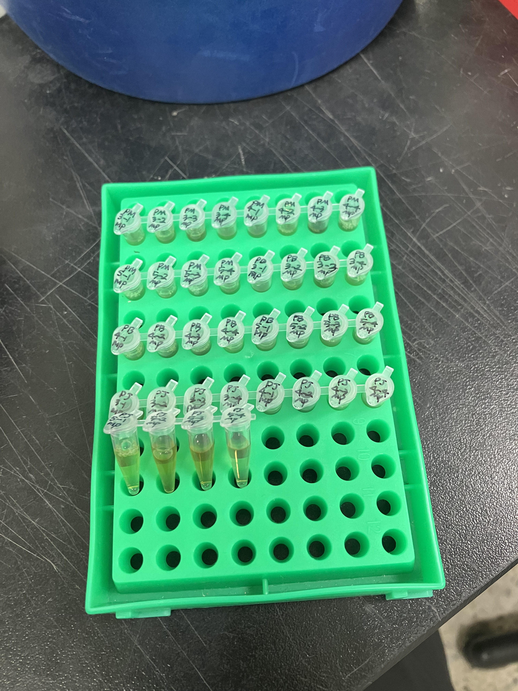

# Tomato Protein Extraction Log (2026-06-24)

### Background & Project Narrative
This project investigates the phenotypic variations observed in tomato plants grown across different soil environments, focusing on differences in Shoot Length (SL), Root Length (RL), Fresh Weight (FW), and Dry Weight (DW). Clear phenotypic differences were identified in plants grown in Gyeongju (GJ) soil (increased overall volume) and Gijang B (GB) soil (accelerated ripening). 

To track the transgenerational effects of these soil microbiomes/epigenetic factors, multi-generation cultivation was conducted:
* **Parent generation (P):** Treated with GB or GJ soil.
* **F1 & F2 generations:** Cultivated under continuous treatment with their respective soils (GB or GJ).
* **F3 generation:** Cultivated without any soil treatments to evaluate inherited phenotypic memory.

### Experimental Design
Protein extraction was performed using leaf samples from the Parent generation to assess the direct molecular profiling of the initial treated groups. The samples are categorized into the following experimental groups:
* **PM:** MES Buffer control (Parent generation)
* **PJ:** Gyeongju soil group (Parent generation)
* **PB:** Gijang B soil group (Parent generation)

**Sample Grid & Batch Configuration:**
The extraction batch consists of 12 unique samples in total, organized into 4 biological replicates per experimental group:
* **PM Group (MES Control):** `PM 3-1`, `PM 3-2`, `PM 3-3`, `PM 3-4`
* **PJ Group (Gyeongju):** `PJ 4-1`, `PJ 4-2`, `PJ 4-3`, `PJ 4-4`
* **PB Group (Gijang B):** `PB 5-1`, `PB 5-2`, `PB 5-3`, `PB 5-4`

---

## Protocol & Notes

### Reference Protocol

#### 1. Buffer Formulation Reference

| Component | Stock Conc. | Vol. for 1 mL | Final Conc. | Vol. for 10 mL | Vol. for 50 mL | Function |
| :--- | :---: | :---: | :---: | :---: | :---: | :--- |
| **Tris-HCl (pH 7.5)** | 1 M | 20 µL | 20 mM | 200 µL | 1 mL | Buffer (stabilizes protein structure) |
| **EDTA (pH 8.0)** | 0.5 M | 2 µL | 1 mM | 20 µL | 100 µL | Assists protease inhibitors |
| **NaCl** | 1 M | 150 µL | 150 mM | 1.5 mL | 7.5 mL | Salt for protein stability |
| **Triton X-100** | — | 1 µL | 0.1% (v/v) | 10 µL | 50 µL | Detergent (breaks down cell wall/membrane) |
| **DTT** | 1 M | 5 µL | 5 mM | 50 µL | 250 µL | Reducing agent (prevents disulfide bonding) |
| **10% SDS** | 0.1 g/mL | 10 µL | 0.1% (w/v) | 100 µL | 500 µL | Detergent (denatures protein 2nd & 3rd structures) |
| **DW (Distilled Water)** | — | 312 µL | — | 3.12 mL | 15.6 mL | Solvent / Vehicle |
| **Protease Inhibitor** | 2X | 500 µL | 1X | 5 mL | 25 mL | Protects proteins from degradation |
| **Total Volume** | — | **1 mL** | — | **10 mL** | **50 mL** | — |

#### 2. Protein Extraction Standard Operating Procedure (SOP)
* **1-1)** Transfer the sample powder into a tube and add 300 µL of extraction buffer.
    * *Note 1-1-1:* Alternatively, you can add the buffer to the tube first, then add the sample and grind it.
    * *Note 1-1-2:* Keep the ratio of powder to solution close to 1:1.
* **1-2)** Vortex thoroughly to ensure the sample dissolves completely in the buffer.
* **1-3)** Centrifuge at 13,000 rpm for 20 minutes at 4°C. (Up to 30 minutes is acceptable).
* **1-4)** Transfer 200 µL of the supernatant into a new microcentrifuge tube (e-tube).
    * *Note 1-4-1:* Aliquot 200 µL twice into PCR tubes per sample type and store (done to ensure sufficient sample volume for Western blot practice and in case target protein expression is high).
* **1-5)** Measure the protein concentration, normalize the samples to equal concentrations, aliquot into 20 µL working volumes for Western blotting, and store at -20°C.

## Pre-Run Preparations

* **Consumables (Per Sample):** 2 × 1.5 mL microcentrifuge tubes / 1 × PCR tube *(Note: Extra PCR tubes required for pooling sets)*
* **Equipment:** Mortar and pestle sets / Metal laboratory spoons / Liquid nitrogen ($LN_2$) & ice buckets / Vortex mixer / Refrigerated centrifuge / NanoDrop spectrophotometer
* **Disinfection:** 70% EtOH / RNase ZAP (for bench surface, mortar, pestle, and spoon decontamination between samples)

---

## Bench Execution Log & Deviations

1. **Workstation Decontamination and Equipment Preparation**
   * Sterilized the laboratory bench surface by thoroughly wiping it down with 70% Ethanol and RNase ZAP.
   * Prepared 4 mortar and pestle sets along with metal laboratory spoons for sample grinding.
   * Decontaminated all mortars, pestles, and spoons by wiping them thoroughly with 70% Ethanol and RNase ZAP to prevent cross-contamination.
   * Prepared 4 buckets filled with liquid nitrogen ($LN_2$) to maintain cryogenic temperatures during the extraction process.

2. **Cryogenic Grinding and Sample Tube Transfer**
   * Retrieved the foil-wrapped tomato leaf samples stored at -20°C and placed them immediately into a liquid nitrogen ($LN_2$) bucket to maintain the frozen chain.
   * Executed the following manual homogenization process for each individual sample sequentially to prevent cross-contamination and sample thawing:
     * Chilled the metal laboratory spoon by submerging it directly into the $LN_2$ bucket.
     * Filled the mortar with $LN_2$ to pre-chill the grinding surface.
     * Extracted the sample from the $LN_2$ bucket, carefully unpacked the foil wrapper, and transferred the leaf tissue into the pre-chilled mortar.
     * Pulverized the leaf tissue manually using the pestle, grinding continuously until the sample was reduced to a fine, uniform powder.
     * Pre-chilled an empty, pre-labeled 1.5 mL microcentrifuge tube by placing it into the $LN_2$ bath.
     * Poured out any residual $LN_2$ from the chilled tube, then used the pre-chilled spoon to carefully transfer the pulverized sample powder into the tube.
     * Sealed the tube cap tightly and immediately submerged it back into the $LN_2$ bucket to preserve protein stability.
     * Thoroughly wiped down the mortar, pestle, and spoon with 70% Ethanol between samples to ensure an absolutely clean surface for the next replicate.

3. **Protein Extraction Buffer Formulation and Addition**
   * Formulated a total volume of **12.0 mL** of the final Working Cocktail Protein Extraction Buffer. 
   * Prepared the core base mixture and added the active components (**DTT** and **Protease Inhibitor**) immediately prior to application to ensure maximum chemical stability.
   * Transferred the 1.5 mL tubes containing the pulverized frozen plant tissue from the liquid nitrogen ($LN_2$) bucket directly into an ice bucket.
   * **Critical Safety Step:** Left the tube caps slightly loose or cracked open immediately after transferring them to the ice bucket. This allowed venting to prevent caps from popping open violently due to pressure differentials caused by the extreme temperature shift.
   * Dispensed **200 µL** of the freshly prepared Working Cocktail Protein Extraction Buffer into each sample tube while the pulverized tissue was completely frozen, ensuring rapid and efficient protein extraction upon thawing.

4. **Vortexing and Multi-Stage Centrifugation (Clarification)**
   * Thoroughly vortexed each sample for more than 10 seconds to fully suspend the pulverized tissue powder within the extraction buffer.
   * **Initial Centrifugation:** Spun the 1.5 mL tubes at **13,000 RPM at 4°C for 15 minutes** to pellet cell debris.
   * **Observation & Deviation:** Upon inspection post-centrifugation, the samples appeared to be insufficiently mixed or incompletely lysed, with the tissue powder not fully integrated with the extraction buffer.
   * **Corrective Action (Re-extraction):** To ensure optimal protein yield and complete lysis, each sample was thoroughly vortexed a second time for more than 10 seconds to completely resuspend the pellet.
   * **Secondary Centrifugation:** Subjected the resuspended samples to an additional centrifugation cycle at **13,000 RPM at 4°C for 10 minutes** to achieve a completely clarified supernatant.

5. **Final Supernatant Transfer and Polishing Centrifugation**
   * To achieve absolute clarity and ensure the complete removal of any remaining trace debris or insoluble matter, carefully transferred **150 µL** of the clear supernatant into a fresh, pre-labeled 1.5 mL microcentrifuge tube.
   * Subjected these newly transferred samples to a final polishing centrifugation cycle at **13,000 RPM at 4°C for 5 minutes** to ensure a perfectly clarified protein extract.

6. **Final Transfer and Sample Pooling**
   * Carefully transferred **150 µL** of the perfectly clarified supernatant from the 1.5 mL tubes into fresh, organized PCR tubes for compact storage.
   * Conducted sample pooling across biological replicates within each experimental group to generate representative composite samples for initial quantification.
   * Combined **30 µL** of supernatant from each of the 4 biological replicates within a set into a fresh PCR tube, yielding a **120 µL pooled sample** per group:
     * **PM Pooled:** 30 µL each from `PM 3-1`, `PM 3-2`, `PM 3-3`, and `PM 3-4` (Total: 120 µL).
     * **PJ Pooled:** 30 µL each from `PJ 4-1`, `PJ 4-2`, `PJ 4-3`, and `PJ 4-4` (Total: 120 µL).
     * **PB Pooled:** 30 µL each from `PB 5-1`, `PB 5-2`, `PB 5-3`, and `PB 5-4` (Total: 120 µL).

7. **Protein Quantification (NanoDrop Spec)**
   * Utilized a NanoDrop spectrophotometer to measure protein concentration ($A_{280}$) using the representative pooled samples (`PM`, `PJ`, `PB`) to evaluate extraction efficiency and determine baseline concentrations for downstream normalization.
   * Cleansed the optical pedestal with 70% Ethanol and blanked the instrument using **1 µL** of the exact Working Cocktail Protein Extraction Buffer prior to running the pooled samples.

8. **Sample Storage**
   * Transferred all final sample tubes—including both the individual biological replicates and the composite pooled samples contained in the PCR tubes—directly into a -20°C freezer for long-term storage to preserve protein stability prior to downstream applications.