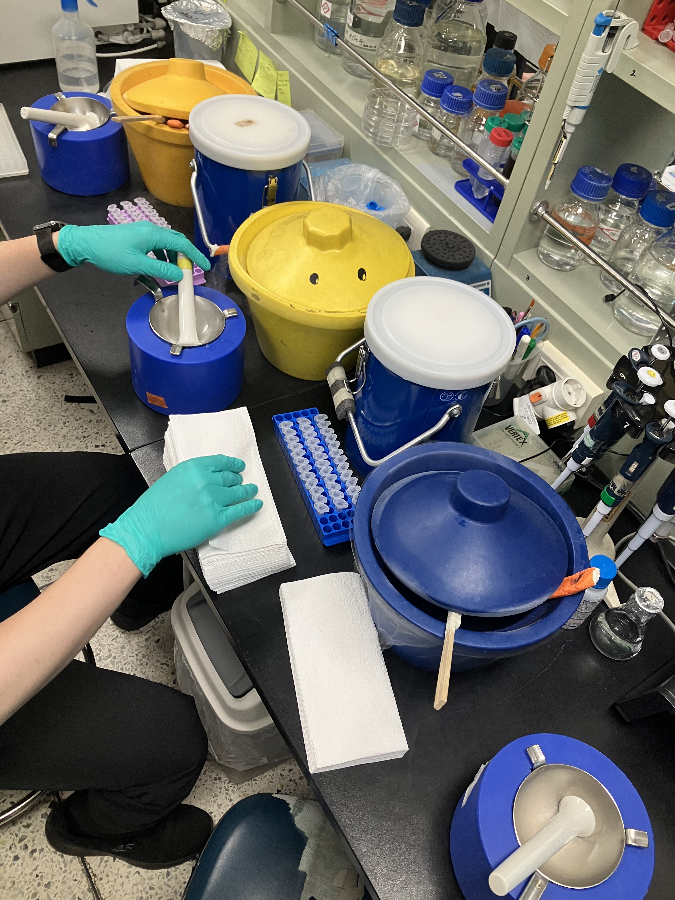
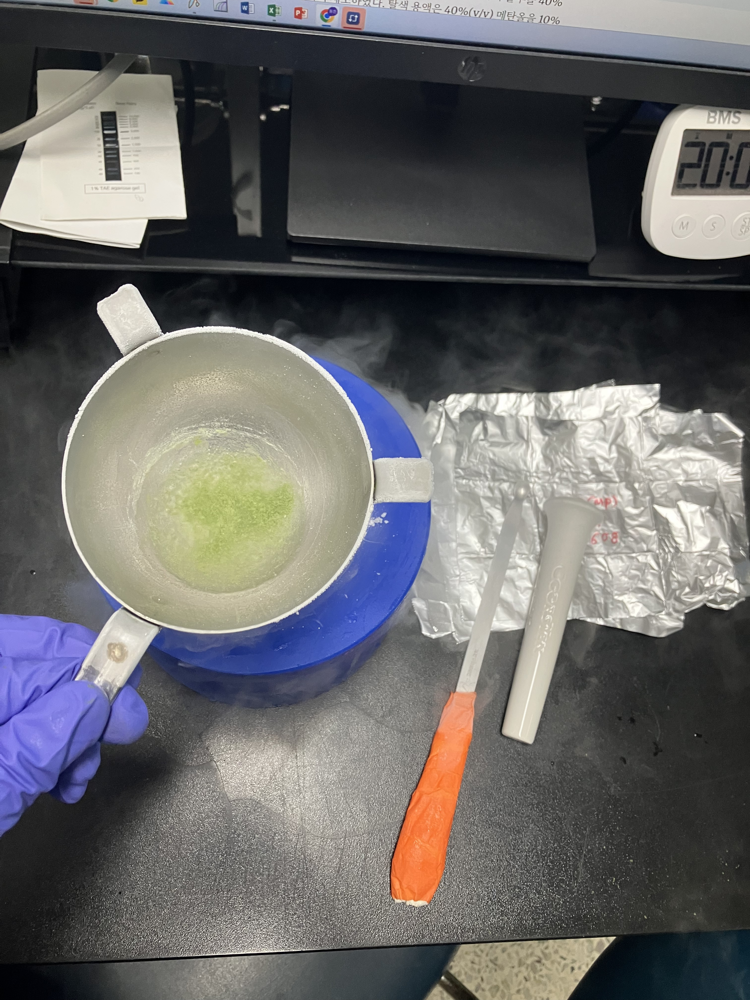

# Tomato RNA Extraction Log (2026-06-25)

### Background & Project Narrative
This project investigates the phenotypic variations observed in tomato plants grown across different soil environments, focusing on differences in Shoot Length (SL), Root Length (RL), Fresh Weight (FW), and Dry Weight (DW). Clear phenotypic differences were identified in plants grown in Gyeongju (GJ) soil (increased overall volume) and Gijang B (GB) soil (accelerated ripening). 

To track the transgenerational effects of these soil microbiomes/epigenetic factors, multi-generation cultivation was conducted:
* **Parent generation (P):** Treated with GB or GJ soil.
* **F1 & F2 generations:** Cultivated under continuous treatment with their respective soils (GB or GJ).
* **F3 generation:** Cultivated without any soil treatments to evaluate inherited phenotypic memory.

### Experimental Design
RNA extraction was performed using leaf samples from the Parent generation to analyze direct transcriptional responses to the initial soil treatments. The samples are categorized into the following experimental groups:
* **PM:** MES Buffer control (Parent generation)
* **PJ:** Gyeongju soil group (Parent generation)
* **PB:** Gijang B soil group (Parent generation)

**Sample Grid & Batch Configuration:**
The extraction batch consists of 12 unique samples in total, organized into 4 biological replicates per experimental group:
* **PM Group (MES Control):** `PM 3-1`, `PM 3-2`, `PM 3-3`, `PM 3-4`
* **PJ Group (Gyeongju):** `PJ 4-1`, `PJ 4-2`, `PJ 4-3`, `PJ 4-4`
* **PB Group (Gijang B):** `PB 5-1`, `PB 5-2`, `PB 5-3`, `PB 5-4`

---

## Protocol & Notes

### Reference Protocol

#### 1. Tomato RNA Extraction Protocol

* **1)** Grind 0.1 g of the sample using liquid nitrogen (LN2).
    * *Note:* All reagents and equipment must be treated with DEPC for at least 2 days and then autoclaved before use. (DEPC preparation: Add 1 mL of DEPC to 1 L of Distilled Water, allow it to dissolve for at least 2 days, then autoclave).
* **2)** Add the ground sample to a 2 mL tube containing 1 mL of TRIzol, vortex thoroughly, and incubate at room temperature (RT) for 5 minutes.
    * *Note 2-1 (Mechanism):* TRIzol consists of phenol, guanidinium, and thiocyanate. Phenol denatures proteins, dissolves lipids, disrupts cell walls, and denatures DNA.
* **3)** Centrifuge at 13,000 rpm for 15 minutes at 4°C.
* **4)** Transfer the supernatant (~1 mL) to a new DEPC-treated microcentrifuge tube (e-tube) and incubate at RT for 5 minutes.
* **5)** Add 200 µL of chloroform, mix by inverting, and incubate at RT for 2 minutes.
    * *Note 5-1 (Mechanism):* Chloroform separates the phases containing proteins and other materials dissolved in TRIzol, facilitating cleaner RNA isolation.
* **6)** Centrifuge at 13,000 rpm for 15 minutes at 4°C.
* **7)** Transfer the supernatant (~500 µL) to a new microcentrifuge tube and add 500 µL of Isopropanol.
    * *Note 7-1 (Mechanism):* Isopropanol exploits the low solubility of nucleic acids in alcohol to efficiently precipitate the RNA.
* **8)** Incubate for 5 minutes, then centrifuge at 13,000 rpm for 15 minutes at 4°C.
* **9)** Discard the supernatant and add 1 mL of 75% DEPC-treated ethanol.
* **10)** Incubate at -20°C for 2 hours OR overnight.
* **11)** Centrifuge at 13,000 rpm for 15 minutes at 4°C.
* **12)** Discard the supernatant, air-dry the pellet completely until the ethanol evaporates (do not exceed 30 minutes), and resuspend by adding 50 µL of DEPC-treated Distilled Water (D.W.).
* **13)** Store at -80°C.

#### 2. DNase Treatment

##### Reaction Mixture

| Component | Volume |
| :--- | :---: |
| 10X Reaction Buffer (Salt) | 3 µL |
| 10X TURBO DNase | 2 µL |
| Total RNA | 25 µL |
| **Total Volume** | **30 µL** |

##### Protocol

* **1)** Mix gently by pipetting, then incubate at 37°C for 30 minutes.
* **2)** Add 270 µL of DEPC-treated Distilled Water (D.W.) to bring the total volume up to 300 µL.
* **3)** Add 300 µL of PCI (Phenol:Chloroform:Isoamyl Alcohol = 25:24:1) (equal to the total volume) and mix by inverting.
* **4)** Centrifuge at 13,000 rpm for 15 minutes at 4°C.
* **5)** Transfer 200 µL of the supernatant into a new 1.5 mL tube, then add the following precipitation reagents:

| Precipitation Component | Volume |
| :--- | :---: |
| 3 M Sodium Acetate (pH 5.2, RNA grade) | 20 µL |
| Glycogen (10 mg/mL) | 1 µL |
| Absolute Ethanol (100%) | 500 µL |

* Mix thoroughly by inverting and incubate at -20°C overnight.
* **6)** Centrifuge at 13,000 rpm for 15 minutes at 4°C.
* **7)** Carefully remove the supernatant without disturbing the pellet, add 1 mL of 70% DEPC-treated ethanol, and centrifuge for 1 minute.
* **8)** Repeat step 7 (the ethanol wash step) once more.
* **9)** Air-dry the ethanol pellet, resuspend in 50 µL of DEPC-treated Distilled Water (D.W.), and store at -20°C.

## Pre-Run Preparations

* **Consumables (Per Sample):** 1 × 2.0 mL microcentrifuge tube / 3 × 1.5 mL microcentrifuge tubes / 1 × PCR tube *(Note: All tubes must be DEPC-treated and autoclaved)*
* **Equipment:** Mortar and pestle sets / Metal laboratory spoons / Liquid nitrogen ($LN_2$) & ice buckets / Vortex mixer / Refrigerated centrifuge / Digital dry bath (Pre-heated to 37°C) / Clean bench (Laminar flow hood)
* **Disinfection:** 70% EtOH / RNase ZAP (for bench surface, mortar, pestle, and spoon decontamination between samples)

---

## Bench Execution Log & Deviations

1. **Workstation Decontamination and Tube Preparation**
   * Sterilized the laboratory bench surface by thoroughly wiping it down with 70% Ethanol and RNase ZAP.
   * Prepared and labeled the required tubes for the 12 samples (12 × 2.0 mL tubes and 24 × 1.5 mL tubes) with their respective sample IDs (`PM 3-1~4`, `PJ 4-1~4`, `PB 5-1~4`).
   * Verified that all plasticware had been pre-treated with DEPC and autoclaved to ensure a completely RNase-free environment.
   * Prepared 4 mortar and pestle sets along with metal laboratory spoons, decontaminating them completely with 70% Ethanol and RNase ZAP.
   * Prepared buckets filled with liquid nitrogen ($LN_2$) to maintain cryogenic temperatures throughout the extraction process.
   

2. **Cryogenic Grinding and Sample Tube Transfer**
   * Retrieved the foil-wrapped tomato leaf samples stored at -20°C and placed them immediately into a liquid nitrogen ($LN_2$) bucket to maintain the frozen chain.
   * Executed the manual homogenization process for each individual sample sequentially to prevent cross-contamination and sample thawing:
     * Chilled the metal laboratory spoon by submerging it directly into the $LN_2$ bucket.
     * Filled the mortar with $LN_2$ to pre-chill the grinding surface.
     * Extracted the sample from the $LN_2$ bucket, carefully unpacked the foil wrapper, and transferred the leaf tissue into the pre-chilled mortar.
     * Pulverized the leaf tissue manually using the pestle, grinding continuously until the sample was reduced to a fine, uniform powder.
     * Pre-chilled an empty, pre-labeled 2.0 mL microcentrifuge tube by placing it into the $LN_2$ bath.
     * Poured out any residual $LN_2$ from the chilled tube, then used the pre-chilled spoon to carefully transfer the pulverized sample powder into the tube.
     * Sealed the tube cap tightly and immediately submerged it back into the $LN_2$ bucket to preserve RNA integrity.
     * Thoroughly wiped down the mortar, pestle, and spoon with 70% Ethanol between samples to ensure an absolutely clean surface for the next replicate.
    

3. **TRIzol Addition, Lysis, and Incubation**
   * Transferred the 2.0 mL tubes containing the pulverized frozen plant tissue from the liquid nitrogen ($LN_2$) bucket directly into an ice bucket.
   * **Critical Safety Step:** Left the tube caps slightly loose or cracked open immediately after transferring them to the ice bucket to allow venting, preventing caps from popping open violently due to pressure differentials.
   * Dispensed exactly **1.0 mL** of TRIzol reagent into each sample tube containing the pulverized, frozen leaf tissue.
   * Thoroughly vortexed each sample to ensure complete tissue homogenization and full suspension within the lysis buffer.
   * Incubated the samples at room temperature (RT) for **5 minutes** to allow complete denaturation of cellular proteins and full dissociation of nucleoprotein complexes.
   * Centrifuged all 12 samples at **13,000 RPM for 15 minutes at 4°C** to separate the insoluble material and plant cell debris from the homogenate.

4. **Supernatant Transfer and Incubation (With Volume Deviation)**
   * Carefully transferred the supernatant from the 2.0 mL tubes into the first set of fresh, pre-labeled, DEPC-treated 1.5 mL tubes.
   * **Protocol Deviation:** Recovered and transferred a volume of **850 µL** of supernatant per sample, rather than the standard 1.0 mL specified in the reference protocol, to maximize recovery from the leaf tissue.
   * Incubated the transferred supernatant at room temperature (RT) for **5 minutes**.

5. **Chloroform Phase Separation and Incubation**
   * Added **200 µL** of chloroform directly into each 1.5 mL tube containing the recovered supernatant.
   * Thoroughly mixed the solution by inverting the tubes repeatedly to ensure full emulsification.
   * Incubated the mixture at room temperature (RT) for **2 minutes** to allow the organic and aqueous phases to begin partitioning.

6. **Aqueous Phase Recovery and Handling**
   * Prepared a second set of 12 fresh, pre-labeled, DEPC-treated 1.5 mL tubes.
   * Following centrifugation, distinct layers formed in the tubes: a lower organic phase, a white interphase, and an upper clear aqueous phase containing the RNA.
   * Carefully recovered exactly **500 µL** of the highly clear aqueous supernatant per sample and transferred it into the new 1.5 mL tubes.
   * **Pipetting Technique Control:** Aspirated the supernatant by lowering the pipette tip progressively from the top surface downward, ensuring the lower interphase was completely undisturbed.
   * **Contamination Avoidance:** Positioned the pipette tip strictly in the physical center of the tube while descending to avoid touching organic debris or materials that adhere to the inner walls of the tube.

7. **Isopropanol Addition and Precipitation Centrifugation**
   * Added exactly **500 µL** of Isopropanol to each tube to maintain a precise 1:1 volumetric ratio relative to the 500 µL of recovered aqueous supernatant.
   * Thoroughly mixed the solution by inverting the tubes repeatedly to initiate nucleic acid precipitation.
   * Incubated the mixture at room temperature (RT) for **5 minutes** to allow the RNA to precipitate.
   * Centrifuged the tubes at **13,000 RPM for 15 minutes at 4°C** to pellet the precipitated RNA.

8. **Ethanol Wash and Overnight Precipitation**
   * Decanted the supernatant smoothly and carefully from each tube to avoid disturbing the newly formed RNA pellet.
   * **Moisture Removal Technique:** Gently dabbed the rim of each inverted microcentrifuge tube onto a clean laboratory wipe to remove residual liquid film without contacting the pellet itself.
   * Added **1.0 mL** of 75% DEPC-treated ethanol to each sample to wash the pellet and remove residual salts.
   * Centrifuged the washed samples at **13,000 RPM for 15 minutes at 4°C** to re-pellet the RNA.
   * Transferred all 12 samples into a -20°C freezer for an overnight incubation to stabilize and maximize the structural precipitation of the final purified RNA.

9. **Post-Overnight Pelleting and Secondary Technical Spin**
   * Centrifuged the overnight-stored samples at **13,000 RPM at 4°C for 15 minutes** to securely re-pellet the RNA after the overnight incubation period.
   * Decanted the ethanol supernatant gently and smoothly from each tube, taking extreme caution not to dislodge or lose the RNA pellet.
   * Dabbed the rim of each inverted tube carefully onto a clean laboratory wipe to pull away the remaining liquid droplets.
   * **Protocol Optimization:** Performed an additional technical centrifugation step at **13,000 RPM at 4°C for 2 minutes** to bring down any remaining residual ethanol film from the inner walls of the tube to the bottom.

10. **Clean Bench Transfer, Residual Ethanol Removal, and Air-Drying**
    * Transferred all tubes to a sterile clean bench (laminar flow hood) to prevent any environmental airborne contamination during the critical drying phase.
    * Used a fine pipette tip to carefully remove the last remaining microliter traces of residual ethanol that had aggregated at the bottom of the tubes after the 2-minute technical spin.
    * Left the tube caps open and allowed the RNA pellets to air-dry inside the clean bench for **5 minutes at room temperature (RT)** until the ethanol completely evaporated.

11. **RNA Resuspension and Cold Storage**
    * Added exactly **50 µL** of standard autoclaved Distilled Water (DW, non-DEPC-treated) to each dried RNA pellet.
    * *Note on Lab Optimization:* Non-DEPC-treated DW was chosen over DEPC-treated water because local instrument data indicates it provides significantly more stable and reproducible baseline curves during downstream NanoDrop spectrophotometer measurements.
    * Transferred the resuspended RNA samples to a 4°C refrigerator for short-term stabilization.
    * Retrieved the samples from the refrigerator and performed thorough, gentle mechanical pipetting to ensure complete visual and physical dissolution of the RNA pellets in the DW.

12. **Sample Aliquoting and DNase Treatment Setup**
    * Prepared a fresh set of 12 pre-labeled PCR tubes.
    * Aliquoted exactly **25 µL** of the completely dissolved RNA sample from each original tube into the corresponding new PCR tube, leaving **25 µL** remaining in the original tube (generating two independent 25 µL aliquots per sample).
    * **DNase Master Mix Formulation (with Excess Overhead):** Prepared a combined master mix in a sterile tube to streamline high-throughput aliquoting and ensure volumetric consistency:
      * **10X Reaction Buffer (Salt):** 120 µL
      * **10X TURBO DNase Enzyme:** 80 µL
      * **Total Master Mix Volume:** 200 µL
    * **Enzyme Addition and Mixing:** Dispensed exactly **5 µL** of the prepared DNase Master Mix into the designated 25 µL RNA sample aliquots, achieving the target final reaction volume of **30 µL** per tube.
    * Gently mixed the reaction components by slowly stirring the fluid with the pipette tip to prevent any mechanical or enzymatic shearing.

13. **DNase Incubation and Enzymatic Digestion**
    * Transferred all 12 reaction tubes to a pre-heated digital dry bath block heater.
    * Incubated the samples at **37°C for exactly 30 minutes** to allow the TURBO DNase enzyme to efficiently digest and clear any contaminating genomic DNA from the RNA preparations.

14. **Reaction Dilution, PCI Phase Separation, and Centrifugation**
    * Added **270 µL** of DEPC-treated Distilled Water (DW) to each tube, bringing the total working reaction volume from 30 µL up to 300 µL.
    * Prepared to add **300 µL** of PCI (Phenol:Chloroform:Isoamyl Alcohol = 25:24:1) to match the total aqueous volume, resulting in a 600 µL mixture per tube.
    * **PCI Liquid Handling Technique:** Since the PCI solution maintains an upper protective aqueous layer, the pipette tip was submerged deep into the lower organic phase to collect the reagent cleanly, withdrawing it slowly to prevent cross-phase contamination.
    * Inverted the tubes repeatedly and thoroughly to mix the organic solvent with the diluted RNA sample.
    * Transferred the tubes immediately into the centrifuge and spun them at **13,000 RPM for 15 minutes at 4°C** to separate the protein-denaturing organic phase from the purified aqueous RNA phase.

15. **Precipitation Reagent Assembly and Supernatant Transfer**
    * Prepared a final set of 12 fresh, pre-labeled, DEPC-treated 1.5 mL tubes.
    * **Precipitation Reagent Base:** Dispensed exactly **500 µL** of Absolute Ethanol (100%) into each new tube.
    * **Salt-Carrier Master Mix Formulation:** Prepared a concentrated salt and carrier matrix to streamline the precipitation step. Combined **800 µL of 3 M Sodium Acetate (pH 5.2, RNA grade)** and **40 µL of Glycogen (10 mg/mL)** in a separate sterile tube to yield a **840 µL total master mix** volume.
    * **Supernatant Extraction:** Recovered exactly **200 µL** of the highly clear aqueous supernatant from the post-PCI centrifugation tubes and transferred it into the new tubes containing the absolute ethanol.
    * **Pipetting Technique Control:** Maintained the identical surface-downward, dead-center pipetting protocol established in Step 6 to guarantee that the lower organic interface and its concentrated debris floor remained entirely undisturbed during extraction.
    * **Precipitation Assembly:** Aliquoted exactly **21 µL** of the prepared Sodium Acetate/Glycogen master mix into each sample tube (already containing 500 µL of absolute ethanol and 200 µL of aqueous supernatant) to establish the final precipitation matrix.

16. **Precipitation Mixing and Overnight Storage**
    * Inverted the fully assembled precipitation tubes repeatedly to ensure a completely homogeneous mixture of the RNA supernatant, absolute ethanol, sodium acetate, and glycogen carrier.
    * Transferred all 12 samples into a -20°C freezer for an overnight incubation to maximize the structural precipitation of the final purified RNA.