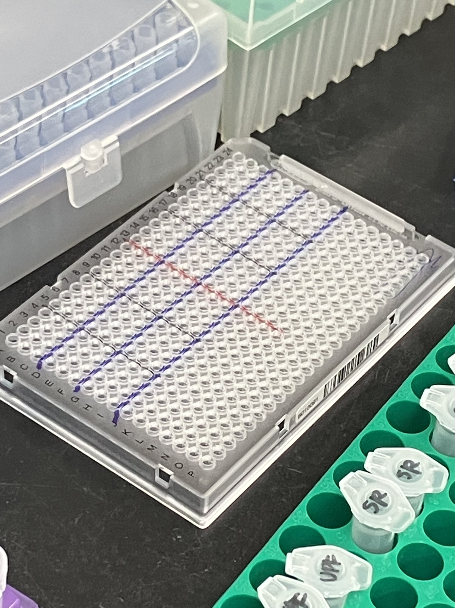
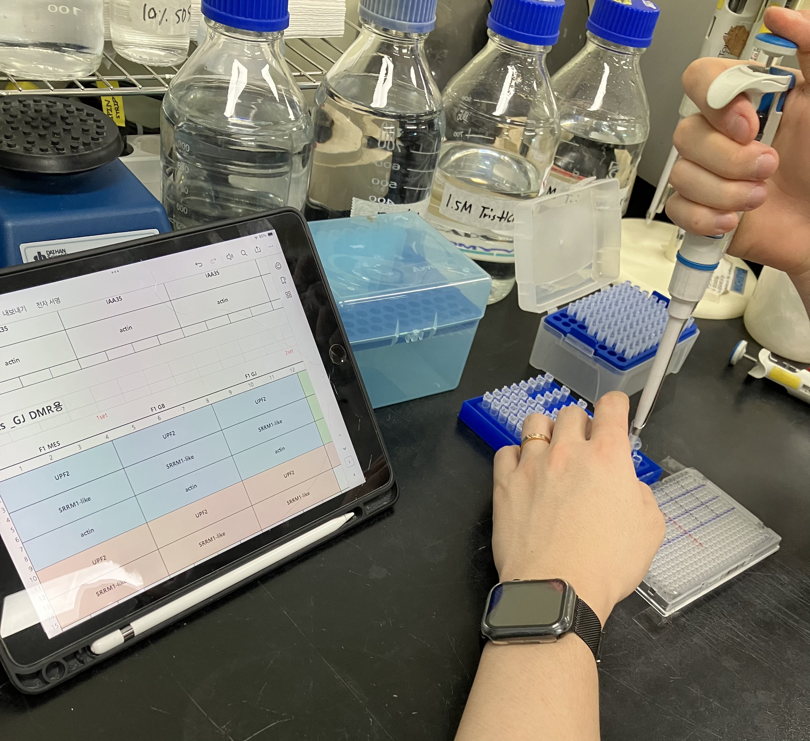
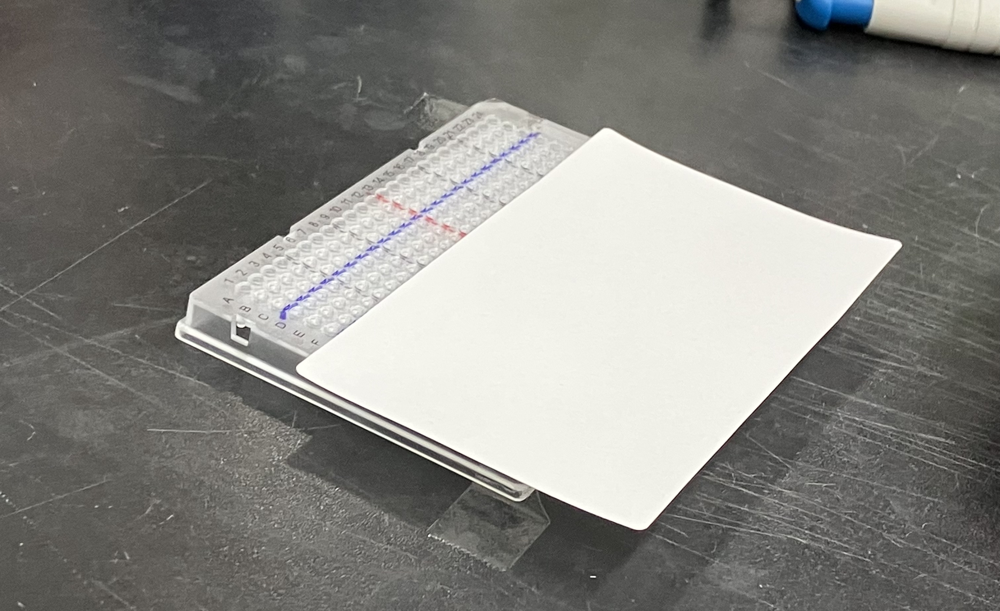
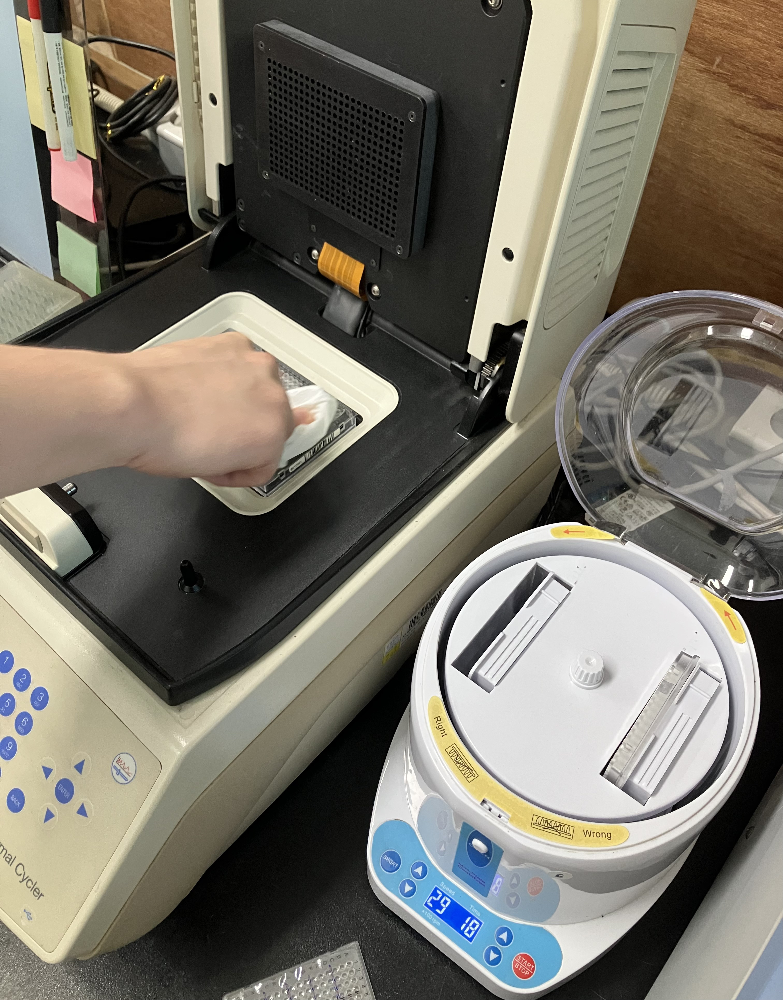
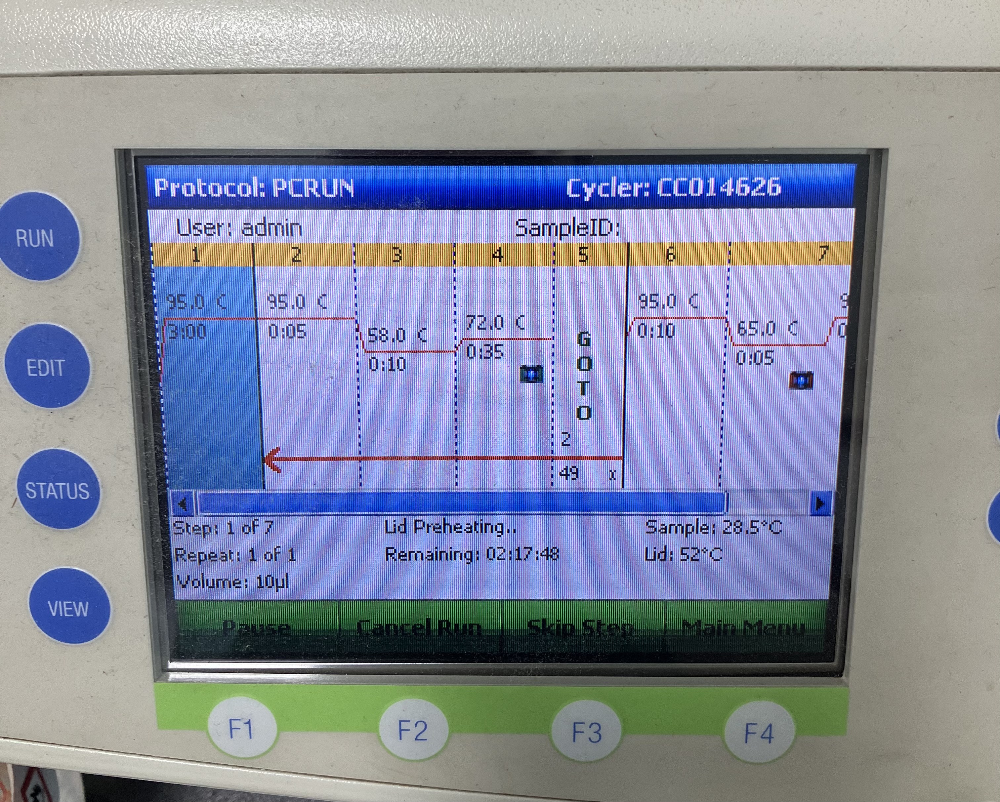
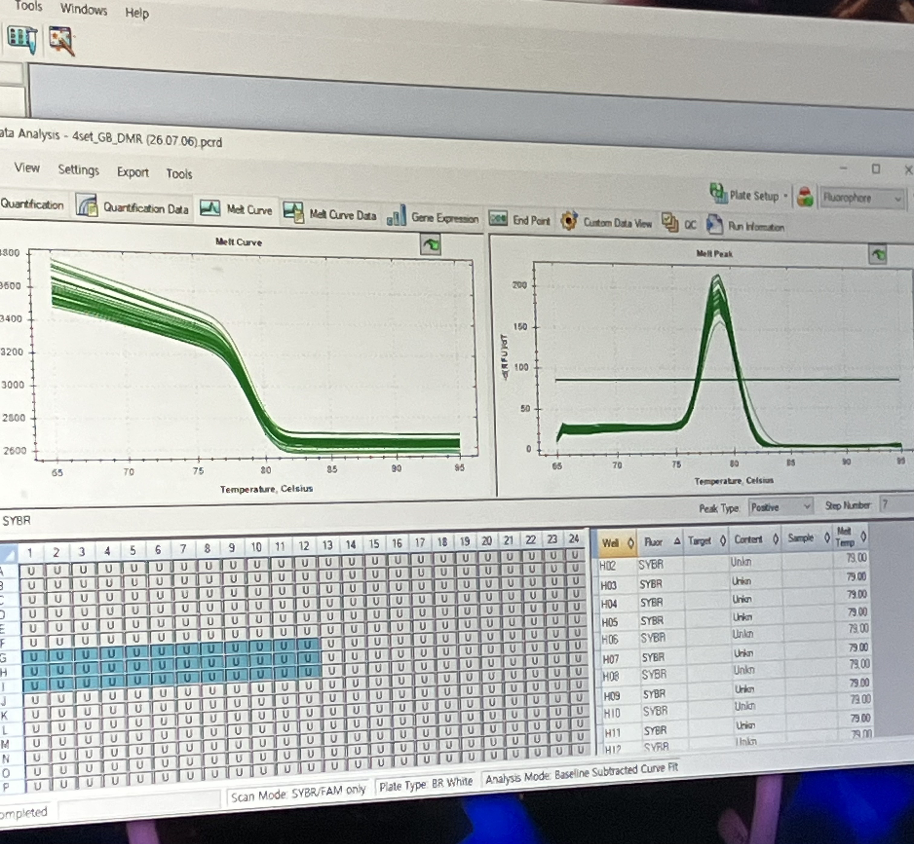

# Tomato qPCR Log (2026-07-07)

### Background & Project Narrative
This project investigates the transgenerational epigenetic mechanisms and phenotypic variations observed in tomato plants grown across distinct soil environments, specifically focusing on Gyeongju (GJ) soil (associated with increased vegetative volume) and Gijang B (GB) soil (associated with accelerated ripening). A multi-generational cultivation scheme was established to track the inheritance, stability, and decay of soil microbiome-induced epigenetic memory across successive generations.

Following prior transcriptomic profiling of the Parent (P) and F3 generations, this experimental phase evaluates the **F1 generation** to characterize the immediate molecular and epigenetic baseline established after parental exposure. Quantitative Polymerase Chain Reaction (qPCR) is employed to analyze targeted genetic loci or expression dynamics within this generation.

### Experimental Design
The assay utilizes DNA samples extracted from the leaf tissues of the F1 generation, partitioned into three environmental treatment cohorts:
* **F1 MES:** MES Buffer vehicle control group
* **F1 GB:** Gijang B soil treatment group
* **F1 GJ:** Gyeongju soil treatment group

**Sample Matrix & Storage Conditions:**
* **Biological Replicates:** Each of the three experimental cohorts consists of 8 distinct biological replicates structured across two primary experimental blocks: replicates **4-1 through 4-4** and **5-1 through 5-4**, totaling 24 independent samples.
* **Sample Allocation Grid:**
  * **MES Control:** MES 4-1, 4-2, 4-3, 4-4 | MES 5-1, 5-2, 5-3, 5-4
  * **GB Treatment:** GB 4-1, 4-2, 4-3, 4-4 | GB 5-1, 5-2, 5-3, 5-4
  * **GJ Treatment:** GJ 4-1, 4-2, 4-3, 4-4 | GJ 5-1, 5-2, 5-3, 5-4
* **Storage Baseline:** Prior to experimental execution, all 24 DNA samples were archived in 0.2 mL PCR tubes and maintained under stable cryopreservation at -20°C.

## Protocol & Notes

### Reference Protocol

#### 1. qPCR Reaction Mixture Formulation
The table below outlines the formulation for a single quantitative PCR (qPCR) reaction (1X) and the corresponding master mix preparation scaled for 40 reactions (40X) to account for technical replicates, controls, and pipetting overhead.

| Component | Stock Concentration | Volume per Reaction (1X) | Master Mix Volume (40X) |
| :--- | :---: | :---: | :---: |
| Template DNA | 50 ng/µL | 2.0 µL | — |
| Forward Primer | 5 pmol | 1.0 µL | 40.0 µL |
| Reverse Primer | 5 pmol | 1.0 µL | 40.0 µL |
| SYBR Green Master Mix | — | 5.0 µL | 200.0 µL |
| Distilled Water (D.W.) | — | 1.0 µL | 40.0 µL |
| **Master Mix Cocktail Subtotal** | — | **8.0 µL** | **320.0 µL** |
| **Total Reaction Volume** | — | **10.0 µL** | — |

*Note on Assembly:* The Master Mix Cocktail (8.0 µL per well) should be prepared in bulk, homogenized gently by vortexing, and aliquoted into the PCR plate before adding the individual Template DNA (2.0 µL per well) to reach the final 10.0 µL target reaction volume.

## Pre-Run Preparations

### Experiment-Specific Reagents & Starting Materials
* **Target Template DNA:** 24 distinct F1 generation DNA samples (MES vehicle control, GB soil, and GJ soil cohorts spanning biological replicate blocks 4-1 to 4-4 and 5-1 to 5-4), retrieved from -20°C cryopreservation in 0.2 mL PCR tubes.
* **Optimized Primer Stocks:** 10 pmol stocks of Forward and Reverse primers designed for targeting ***UPF2***, ***SRRM1-like***, and ***Actin*** (internal reference control).
* **Reaction Assay Matrix:** 1 × optical 384-well qPCR plate, physically partitioned using a fine-tip permanent marker into a 3 $\times$ 6 macro-grid matching the experimental target genes and sample set configurations.

### Specific Consumables Allocation
* **Master Mix Partitioning Tubes:** 6 × sterile 1.5 mL microcentrifuge tubes (strictly allocated as 2 independent tubes per target gene to segregate the master mix volumes required for Set 1 and Set 2).
* **Physical Stabilization Components:** Laboratory tape designated for anchoring the flexible 384-well plate to the workspace surface to eliminate micro-shifting during high-density manual pipetting.
* **Localized Photo-Shielding Materials:** Adhesive optical PCR plate sealing film deployed progressively during the run to mask and isolate completed rows from ambient light while adjacent rows are loaded.

## Bench Execution Log & Deviations

1. **Workspace Sanitization and Contamination Control**
   * Thoroughly decontaminated and wiped down the laboratory bench surface, pipettes, and equipment using 70% ethanol (EtOH) and laboratory tissue to eliminate any potential exogenous nucleic acids, nucleases, or amplicon carryover.

2. **High-Throughput Plate Selection and Physical Partitioning**
   * Utilized a standard 384-well qPCR plate (16 rows $\times$ 24 columns) to accommodate the multi-sample, multi-gene high-throughput expression assay.
   * **Physical Layout Optimization:** To minimize manual pipetting orientation errors and guarantee precise mapping, the surface of the 384-well plate was physically partitioned using a fine-tip permanent marker into a macro-grid consisting of a 3 $\times$ 6 block matrix. 

3. **Experimental Matrix Design and Architecture**
   * Each discrete block within the grid is structured as a 3 $\times$ 4 matrix:
     * **Rows (Vertical Axis within Block):** 3 technical replicates per sample.
     * **Columns (Horizontal Axis within Block):** 4 distinct biological replicates (replicates 1 through 4).
   * The entire plate layout maps these blocks across a 3 $\times$ 6 macro-matrix:
     * **Macro-Rows (Target Genes):** Partitioned into 3 tiers tracking specific transcripts: *UPF2*, *SRRM1-like*, and *Actin* (internal reference control).
     * **Macro-Columns (Experimental Cohorts):** Divided into 6 sectors spanning two distinct sample collection blocks: Set 1 (Biological Replicates 4-1 to 4-4) and Set 2 (Biological Replicates 5-1 to 5-4) for all three treatment groups (MES, GB, GJ).

---

### 384-Well qPCR Plate Mapping Layout

The table below visualizes the exact physical partitioning of the 384-well plate. The configuration fully utilizes all 24 columns and rows A through I.

| 384-Well Plate Rows | Set 1: Replicates 4-1 to 4-4 (Columns 1–12) | Set 2: Replicates 5-1 to 5-4 (Columns 13–24) |
| :--- | :--- | :--- |
| **Rows A, B, C** Target Gene: ***UPF2*** | **Cols 1–4:** F1 MES (4-1 to 4-4) **Cols 5–8:** F1 GB (4-1 to 4-4) **Cols 9–12:** F1 GJ (4-1 to 4-4) | **Cols 13–16:** F1 MES (5-1 to 5-4) **Cols 17–20:** F1 GB (5-1 to 5-4) **Cols 21–24:** F1 GJ (5-1 to 5-4) |
| **Rows D, E, F** Target Gene: ***SRRM1-like*** | **Cols 1–4:** F1 MES (4-1 to 4-4) **Cols 5–8:** F1 GB (4-1 to 4-4) **Cols 9–12:** F1 GJ (4-1 to 4-4) | **Cols 13–16:** F1 MES (5-1 to 5-4) **Cols 17–20:** F1 GB (5-1 to 5-4) **Cols 21–24:** F1 GJ (5-1 to 5-4) |
| **Rows G, H, I** Target Gene: ***Actin*** | **Cols 1–4:** F1 MES (4-1 to 4-4) **Cols 5–8:** F1 GB (4-1 to 4-4) **Cols 9–12:** F1 GJ (4-1 to 4-4) | **Cols 13–16:** F1 MES (5-1 to 5-4) **Cols 17–20:** F1 GB (5-1 to 5-4) **Cols 21–24:** F1 GJ (5-1 to 5-4) |

4. **Primer-Water Core Mixture Preparation**
   * Retrieved the pre-aliquoted stock tubes of Forward (F) primers, Reverse (R) primers, and Distilled Water (D.W.), ensuring each tube was thoroughly vortexed to achieve complete homogeneity prior to liquid handling.
   * **Protocol Optimization (Primer Concentration):** Utilized Forward and Reverse primer stocks at an optimized concentration of **10 pmol** rather than the baseline 5 pmol specified in the reference protocol to enhance amplification efficiency, while maintaining the identical volumetric input of 40.0 µL.
   * Formulated the baseline core mixture in sterile 1.5 mL microcentrifuge tubes by combining exactly 40.0 µL of Forward primer, 40.0 µL of Reverse primer, and 40.0 µL of D.W. per tube.
   * Prepared a total of **6 independent tubes** across the workflow, allocating 2 distinct tubes for each of the 3 target genes (*UPF2*, *SRRM1-like*, and *Actin*) to strictly partition the master mix volumes required for Set 1 and Set 2.

5. **Photosensitive Fluorophore Incorporation and Master Mix Finalization**
   * **Technical Control Optimization (Light Protection):** To mitigate the risk of photo-bleaching and fluorescence decay, the SYBR Green Master Mix was withheld and incorporated as the final constituent of the assay cocktail.
   * Added exactly 200.0 µL of SYBR Green Master Mix into each of the 6 pre-assembled core mixture tubes, completing the 40X master mix formulation to its final volume of 320.0 µL per tube.
   * Immediately following fluorophore addition, individual tubes were thoroughly vortexed to guarantee uniform enzyme and dye distribution, and then transferred to a light-shielded environment for dark storage prior to plate loading.

6. **Plate Mechanical Stabilization**
   * **Technical Control Optimization:** Prior to initiating any liquid handling within the plate, the 384-well qPCR plate was securely anchored to the clean bench workspace surface using laboratory tape. This baseline step eliminated any accidental plate displacement or micro-shifting, guaranteeing absolute positioning accuracy during high-precision manual pipetting across the dense well matrix.

7. **Strategic DNA Sample Aliquoting**
   * **Pipetting Technique Control:** Aliquoted exactly 2.0 µL of the individual Template DNA samples into their designated wells according to the plate map. To ensure total volumetric consistency and prevent droplet suspension or loss, the pipette tip was systematically positioned to touch a uniform, consistent quadrant of the inner well wall for each deposit.
   

8. **Progressive Master Mix Aliquoting and Sequential Photo-Shielding**
   * **Protocol Optimization & Technical Control (Photo-Protection):** To mitigate the severe risk of photo-bleaching and fluorescence decay of the SYBR Green master mix during the extended manual loading phase, the cocktail was introduced using a systematic, bottom-up row sequence coupled with progressive localized shielding.
   * **Aliquoting Sequence and Structural Zone Isolation:**
     * **Phase 1 (Rows G, H, I - *Actin*):** Aliquoted exactly 8.0 µL of the *Actin* master mix cocktail into Rows G, H, and I first. Immediately upon completion of this block, Rows G, H, and I were physically covered and secured using an adhesive PCR plate sealing film to isolate the fluorophores from ambient light exposure.
     * **Phase 2 (Rows D, E, F - *SRRM1-like*):** Proceeded to the adjacent upward tier, dispensing 8.0 µL of the *SRRM1-like* master mix cocktail into Rows D, E, and F. This specific sector was then immediately covered and shielded with the adhesive sealing film.
     * **Phase 3 (Rows A, B, C - *UPF2*):** Finalized the master mix delivery by aliquoting 8.0 µL of the *UPF2* cocktail into the top tier (Rows A, B, and C).
   * **Enzymatic Pre-reaction Avoidance:** For all master mix additions across all rows, the cocktail droplet was precisely deposited onto the **exact opposite inner wall surface** relative to the pre-deposited DNA template droplet. This rigorous physical partitioning prevented premature contact between the template DNA and the Taq polymerase, successfully eliminating ambient enzymatic activity, primer-dimer complexes, or non-specific amplification prior to the formal thermal cycling run.
  

9. **Plate Sealing and Hermetic Attachment**
   * Covered the entire 384-well plate with an adhesive optical PCR sealing film to isolate the reactions.
   * Applied firm, uniform manual pressure across the entire grid surface using hands, fingernails, and laboratory tissue to secure a hermetic seal over every individual well. This step is critical to prevent sample evaporation, volume shifting, or cross-well contamination during the high-temperature phases of thermal cycling.

10. **Centrifugation and Liquid Consolidation**
    * Conducted a rigorous visual quality control check to confirm the absolute structural integrity of the sealing film across all utilized wells.
    * Subjected the sealed plate to a technical centrifugation step (spin down) to drive the separate DNA template and master mix droplets down to the bottom of the wells, achieving uniform reaction composition and completely eliminating any micro-air bubbles that could disrupt optical paths.

11. **Optical Surface Clearance and Contamination Removal**
    * **Technical Control Optimization:** Prior to loading the plate into the quantitative real-time PCR instrument, thoroughly wiped the upper surface of the optical sealing film with 70% ethanol (EtOH) and a clean laboratory towel. This step eliminated any fingerprints, skin lipids, smudges, or dust contamination that could scatter the optical excitation beam or degrade the quality of the fluorescence emission data collected by the instrument's sensors.
    

12. **Real-Time PCR Amplification and Thermal Cycling**
    * Inserted the prepared 384-well plate into the real-time PCR instrument, locked the heated lid assembly, and initiated the `PCRRUN` protocol under the `admin` user profile.
    * Configured the instrument with a precise **10 µL reaction volume** baseline parameter and executed the thermal cycling profile structured as follows:
      * **Initial Denaturation:** 95.0°C for 3:00 minutes to ensure complete template DNA melting and hot-start polymerase activation.
      * **Amplification Cycling (50 Total Cycles):**
        * *Denaturation:* 95.0°C for 5 seconds.
        * *Annealing:* 58.0°C for 10 seconds.
        * *Extension & Data Acquisition:* 72.0°C for 35 seconds (with automated fluorescence plate read).
        * *Loop Command:* GOTO Step 2, repeated for 49 additional cycles.
      * **Dissociation / Melt Curve Analysis:**
        * *Final Denaturation:* 95.0°C for 10 seconds.
        * *Cool-Down / Pre-melt:* 65.0°C for 5 seconds, followed by a gradual thermal ramp up to 95.0°C accompanied by continuous fluorescence monitoring to verify amplification specificity and screen for primer-dimers.

13. **Data Retrieval and Technical Replicate Quality Control**
    * Exported the raw cycle threshold ($C_t$) values from the qPCR instrument software into Microsoft Excel for mathematical processing.
    * **Protocol Optimization (Outlier Truncation & Filtering):** Evaluated the 3 technical replicates for each sample to assess internal variance. Rather than filtering single discrepant wells blindly, if an entire biological replicate block (the complete 3 technical replicate wells within a specific sample coordinate) displayed irregular amplification curves, baseline shifts, or anomalous values, the entire technical replicate block was systematically truncated and excluded from downstream analysis to ensure mathematical rigor.
  

14. **Relative Quantification Calculations**
    * Computed the mean $C_t$ value for the validated, outlier-filtered technical replicates per sample.
    * Executed relative quantification using the comparative $C_t$ method ($\Delta\Delta C_t$) structured as follows:
      * **$\Delta C_t$ Calculation:** Normalized the target gene expression against the internal reference control (*Actin*) for each sample:
        $$\Delta C_t = C_{t,\text{ Target}} - C_{t,\text{ Actin}}$$
      * **$\Delta\Delta C_t$ Calculation:** Determined the relative shift by calibrating the treatment cohorts (F1 GB and F1 GJ) against the designated baseline vehicle control group (F1 MES):
        $$\Delta\Delta C_t = \Delta C_{t,\text{ Treatment}} - \Delta C_{t,\text{ Control}}$$
      * **Fold Change Evaluation:** Calculated the final relative expression fold change using the standard formula to establish the magnitude of gene upregulation or downregulation:
        $$\text{Fold Change} = 2^{-\Delta\Delta C_t}$$

