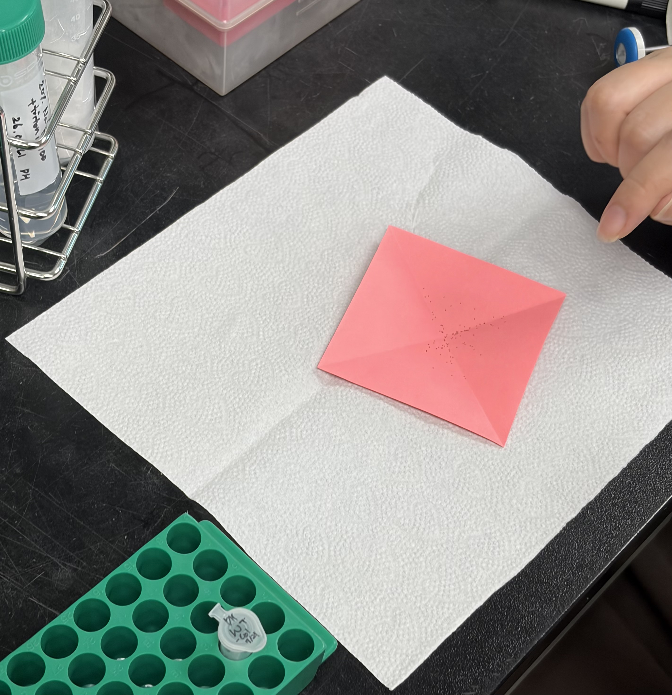

# Arabidopsis Bacteria Pathogen Infection Preperation (2026-07-21)

### Experimental Design
The experiment is configured for high-density germination and uniform growth across 36 growth cells prior to downstream pathogen challenge:
* **Target Layout:** 3 trays × 12 growth cells/tray (36 cells total).
* **Sowing Density:** 10 seeds/cell (Net requirement: 360 seeds).
* **Preparation Aliquots:** 3 × 1.5 mL microcentrifuge tubes containing ~150 seeds/tube (Total prepared: ~450 seeds to account for procedural handling losses and floating seed exclusion).

---

## Protocol & Notes

### Reference Protocol

#### 1. Surface Sterilization Solution Formulation Reference

| Component | Stock Conc. | Vol. for 30 mL Working Sol. | Final Ratio / Conc. | Function |
| :--- | :---: | :---: | :---: | :--- |
| **Sodium Hypochlorite (NaClO)** | Undiluted Stock | 6.0 mL | 20% (v/v) | Primary antimicrobial sterilant |
| **Triple-Distilled Water (3'DW)** | — | 24.0 mL | 80% (v/v) | Solvent / Diluent |
| **Triton X-100** | Pure Liquid | 1–2 drops (~30 µL) | Trace (~0.1% v/v) | Non-ionic surfactant (penetrates seed coat micro-structures) |
| **Total Volume** | — | **30.0 mL** | — | — |

#### 2. Seed Sterilization & Stratification Standard Operating Procedure (SOP)
* **1-1) Aliquoting:** Quantify and transfer ~150 *Arabidopsis* seeds into pre-autoclaved 1.5 mL tubes using cross-creased glassine paper over a white napkin substrate.
* **1-2) Disinfection:** Add 1.0 mL of 20% NaClO working solution to each tube. Vortex briefly, pulse spin-down, and incubate at room temperature for **strictly 1 minute**.
* **1-3) Clarification:** Immediately aspirate supernatant. Systematically discard floating seeds to eliminate low-mass and low-viability samples.
* **1-4) Washing:** Wash seeds at least 3 times using 1.0 mL sterile 3'DW per cycle (vortex $\rightarrow$ 1 min static incubation $\rightarrow$ pulse spin-down $\rightarrow$ supernatant aspiration). Verify complete removal of chlorine odor before proceeding.
* **1-5) Stratification:** Resuspend seeds in 1.0 mL sterile 3'DW and incubate at 4°C in the dark for 3 days (72 hours) to break dormancy and synchronize germination.

## Pre-Run Preparations

* **Consumables:** 3 × 1.5 mL microcentrifuge tubes (pre-autoclaved) / 1 × 50 mL Falcon tube (sterile) / Glassine paper / White absorbent napkins
* **Reagents:** *Arabidopsis thaliana* bulk seed stock (Col-0) / Sodium hypochlorite (NaClO) / Triple-distilled water (3'DW) / Triton X-100

---

## Bench Execution Log & Deviations

1. **Seed Material Retrieval & Storage Deviation:** Retained *Arabidopsis thaliana* (ecotype Columbia, Col-0) seeds from bulk stock. **Protocol Deviation:** Bulk seed stock was maintained in a 50 mL Falcon tube at room temperature (RT) due to high volume capacity constraints. Standard operating procedure requires long-term seed storage at 4°C to maintain dormancy and viability; all subsequent small-volume treatment working aliquots must be strictly stored at 4°C.

2. **Consumable & Reagent Staging:** Staged three pre-autoclaved 1.5 mL microcentrifuge tubes and one sterile 50 mL Falcon tube. Retrieved primary surface-sterilization reagents: sodium hypochlorite (NaClO), triple-distilled water (3'DW), and Triton X-100.

3. **Surface Sterilization Solution Preparation:** Prepared a 20% (v/v) sodium hypochlorite working solution in the designated 50 mL Falcon tube by combining 6 mL NaClO with 24 mL triple-distilled water (3'DW) (1:4 v/v ratio), supplemented with 1–2 drops of Triton X-100. Homogenized thoroughly via vortexing.
   - **Technical Rationale:** Triton X-100 serves as a non-ionic surfactant/wetting agent, reducing surface tension to ensure complete penetration of the disinfectant into hydrophobic seed coat micro-crevices and surface structures.
   - Labeled tube strictly as: `20% NaClO + Triton X-100 2026.07.21. DH`.

4. **Seed Quantification & Aliquoting:** Calculated a net requirement of 120 seeds (10 seeds/cell across 12 growth cells). Dispensed approximately 150 *Arabidopsis* seeds into each of the three pre-autoclaved 1.5 mL tubes to maintain a safety buffer against seed loss during subsequent liquid handling.
   - Utilized diagonally cross-creased glassine paper to funnel seeds central to the tube orifice during transfer from bulk stock.
   - **Contamination & Recovery Precautions:** The white napkin substrate serves as a high-contrast backdrop and catch area. For low-yield experimental treatment seeds, static-driven or accidental seed dispersion without a clean backdrop results in unrecoverable sample loss.
   - **Technical Note & Optimization:** Seed count was visually estimated (~150 seeds/tube) given the excess availability of wild-type stock. 
   - **Critical Operational Standard:** Downstream experimental treatment samples with limited seed yields must undergo exact manual quantification prior to sterilization.
   

5. **Seed Surface Sterilization & Quality Selection:** Dispensed 1.0 mL of the prepared 20% NaClO working solution into each of the three seed-containing microcentrifuge tubes.
   - Vortexed briefly to ensure uniform exposure to disinfectant, followed by a gentle pulse spin-down to collect liquid and submerge the seeds.
   - Incubated for **strictly 1 minute** to achieve surface sterilization without compromising embryo viability or seed coat integrity.

6. **Supernatant Removal & Buoyant Seed Elimination:** Immediately aspirated the disinfectant supernatant post-incubation using a micropipette.
   - **Quality Selection:** Intentionally aspirated and discarded all buoyant (floating) seeds during liquid removal, as seed buoyancy strongly correlates with low seed mass, structural defects, and poor germination potential.
   - **Operational Precaution:** Adjusted pipette tip position precisely to avoid disturbing or accidentally aspirating dense, settled seeds at the bottom of the tube.

7. **Aseptic Washing Sequence:** Executed three sequential wash cycles to thoroughly purge residual disinfectant:
   - Dispensed 1.0 mL of sterile 3'DW into each tube.
   - Resuspended seeds via brief vortexing and incubated statically for 1 minute at RT.
   - Performed a gentle pulse spin-down to pellet seeds, followed by careful aspiration of the aqueous supernatant.

8. **Disinfectant Clearance Quality Control:** Evaluated the sample post-third wash via qualitative olfactory assessment to confirm complete removal of residual NaClO.
   - **Quality Control Threshold:** Mandatory additional wash cycles are required if trace chlorine odor persists following the third iteration. Three wash cycles were empirically verified as sufficient to achieve complete disinfectant removal in this run.

9. **Cold Stratification & Germination Synchronization:** Dispensed 1.0 mL of sterile 3'DW into each tube to submerge the sterilized seeds, then transferred all tubes to 4°C dark incubation for 3 days (72 hours).
   - **Biological Purpose:** Cold moist stratification breaks seed dormancy and synchronizes metabolic activation, ensuring uniform germination rates and developmental synchronization post-sowing.