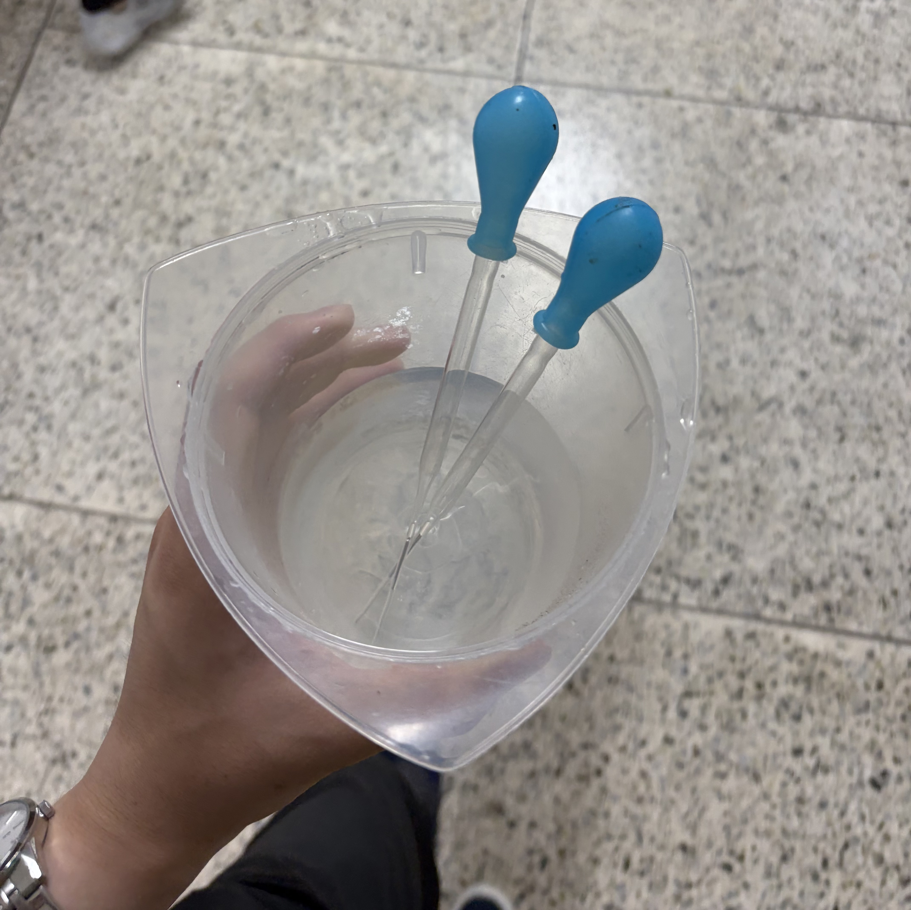
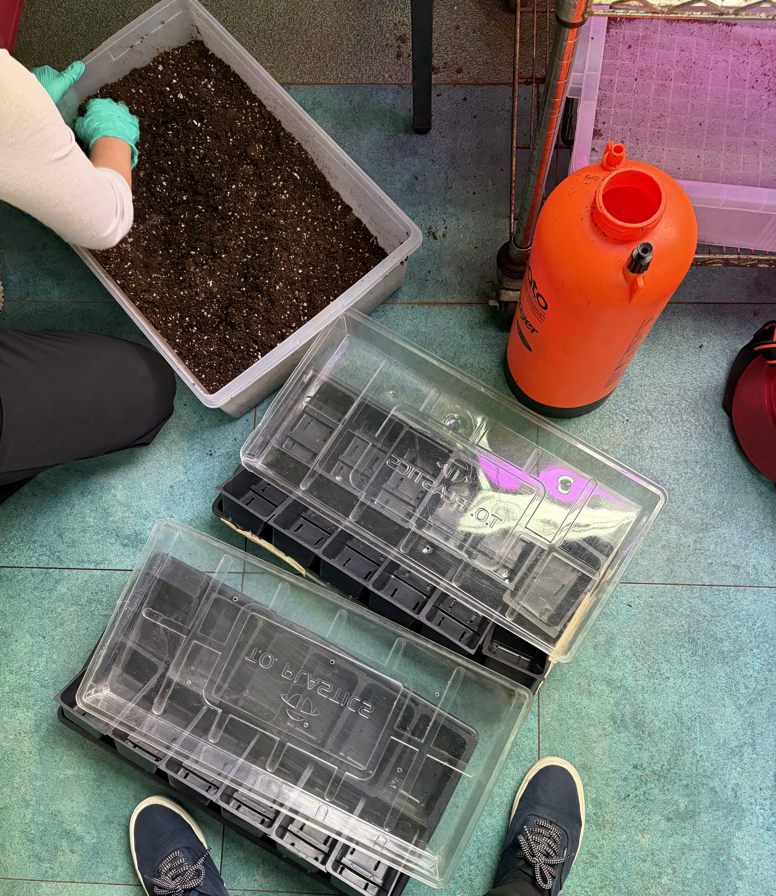
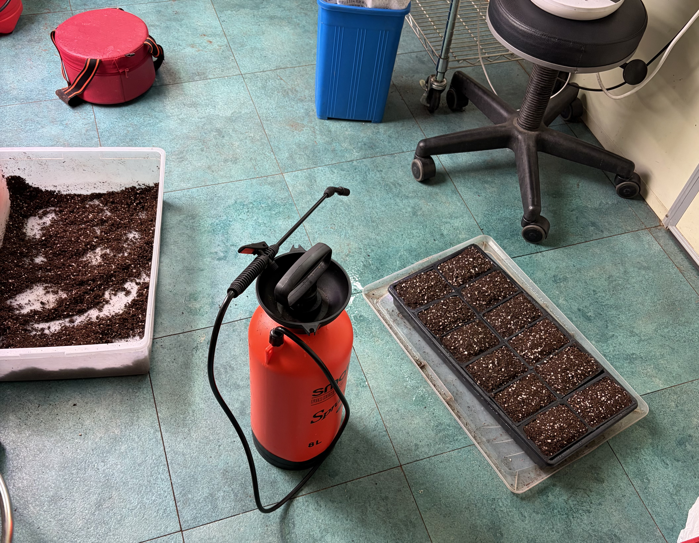
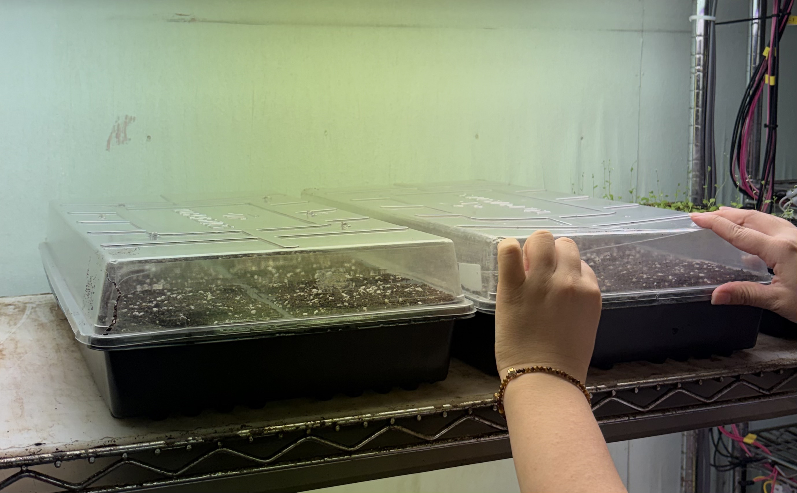

# Arabidopsis Sowing (2026-07-24)

### Experimental Design
The experiment is configured for synchronized high-density germination and uniform seedling establishment across 24 growth cells:
* **Target Layout:** 2 trays × 12 growth cells/tray (24 cells total).
* **Sowing Density:** 12 seeds/cell arranged in a 3×4 spatial grid matrix (Net requirement: 288 seeds).
* **Incubation Parameters:** 12-hour light / 12-hour dark photoperiod in a controlled-environment growth chamber.
* **Microenvironment Control:** Covered with perforated transparent plastic domes for 7 days post-inoculation to prevent high-irradiance photo-oxidative stress and desiccation.

---

## Protocol & Notes

### Reference Protocol

#### 1. Sowing & Propagation Standard Operating Procedure (SOP)
* **1-1) Cold Stratification:** Submerge surface-sterilized seeds in 1.0 mL sterile 3'DW; incubate at 4°C in total darkness for 72 h to break physiological dormancy.
* **1-2) Transfer Tool Fabrication:** Snap tip off a glass Pasteur pipette to form a wide-bore orifice; flush thoroughly with sterile 3'DW to purge glass debris.
* **1-3) Substrate Preparation & Packing:** Homogenize soil with 1'DW to a damp, friable consistency. Loosely load NaOCl-sterilized 12-cell trays without compaction, forming central convex mounds in each cell.
* **1-4) Pre-Sowing Hydration:** Surface-mist trays with 1'DW aerosol until central mounds collapse flat and soil reaches gravimetric saturation.
* **1-5) Matrix Sowing:** Aspirate seeds using the modified pipette and dispense 12 seeds/cell in a 3×4 spatial matrix. Re-singulate seed clusters using fine micro-forceps.
* **1-6) Incubation & Acclimation:** Cover trays with perforated transparent domes. Incubate in a growth chamber (12h light / 12h dark). Remove domes and begin bottom irrigation after 7 days.

---

## Pre-Run Preparations

* **Consumables:** 2 × 12-cell plant propagation trays with base trays and perforated transparent domes / Glass Pasteur pipettes / Plastic mixing container / Fine aerosol pressure sprayer / Fine micro-forceps
* **Reagents:** *Arabidopsis thaliana* seed stock (ecotype Columbia, Col-0) / 70% Ethanol (EtOH) / Sodium hypochlorite (NaOCl) / Triple-distilled water (3'DW) / Single-distilled water (1'DW) / Dry soil substrate (potting mix)

---

## Bench Execution Log & Deviations

1. **Cold Moist Stratification (Pre-Sowing Setup):**
   * Post-surface sterilization, 1.0 mL of sterile triple-distilled water (3'DW) was dispensed into each microcentrifuge tube containing *Arabidopsis thaliana* (ecotype Columbia, Col-0) seeds to ensure complete submergence.
   * Incubated tubes at 4°C in total darkness for 72 hours to break physiological seed dormancy and synchronize germination kinetics prior to sowing.

2. **Sowing Setup & Dispensing Tool Preparation:**
   * Retrieved stratified *A. thaliana* Col-0 seed suspensions from 4°C storage following completion of the 72-hour cold treatment.
   * Fabricated a wide-bore seed transfer tool by modifying a glass Pasteur pipette—snapping the narrow tip to widen the orifice diameter, permitting unobstructed seed passage without mechanical shearing or suction clogging.
   * Rinsed the modified pipette thoroughly with sterile 3'DW to remove residual glass micro-debris and pre-wet the interior walls.
   * Staged two 12-cell plant propagation trays (24 total culture cells) prior to seed inoculation.
   

3. **Substrate Preparation & Hydration Tuning:**
   * Surface-disinfected a large plastic mixing container thoroughly using 70% ethanol (EtOH).
   * Transferred dry soil substrate into the container and homogenized it with single-distilled water (1'DW).
   * **Technical Control / Moisture Calibration:** In contrast to high-moisture requirements of larger crops such as *Solanum lycopersicum*, substrate moisture for *A. thaliana* was maintained at a moderately damp, friable consistency. This lower moisture threshold prevents substrate compaction, minimizes hypoxia risks, and facilitates delicate cotyledon emergence.

4. **Tray Cell Packing & Substrate Geometry:**
   * Filled pre-cleaned, sodium hypochlorite (NaOCl)-sterilized 12-cell propagation trays with the prepared soil substrate.
   * Substrate was loosely loaded without mechanical compaction to maintain optimal soil aeration and macro-porosity for early root extension.
   * Molded the substrate surface of each cell into a slight convex (mounded) topology at the center to prevent water pooling and hypocotyl flooding.
   

5. **Pre-Sowing Substrate Hydration & Settling:**
   * Loaded the convex-mounded cells into the primary tray base and applied a thorough surface misting of single-distilled water (1'DW) using a fine aerosol sprayer.
   * Fine droplet misting facilitated gravimetric settling of the loose soil, collapsing the central mounds into flat, uniform seed beds without disturbing substrate porosity.
   * Continued spray hydration until the tray achieved significant gravimetric mass, ensuring complete saturation of the soil profile prior to seed inoculation.
   

6. **Seed Inoculation & Spatial Grid Matrix Layout:**
   * Aspirated the stratified *A. thaliana* seed-water suspension into the modified wide-bore glass pipette, applying subtle liquid pulsing to linearly align and singulate seeds within the stem barrel for controlled release.
   * Inoculated 12 seeds per cell, arranging them into a structured 3×4 spatial grid matrix to ensure uniform light interception and prevent localized seedling competition.
   * **Corrective Handling / Micro-Repositioning:** In instances where uncontrolled fluid discharge caused seed clustering, fine micro-forceps were deployed to gently re-singulate and shift seeds into target matrix coordinates without damaging seed coat integrity.

7. **Microenvironment Optimization & Photoprotection:**
   * Covered the inoculated trays with perforated transparent plastic domes to establish a high-humidity microenvironment during initial germination.
   * **Technical Control / Photoprotection & Desiccation Mitigation:** Dome enclosure prevents high-irradiance photo-oxidative stress and rapid desiccation of fragile *A. thaliana* cotyledons during early emergence, as unshielded seedlings are highly susceptible to photon-induced necrosis.

8. **Growth Chamber Incubation & Acclimation Schedule:**
   * Transferred covered propagation trays to a controlled-environment plant growth chamber maintained at a 12-hour light / 12-hour dark photoperiod.
   * Initiated daily visual inspections to monitor germination kinetics, hypocotyl elongation, and seedling health.
   * **Post-Germination Maintenance Plan:** Domes will remain intact for 7 days post-sowing. Following the 1-week germination phase, domes will be removed to allow atmospheric gas exchange, with standard bottom-irrigation regimens commencing immediately thereafter.
   