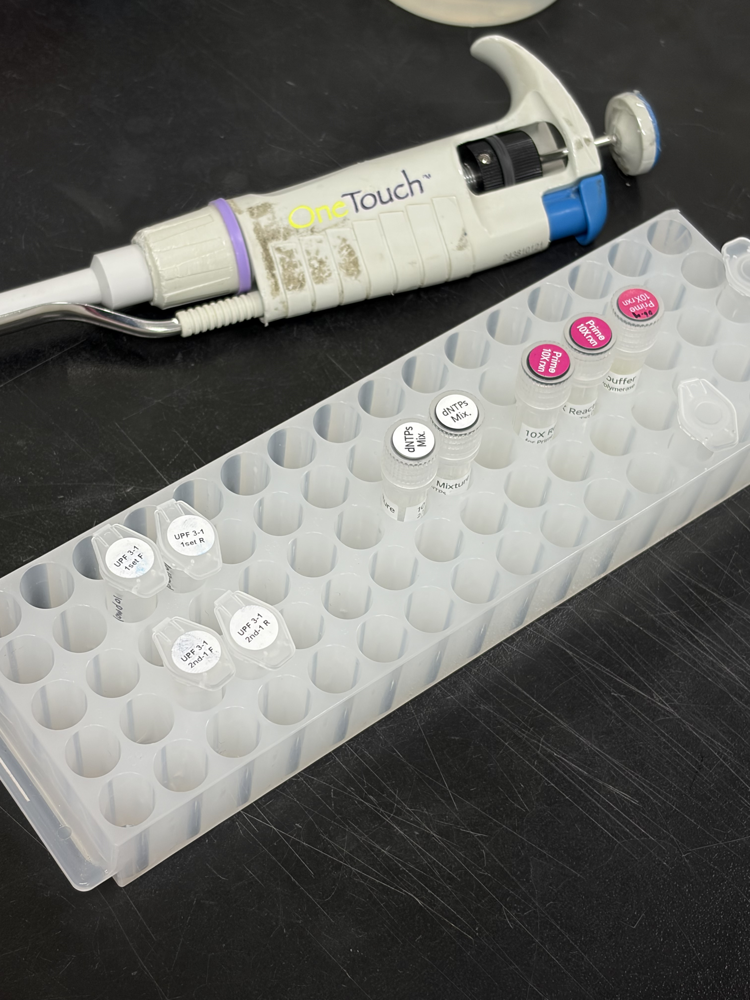
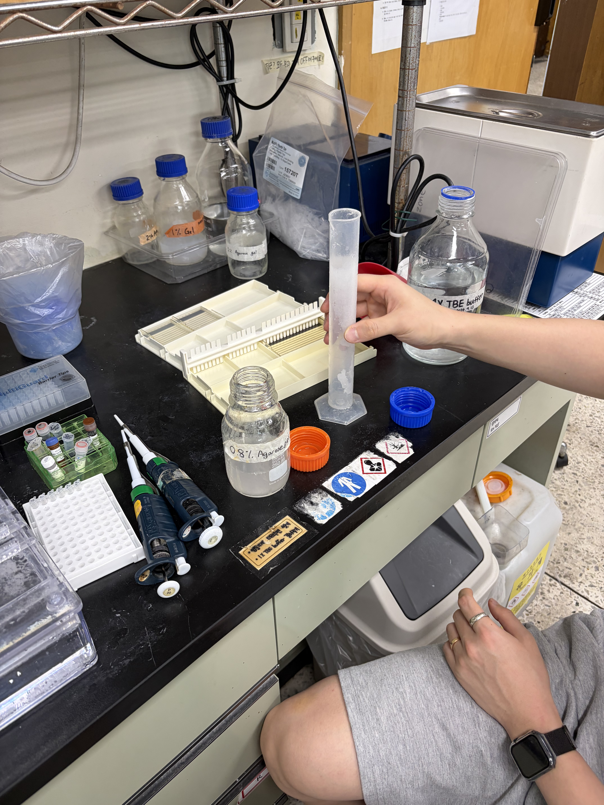
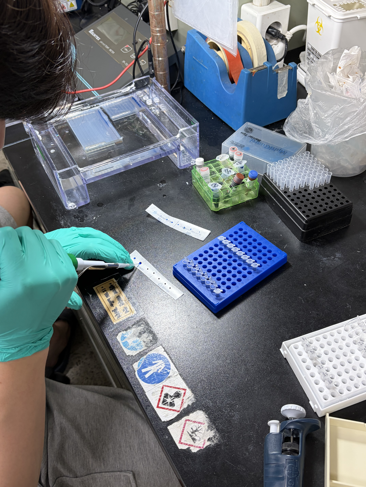
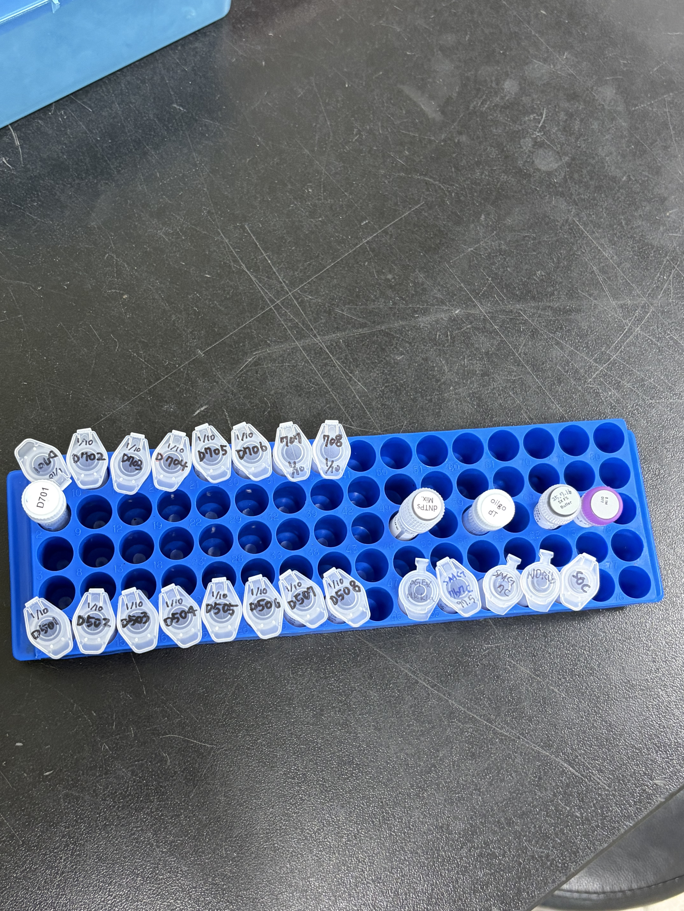
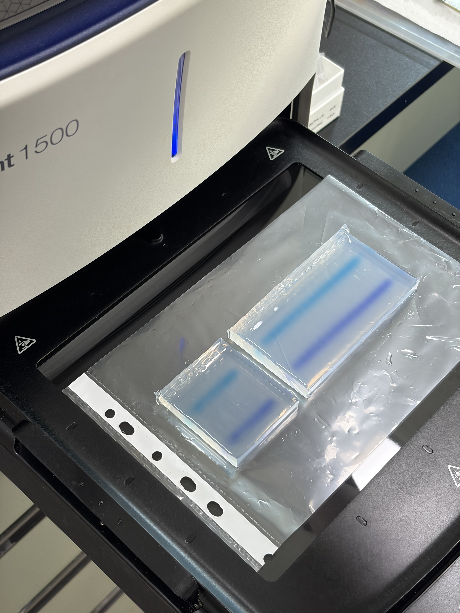
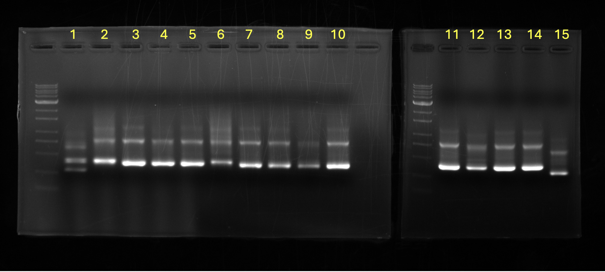

# Tomato DNA Deep Sequencing Log (2026-07-28)

### Background & Project Narrative

Following previous functional studies utilizing *S1UPF3a* knockout mutations in the *Solanum lycopersicum* cv. 'Money Maker' cultivar background, this experiment extends the investigation to the dwarf model cultivar *S. lycopersicum* cv. 'Micro-Tom'. To investigate the conserved regulatory mechanisms of *S1UPF3a* and isolate stable genetic variants, a cohort of 15 independent *S1UPF3a* knockout line candidates (designated Micro-Tom Samples 1–15) was generated and cultivated under controlled growth chamber conditions. High-throughput genomic DNA extraction and nested indexing PCR amplification were conducted to prepare targeted amplicons for deep sequencing analysis to characterize target site mutation patterns and edit efficiencies across all 15 lines.

## Reference Protocol

### 1. Genomic DNA Extraction (CTAB Method)

* **1)** Prepare sterile 1.5 mL microcentrifuge tubes (e-tubes) and collect the tomato leaf samples into each designated tube. 
* **2)** Add 1 mL of CTAB Buffer and 5 µL of $\beta$-Mercaptoethanol to each tube, then thoroughly grind the leaf tissue sample.
* **3)** Incubate the mixtures at 65°C for 1 hour using a digital dry bath or water bath. 
    * *Note:* To ensure uniform lysis, invert the tubes 10 times every 10 minutes throughout the incubation period.
* **4)** Vortex the incubated samples thoroughly.
* **5)** Centrifuge at 13,000 rpm for 10 minutes at 4°C. 
    * *Note:* Evaluate the pellet and phase separation state after the run; an additional 3 minutes of centrifugation may be applied if the sample state requires further clarification.
* **6)** Carefully transfer 700 µL of the cleared supernatant to a new 2.0 mL microcentrifuge tube.
* **7)** Add 700 µL of PCI (Phenol:Chloroform:Isoamyl Alcohol = 25:24:1) to the recovered supernatant to achieve a 1:1 volumetric ratio.
* **8)** Mix the solution completely by inverting the tube 10 times, then centrifuge at 13,000 rpm for 10 minutes at 4°C.
* **9)** Recover 500 µL of the upper aqueous supernatant and transfer it into a fresh 2.0 mL microcentrifuge tube.
* **10)** Add an equal volume (500 µL) of PCI directly to the transferred supernatant.
* **11)** Mix by inverting the tube 10 times, then centrifuge at 12,000 rpm for 10 minutes at 4°C.
* **12)** Transfer exactly 450 µL of the final clear aqueous supernatant into a new 1.5 mL e-tube.
* **13)** Add 450 µL of Isopropanol (Isopropyl Alcohol) to maintain a precise 1:1 ratio, and mix thoroughly by inverting.
* **14)** Incubate the final precipitation mixture at -20°C overnight to maximize DNA yield.

### 2. Ethanolic Wash and DNA Solubilization

* **1)** Centrifuge overnight precipitation mixtures at 13,000 rpm for 10 minutes at 4°C to pellet genomic DNA.
* **2)** Decant the supernatant, gently blot inverted tube rims on clean laboratory wipes, and add 1 mL of 70% ethanol.
* **3)** Centrifuge at 13,000 rpm for 1 minute at 4°C.
* **4)** Decant the supernatant, add a secondary wash of 1 mL of 70% ethanol, and centrifuge at 13,000 rpm for 1 minute at 4°C.
* **5)** Decant the wash solution and execute a dry spin at 13,000 rpm for 1 minute at 4°C to collect residual ethanol.
* **6)** Transfer tubes to a laminar flow clean bench and aspirate residual ethanol using a micropipette without contacting the DNA pellet.
* **7)** Air-dry open tubes at room temperature for 5 minutes to evaporate trace solvent.
* **8)** Reconstitute the genomic DNA pellet by adding 40 µL of sterile distilled water (DW) and store at 4°C.

### 3. PCR Reaction Mixture Setup

| Component | Specification / Note | Volume per Single Reaction (µL) |
| :--- | :--- | :--- |
| Genomic DNA Template | Target Extract | 2.00 |
| dNTP Mixture | dNTPs Mix | 2.00 |
| Reaction Buffer | 10X Prime Rxn Buffer | 2.00 |
| Forward Primer | Working Stock | 1.00 |
| Reverse Primer | Working Stock | 1.00 |
| Taq DNA Polymerase | Recombinant Taq | 0.25 |
| Sterile Water | 3' Distilled Water (3' DW) | 11.75 |
| **Total Reaction Volume** | — | **20.00** |

### 4. Thermal Cycling Conditions

| Stage | Step | Temperature | Time | Cycles |
| :--- | :--- | :--- | :--- | :--- |
| **Initial Denaturation** | Pre-incubation | 95°C | 5 min | 1 |
| **Amplification** | Denaturation | 95°C | 30 sec | 30 |
| | Annealing | 58°C | 1 min | |
| | Extension | 72°C | 30 sec | |
| **Final Extension** | Elongation | 72°C | 5 min | 1 |
| **Hold** | Infinite Hold | 12°C | $\infty$ | 1 |

### 5. 0.8% Agarose Gel Electrophoresis

* **1)** Dissolve 0.8 g of agarose powder in 100 mL of 1X TBE buffer (0.8% w/v) by microwave heating until completely clarified.
* **2)** Cool the molten agarose solution to ~50–55°C, supplement with 5 µL of nucleic acid gel stain, and swirl gently to mix without generating microbubbles.
* **3)** Pour the mixture into a gel casting tray, insert the comb, systematically pop any surface or well-adjacent bubbles using a pipette tip, and cover to polymerize at room temperature.
* **4)** Submerge the polymerized gel in an electrophoresis tank filled with 1X TBE buffer until the liquid level stands slightly above the gel surface.
* **5)** Mix DNA samples with 6X DNA Loading Dye at a 5:1 volumetric ratio (e.g., 10 µL sample + 2 µL dye for analytical runs; 20 µL sample + 4 µL dye for preparative runs).
* **6)** Load 5 µL of molecular DNA ladder into the leftmost reference well and the prepared sample-dye mixtures into designated sample wells.
* **7)** Execute electrophoretic separation at a constant 100 V for 40 minutes.

### 6. Silica-Column Agarose Gel Extraction and Elution

* **1)** Excise the target DNA band from the 0.8% agarose gel using a clean scalpel and transfer the gel slice into a sterile 1.5 mL microcentrifuge tube.
* **2)** Add 350 µL of Gel Dissolving Buffer (GDB) to the gel slice.
* **3)** Incubate at 50°C for 10 minutes in a dry bath to completely dissolve the gel matrix, inverting the tube every 2 minutes.
* **4)** Add 110 µL of Isopropanol ($\sim 1/3$ volume of GDB) to the dissolved gel mixture and mix thoroughly by inversion.
* **5)** Transfer the combined mixture ($\sim 500\,\mu\text{L}$) into a silica-membrane spin column fitted within a collection tube.
* **6)** Centrifuge at 13,000 rpm for 1 minute at 4°C, then discard the flow-through from the collection tube.
* **7)** Add 700 µL of Wash Buffer (NSW) to the spin column and centrifuge at 13,000 rpm for 1 minute at 4°C.
* **8)** Discard the flow-through and perform an additional dry spin at 13,000 rpm for 1 minute at 4°C to completely remove residual wash buffer.
* **9)** Air-dry the spin column membrane at room temperature for 5 minutes to evaporate trace ethanol.
* **10)** Transfer the spin column into a fresh 1.5 mL microcentrifuge tube, apply 12 µL of sterile distilled water (DW) directly onto the center of the membrane, and incubate at room temperature for 2 minutes.
* **11)** Centrifuge at 13,000 rpm for 1 minute at 4°C to elute the purified DNA, then quantify yield and purity using spectrophotometry (e.g., NanoDrop).

## Pre-Run Preparations

* **Consumables (Per Sample):** 
  * 2 × 1.5 mL microcentrifuge tubes (Lysis & Alcohol Precipitation)
  * 2 × 2.0 mL microcentrifuge tubes (PCI Organic Extractions)
  * 3 × PCR strip tubes (1st, 2nd, and 3rd Indexing Amplification)
  * 1 × Silica-membrane gel elution spin column assembly
* **Equipment:** 
  * Digital Dry Bath (Pre-heated to 65°C for Lysis; 50°C for Gel Solubilization)
  * Motorized handheld drill & autoclaved drill tips
  * Thermocycler
  * Electrophoresis system & gel casting assembly
  * iBright 1500 Imaging System
  * UV Transilluminator & protective glasses
  * NanoDrop Spectrophotometer

## Bench Execution Log & Deviations

### 1. Consumable Allocation, Autoclaving, and System Setup
* **Tube Inventory Allocation:** Prepared autoclaved 68 microcentrifuge tubes to accommodate the high-throughput processing of 15 tomato leaf samples across phase-separation steps:
  * 30 × 1.5 mL microcentrifuge tubes (15 for Step 2 initial collection/lysis; 15 for Step 5 final alcohol precipitation).
  * 30 × 2.0 mL microcentrifuge tubes (15 for Step 4 primary PCI extraction; 15 for Step 5 secondary PCI extraction).
* **Pre-Labeling & System Setup:** Sequentially labeled all tubes (1–15) across all processing stages. Pre-heated the digital dry bath and stabilized temperature at **65°C**.

### 2. Sample Dissection, Reduced-Volume Lysis, and Mechanical Homogenization
* **Sample Loading:** Excised fresh tomato leaf tissue and transferred designated tissue fragments into the primary set of 1.5 mL microcentrifuge tubes (Samples 1–15).
* **Initial Lysis Charge & Protocol Deviation (BME Omission & Splashing Control):** 
  * Aliquoted **200 µL of 2X CTAB Buffer** directly into each sample tube prior to grinding.
  * **Protocol Deviation (Omission of $\beta$-Mercaptoethanol):** $\beta$-Mercaptoethanol (BME) was entirely omitted from the initial lysis buffer mixture for this extraction run.
  * **Protocol Deviation (Volumetric Reduction):** Reduced initial CTAB volume to 200 µL (compared to the 300 µL used in prior runs or 1 mL in standard protocol) to minimize splashing, aerosol formation, and sample overflow during mechanical drilling.
* **Mechanical Homogenization:** Attached an autoclaved drill tip to the motorized handheld drill. Carefully pulverized leaf tissues inside each tube using gentle, short bursts to prevent friction-induced heating of the lysate.
* **Cross-Contamination Prevention:** Sanitized the drill tip with 70% ethanol wipes between every single sample processing step to eliminate nucleic acid carryover.
* **Secondary Buffer Replenishment:** Added the remaining **800 µL of 2X CTAB Buffer** to each tube immediately post-drilling to achieve the targeted final working volume of 1 mL, followed by thorough vortexing to fully homogenize the lysate slurry.

### 3. Thermal Lysis and Primary Centrifugation
* **Thermal Incubation:** Transferred all 15 sample tubes into the digital dry bath and incubated at **65°C for 1 hour**.
* **Intermittent Agitation Cycle:** Inverted all tubes manually 10 times every 10 minutes throughout the 1-hour incubation period to ensure effective surfactant penetration and uniform heat distribution.
* **Primary Centrifugation:** Loaded tubes into the centrifuge and cleared cellular debris at **13,000 RPM for 10 minutes at 4°C**.

### 4. Primary Supernatant Recovery and First Organic Phase Separation (PCI Extraction)
* **Supernatant Recovery:** Carefully aspirated **700 µL** of the cleared aqueous supernatant without disturbing the debris pellet and transferred it into the first set of 2.0 mL microcentrifuge tubes (Samples 1–15).
* **Reagent Loading:** Added **700 µL of PCI (Phenol:Chloroform:Isoamyl Alcohol = 25:24:1)** to achieve a 1:1 volumetric ratio.
* **Emulsification & Centrifugation:** Inverted the tubes 10 times to emulsify the aqueous and organic phases, then centrifuged at **13,000 RPM for 10 minutes at 4°C** for complete phase separation.

### 5. Secondary Organic Phase Extraction and Overnight Alcohol Precipitation
* **Secondary Organic Extraction (Standard Execution):** 
  * Aspirated **500 µL** of the upper clear aqueous supernatant and transferred it into the second set of 2.0 mL microcentrifuge tubes.
  * Added **500 µL of PCI** (1:1 volumetric ratio), inverted 10 times, and centrifuged at **12,000 RPM for 10 minutes at 4°C**.
* **Isopropanol Precipitation (Standard Execution):** 
  * Extracted exactly **450 µL** of the cleared aqueous supernatant into the final set of 1.5 mL microcentrifuge tubes.
  * Added **450 µL of Isopropanol** (1:1 volumetric ratio) and mixed thoroughly by repeated manual inversion.
* **Overnight Storage:** Transferred all 15 precipitation mixtures to a **-20°C freezer** for **overnight incubation** to maximize genomic DNA aggregation and recovery yield.

### 6. Primary DNA Pelleting and Initial Ethanolic Wash

* **Primary Pelleting:** Transferred the overnight -20°C precipitation mixtures directly to the centrifuge and spun at **13,000 RPM for 10 minutes at 4°C** to precipitate high-molecular-weight genomic DNA into solid pellets.
* **Supernatant Decantation & Blotting:** Decanted the supernatant into a designated liquid waste container and gently dabbed inverted tube rims on clean laboratory napkins to remove residual isopropanol without disturbing the DNA pellets.
* **Primary Wash Addition:** Re-suspended/washed each DNA pellet by aliquoting **1.0 mL of 70% ethanol** into all 15 microcentrifuge tubes.
* **Technical Control Optimization (Extended Wash Spin):**
  * *Standard Protocol Reference:* 13,000 RPM for 1 minute at 4°C.
  * *Action & Rationale:* Upon visual inspection following an initial brief spin, an additional **3-minute centrifugation step at 13,000 RPM (4°C)** was applied to guarantee maximum pellet compaction and prevent pellet loss during subsequent decantation steps.

### 7. Secondary Ethanolic Wash and Residual Solvent Clearance

* **Secondary Wash Execution:** 
  * Decanted the primary ethanol wash supernatant and blotted the tube rims on laboratory napkins.
  * Added a secondary wash volume of **1.0 mL of 70% ethanol** to each tube.
* **Protocol Deviation (Extended Secondary Wash Spin):** Centrifuged all 15 samples at **13,000 RPM for 3 minutes at 4°C**.
  * *Protocol Deviation:* Extended wash time to 3 minutes, deviating from the 1-minute spin specified in the reference protocol, to enhance pellet stabilization and salt desorption.
* **Secondary Supernatant Decantation:** Decanted the secondary wash solution and blotted the inverted tube rims against clean laboratory napkins.
* **Protocol Deviation (Extended Dry Spin for Residual Solvent Clearance):** Executed a residual solvent spin with the empty tubes at **13,000 RPM for 3 minutes at 4°C**.
  * *Protocol Deviation:* The dry spin duration was extended to 3 minutes (compared to the standard 1-minute reference protocol) to efficiently drive all residual wall-bound ethanol to the bottom of the tube for precise complete aspiration prior to drying.

### 8. Residual Solvent Aspiration, Air-Drying, and Reconstitution

* **Clean Bench Transfer:** Transferred all 15 sample tubes into a laminar flow clean bench to maintain a sterile, particulate-free environment during the final open-tube processing steps.
* **Residual Ethanol Aspiration:** 
  * Carefully aspirated trace ethanol droplets using a P100 micropipette adjusted to 100 µL.
  * **Pellet Protection Protocol:** Strictly avoided touching the visible white genomic DNA pellets with the pipette tip. For samples where pellets were transparent or ambiguous, the centrifugal slope (outer tube wall angle) was strictly avoided during aspiration to prevent accidental sample loss.
* **Ambient Air Drying:** Opened all tube caps and air-dried the pellets at room temperature (RT) for exactly **5 minutes** to evaporate residual ethanol while avoiding over-drying, which can inhibit re-solubilization.
* **Reconstitution & Short-Term Storage:** 
  * Aliquoted **40 µL of Distilled Water (DW)** into each tube to resuspend the purified genomic DNA.
  * Closed and sealed all tubes securely before transferring the final reconstituted samples to **4°C storage** for downstream concentration and quality control analysis.

### 9. PCR Strip Tube Preparation and Master Mix Assembly

* **PCR Vessel Allocation & Labeling:** Arranged PCR strip tubes to accommodate 15 reactions, sequentially labeling tube caps from 1 to 15.
* **Bulk Master Mix Preparation:** Assembled a centralized master mix ($N = 17$ reactions) in a sterile 1.5 mL microcentrifuge tube labeled **"1st PCR mixture"**:
  * $34.00\,\mu\text{L}$ dNTP Mix ($2.00\,\mu\text{L}/\text{sample}$)
  * $34.00\,\mu\text{L}$ 10X Reaction Buffer ($2.00\,\mu\text{L}/\text{sample}$)
  * $17.00\,\mu\text{L}$ Forward Primer (UPF 3-1 1set F) ($1.00\,\mu\text{L}/\text{sample}$)
  * $17.00\,\mu\text{L}$ Reverse Primer (UPF 3-1 1set R) ($1.00\,\mu\text{L}/\text{sample}$)
  * $199.75\,\mu\text{L}$ 3' Distilled Water ($11.75\,\mu\text{L}/\text{sample}$)
* **Enzyme Addition & Homogenization:**
  * Thoroughly vortexed the preliminary buffer-primer mixture.
  * Retrieved Taq DNA Polymerase from $-20^\circ\text{C}$ storage, immediately transferring it to a cold block/icebox.
  * Added $4.25\,\mu\text{L}$ Taq Polymerase ($0.25\,\mu\text{L}/\text{sample}$) to the tube.
  * Mixed gently by repeated pipetting with a P100 micropipette to fully homogenize the enzyme without introducing air bubbles.
  

### 10. Direct-Wall Template Loading Technique and Thermal Cycling Execution

* **Side-Wall Template Pre-Positioning (Visual Tracking Protocol):** 
  * Aliquoted $2.00\,\mu\text{L}$ of genomic DNA template ($4^\circ\text{C}$ storage, Samples 1–15) onto a standardized, upper position on the inner side wall of each PCR tube.
  * *Rationale:* Wall-depositing provided immediate visual verification of completed template transfers across all 15 tubes, eliminating risk of skipped wells or double-dosing.
* **Master Mix Dispensing & Wall-Flush Consolidation:** 
  * Dispensed $18.00\,\mu\text{L}$ of the "1st PCR mixture" directly onto the wall-bound DNA droplet in each tube.
  * *Action & Rationale:* Direct liquid contact washed the template droplet down to the bottom of the tube, giving clear visual confirmation of combined reagents per reaction.
* **Centrifugal Consolidation & Thermocycling:** 
  * Briefly spun down the PCR strips in a benchtop centrifuge to eliminate air bubbles and collect all liquid at the tube apex ($20.00\,\mu\text{L}$ total reaction volume).
  * Loaded reaction strips into the thermocycler, applied parameters specified in **Section 4 (Thermal Cycling Conditions)**, and executed the program.

### 11. 0.8% Agarose Gel Casting and Matrix Preparation

* **Reagent Quantitation & Reconstitution:** 
  * Weighed $0.80\,\text{g}$ of agarose powder on a weighing paper using an analytical balance.
  * Transferred the powder into a dedicated agarose media bottle and added $100\,\text{mL}$ of 1X TBE buffer to yield a 0.8% (w/v) agarose solution.
* **Thermal Dissolution:** Microwaved the solution for approximately 4 minutes, monitoring closely to ensure vigorous boiling and complete optical clarification (dissolution) of the agarose matrix.
* **Controlled Cooling & Nucleic Acid Stain Addition:** 
  * Allowed the molten agarose to cool at room temperature for $\ge 15$ minutes until safe to handle (approx. $50\text{--}55^\circ\text{C}$).
  * Aliquoted $5.00\,\mu\text{L}$ of DNA gel nucleic acid staining dye directly into the bottle and swirled thoroughly to achieve homogeneous dye distribution without generating microbubbles.
* **Gel Casting, Comb Placement, and Bubble Elimination:** 
  * Poured the stained agarose solution into the gel casting tray assembly and positioned the well comb.
  * Systematically popped all surface and well-adjacent air bubbles using a clean micropipette tip to prevent optical anomalies during imaging or band distortion during electrophoresis.
* **Contamination Control & Solidification:** Covered the gel casting tray with a clean laboratory napkin to shield the matrix from ambient dust and airborne particulates, allowing it to polymerize completely at room temperature.

### 12. Electrophoresis Chamber Setup and Buffer Submersion

* **Chamber Assembly:** Filled the electrophoresis chamber with 1X TBE buffer.
* **Level Calibration:** Adjusted the buffer volume to ensure the gel was fully submerged, with the buffer level standing slightly above the matrix surface to maintain uniform electrical field distribution and prevent gel dehydration during the run.

### 13. Sample Preparation and Well Loading

* **Hydrophobic Mixing:** Utilized a Parafilm sheet as a clean, hydrophobic surface for sample preparation.
* **Loading Dye Integration:** Aliquoted 2.00 µL of 6X DNA Loading Dye onto the Parafilm and mixed thoroughly with 10.00 µL of the respective DNA sample (total volume: 12.00 µL).
* **Well Aliquoting:** Carefully loaded the 12.00 µL of mixed sample into the gel wells.
* **Molecular Weight Marker:** Aliquoted 5.00 µL of the DNA Ladder into the leftmost well of each gel run to establish a standard sizing reference for fragment analysis.

### 14. Electrophoretic Separation

* **Parameters:** Applied a constant voltage of **100V**.
* **Run Duration:** Executed the electrophoretic migration for **40 minutes** to achieve sufficient separation of the PCR products within the agarose matrix.

### 15. Secondary (Nested) PCR Master Mix Assembly and Direct-Wall Template Loading

* **PCR Strip Tube Allocation:** Prepared a secondary set of PCR strip tubes, sequentially labeling caps 1 through 15 to correspond with primary amplicon IDs.
* **Bulk Secondary Master Mix Assembly:** Assembled the nested amplification master mix ($N = 17$ reactions) in a sterile 1.5 mL microcentrifuge tube labeled **"2nd PCR mixture"**:
  * $34.00\,\mu\text{L}$ dNTP Mix ($2.00\,\mu\text{L}/\text{sample}$)
  * $34.00\,\mu\text{L}$ 10X Reaction Buffer ($2.00\,\mu\text{L}/\text{sample}$)
  * $17.00\,\mu\text{L}$ Secondary Forward Primer (UPF 3-1 2nd-1 F) ($1.00\,\mu\text{L}/\text{sample}$)
  * $17.00\,\mu\text{L}$ Secondary Reverse Primer (UPF 3-1 2nd-1 R) ($1.00\,\mu\text{L}/\text{sample}$)
  * $199.75\,\mu\text{L}$ 3' Distilled Water ($11.75\,\mu\text{L}/\text{sample}$)
* **Enzyme Addition:** Added $4.25\,\mu\text{L}$ Taq DNA Polymerase ($0.25\,\mu\text{L}/\text{sample}$) kept on ice, followed by gentle micropipette mixing.
* **Template Loading & Reaction Consolidation:** 
  * Aliquoted $2.00\,\mu\text{L}$ of the unpurified **1st PCR product** (Samples 1–15) directly onto the upper side wall of each secondary PCR tube for immediate transfer verification.
  * Dispensed $18.00\,\mu\text{L}$ of the "2nd PCR mixture" onto the wall-bound primary amplicon, flushing the template down to the tube apex.
* **Thermocycling:** Spun down reaction strips briefly and loaded them into the thermocycler using the identical parameters established in **Section 4 (Thermal Cycling Conditions)**.

### 16. Secondary Amplicon Electrophoretic Resolution and Quality Control

* **0.8% Agarose Matrix Casting:** Dissolved $0.80\,\text{g}$ agarose in $100\,\text{mL}$ 1X TBE buffer by boiling, cooled to $\sim 50\text{--}55^\circ\text{C}$, supplemented with $5.00\,\mu\text{L}$ nucleic acid gel stain, and cast with comb in place under a protective napkin shield.
* **Chamber Preparation:** Submerged the cast gel into the electrophoresis tank filled with 1X TBE buffer to a level slightly above the gel surface.
* **Sample Preparation & Well Loading:** 
  * Mixed $2.00\,\mu\text{L}$ of 6X DNA Loading Dye with $10.00\,\mu\text{L}$ of each **2nd PCR product** on Parafilm.
  * Loaded $12.00\,\mu\text{L}$ of each mixture into designated wells (Samples 1–15).
  * Loaded $5.00\,\mu\text{L}$ of molecular DNA ladder in the leftmost reference well.
* **Electrophoresis:** Executed electrophoretic run at a constant **100V for 40 minutes** to resolve target nested PCR amplicons.

### 17. Tertiary (Indexing) PCR Core Master Mix Assembly (Primer-Free)

* **Primer-Free Master Mix Assembly:** Assembled a core reaction master mix ($N = 17$ reactions) lacking indexing primers in a sterile 1.5 mL microcentrifuge tube:
  * $34.00\,\mu\text{L}$ dNTP Mix ($2.00\,\mu\text{L}/\text{sample}$)
  * $34.00\,\mu\text{L}$ 10X Reaction Buffer ($2.00\,\mu\text{L}/\text{sample}$)
  * $199.75\,\mu\text{L}$ 3' Distilled Water ($11.75\,\mu\text{L}/\text{sample}$)
* **Enzyme Integration:** 
  * Vortexed the water-buffer-dNTP mixture thoroughly.
  * Added $4.25\,\mu\text{L}$ Taq DNA Polymerase ($0.25\,\mu\text{L}/\text{sample}$) kept on ice.
  * Homogenized gently by micropipetting to prevent enzyme shear.

### 18. Dual-Index Combinatorial Grid and Spatial Wall-Isolation Loading

#### Indexing Combinatorial Matrix Layout
| Row Index / Col Index | Col 1 (D501) | Col 2 (D502) | Col 3 (D503) | Col 4 (D504) | Col 5 (D505) | Col 6 (D506) | Col 7 (D507) | Col 8 (D508) |
| :--- | :--- | :--- | :--- | :--- | :--- | :--- | :--- | :--- |
| **Row 1 (D701)** | Sample 1 | Sample 2 | Sample 3 | Sample 4 | Sample 5 | Sample 6 | Sample 7 | Sample 8 |
| **Row 2 (D702)** | Sample 9 | Sample 10 | Sample 11 | Sample 12 | Sample 13 | Sample 14 | Sample 15 | *Empty (2,8)* |

* **Template Loading:** Aliquoted $2.00\,\mu\text{L}$ of unpurified **2nd PCR product** (Samples 1–15) onto the upper inner side wall of each designated strip tube.
* **Master Mix Dispensing:** Aliquoted $16.00\,\mu\text{L}$ of the primer-free master mix into each reaction tube.
* **Spatial Primer Isolation Protocol ($0^\circ / 180^\circ$ Wall Loading):**
  * **Row Index Primer (D70x):** Aliquoted $1.00\,\mu\text{L}$ onto the upper inner side wall at the **$0^\circ$ position**.
  * **Column Index Primer (D50y):** Aliquoted $1.00\,\mu\text{L}$ onto the opposing inner side wall at the **$180^\circ$ position**.
  * *Rationale:* Physical spatial separation of row and column indexing primers on opposite tube walls prevents premature non-specific hybridization and primer-dimer formation prior to initial thermal denaturation.
* **Reaction Consolidation & Thermocycling:** Softly spun down the reaction strips in a benchtop microcentrifuge to coalesce all wall-bound components ($20.00\,\mu\text{L}$ final volume) and initiated thermal cycling under standard conditions.

### 19. Full-Volume Preparative Gel Electrophoresis for Downstream Extraction

* **Preparative Sample Preparation:** Combined the entire volume ($\sim20.00\,\mu\text{L}$) of each tertiary indexing PCR product with $4.00\,\mu\text{L}$ of 6X DNA Loading Dye (total volume: $24.00\,\mu\text{L}$).
* **Preparative Well Loading:** Quantitatively loaded the full $24.00\,\mu\text{L}$ volume into the 0.8% agarose gel wells to maximize target amplicon recovery yield for downstream gel isolation and elution.
* **Electrophoretic Resolution:** Executed electrophoresis at **100V for 40 minutes** in 1X TBE buffer to cleanly resolve indexed target bands prior to gel excision.

### 20. Gel Imaging, Quality Control Screening, and Target Band Excision

* **Gel Imaging & Analytical QC Screening:** 
  * Captured fluorescence gel images across all three PCR stages using the iBright 1500 Imaging System.
  * Visually inspected the 1st and 2nd analytical PCR gel runs to confirm clean, specific target amplification and the absence of off-target products or non-specific primer-dimers prior to downstream preparative processing.
  
* **UV Transillumination & Safety Protocol:** Upon verifying successful preliminary amplicon profiles, activated the UV transilluminator and equipped appropriate UV-protective eyewear.
* **Preparative Target Band Excision:** Meticulously excised the exact target indexed DNA bands from the 3rd preparative PCR gel using a clean scalpel, minimizing excess agarose matrix around the bands.

* **Sample Fraction Isolation:** Transferred each excised gel slice into an individual, pre-labeled 1.5 mL microcentrifuge tube (Samples 1–15) for immediate silica-column extraction.

### 21. Gel Solubilization, Binding Preparation, and Silica Matrix Capture

* **Solubilization Buffer Addition:** Aliquoted $300\,\mu\text{L}$ of Gel Dissolving Buffer (GDB) into each 1.5 mL tube containing the excised gel slices (Samples 1–15).
  * *Volumetric Adjustment:* Used $300\,\mu\text{L}$ GDB (adjusted for excised gel mass relative to the $350\,\mu\text{L}$ baseline reference).
* **Thermal Dissolution & Agitation:** Transferred tubes to a pre-heated $50^\circ\text{C}$ water bath for 10 minutes to achieve complete dissolution of the agarose matrix. Inverted tubes manually every 2 minutes throughout thermal incubation to promote uniform heat transfer and chemical degradation.
* **Isopropanol Phase Adjustment:** Added $100\,\mu\text{L}$ of Isopropanol (IPA; strictly maintaining the $1/3$ volumetric ratio of GDB) to each dissolved lysate, mixing thoroughly by inversion to facilitate selective nucleic acid binding.
* **Column Charging & Centrifugal Binding:** Transferred the complete mixture ($\sim400\,\mu\text{L}$) into individual silica-membrane spin columns seated within collection tubes. Centrifuged at **13,000 RPM for 1 minute at 4°C** and discarded the flow-through.

### 22. Desalting Wash, Matrix Evacuation, and Precise Target Elution

* **Desalting Wash (NSW):** Added $700\,\mu\text{L}$ of Wash Buffer (NSW) to each silica spin column and centrifuged at **13,000 RPM for 1 minute at 4°C**, followed by flow-through decantation.
* **Dry Spin Solvent Evacuation:** Spun the empty column assemblies at **13,000 RPM for 1 minute at 4°C** to force out residual membrane-bound wash buffer.
* **Ambient Air Drying:** Uncapped spin columns and air-dried the membranes at room temperature for **5 minutes** to fully evaporate trace ethanolic contaminants.
* **Targeted Elution Buffer Deposition:** 
  * Transferred silica columns into fresh, pre-labeled 1.5 mL microcentrifuge tubes.
  * Aliquoted $12\,\mu\text{L}$ of Elution Buffer directly onto the **physical center** of each silica membrane, exercising extreme caution to avoid direct tip contact with the matrix surface.
  * *Rationale:* Centric deposition ensures complete rehydration of the localized DNA binding area for maximum recovery efficiency in low-volume elutions.
* **Incubation & Elute Recovery:** Allowed columns to stand at room temperature for **2 minutes** for complete nucleic acid solubilization, then centrifuged at **13,000 RPM for 1 minute at 4°C** to collect the purified amplicon library.
* **Spectrophotometric Quality Control:** Quantified total concentration ($\text{ng}/\mu\text{L}$) and evaluated purity ratios ($A_{260}/A_{280}$ and $A_{260}/A_{230}$) for all 15 purified samples using a NanoDrop spectrophotometer prior to sequencing downstream.

### 23. Post-Elution Spectrophotometric Quantification and Quality Control

#### NanoDrop Spectrophotometric Data (15 Samples)

| Sample ID | Concentration ($\text{ng}/\mu\text{L}$) | $A_{260}$ | $A_{280}$ | $A_{260}/A_{280}$ | $A_{260}/A_{230}$ | Quality Control Status / Observations |
| :--- | :--- | :--- | :--- | :--- | :--- | :--- |
| **3rdPCR_1** | 3.5 *(3.2)* | 0.070 | 0.028 | 2.45 *(3.19)* | 0.08 *(0.08)* | Low yield; near detection limit (Re-measured) |
| **3rdPCR_2** | 14.6 | 0.292 | 0.147 | 1.98 | 0.11 | Pure protein ratio; residual GDB/salt trace |
| **3rdPCR_3** | 16.2 | 0.323 | 0.171 | 1.89 | 0.22 | Optimal $A_{260}/A_{280}$ purity |
| **3rdPCR_4** | 32.6 | 0.651 | 0.343 | 1.90 | 0.84 | Moderate yield; acceptable purity profile |
| **3rdPCR_5** | 56.5 | 1.130 | 0.624 | 1.81 | 0.46 | High yield; clean nucleic acid peak |
| **3rdPCR_6** | 14.3 | 0.286 | 0.148 | 1.92 | 0.80 | Low yield; pure protein ratio |
| **3rdPCR_7** | 24.9 | 0.498 | 0.267 | 1.86 | 1.79 | High purity; optimal $A_{260}/A_{230}$ ratio |
| **3rdPCR_8** | 20.1 | 0.402 | 0.212 | 1.89 | 0.05 | Moderate yield; low $A_{260}/A_{230}$ ratio |
| **3rdPCR_9** | 15.3 | 0.307 | 0.164 | 1.87 | 1.01 | Moderate purity profile |
| **3rdPCR_10** | 26.0 | 0.520 | 0.231 | 2.25 | 0.03 | Slight $A_{260}/A_{280}$ elevation |
| **3rdPCR_11** | 60.3 | 1.206 | 0.600 | 2.01 | 0.07 | High yield library amplicon |
| **3rdPCR_12** | 51.0 | 1.020 | 0.531 | 1.92 | 0.06 | High yield library amplicon |
| **3rdPCR_13** | 54.1 | 1.083 | 0.552 | 1.96 | 0.06 | High yield library amplicon |
| **3rdPCR_14** | 106.2 | 2.125 | 1.068 | 1.99 | 0.12 | Maximum yield recovery |
| **3rdPCR_15** | 68.4 | 1.369 | 0.746 | 1.84 | 0.49 | High yield library amplicon |

* **Technical Data Evaluation:**
  * **Yield Range:** $3.5\text{--}106.2\,\text{ng}/\mu\text{L}$ (Average yield: $\sim39.2\,\text{ng}/\mu\text{L}$).
  * **$A_{260}/A_{280}$ Purity:** The majority of amplicons fell strictly within the target range ($1.80\text{--}2.00$), indicating clean removal of cellular protein fractions.
  * **$A_{260}/A_{230}$ Ratio Deviations:** Suppressed $A_{260}/A_{230}$ ratios across several low-concentration elutes indicate minor residual chaotropic salt carryover (GDB buffer) or trace ethanol, typical of low-volume silica column extractions prior to pooling/bead clean-up.