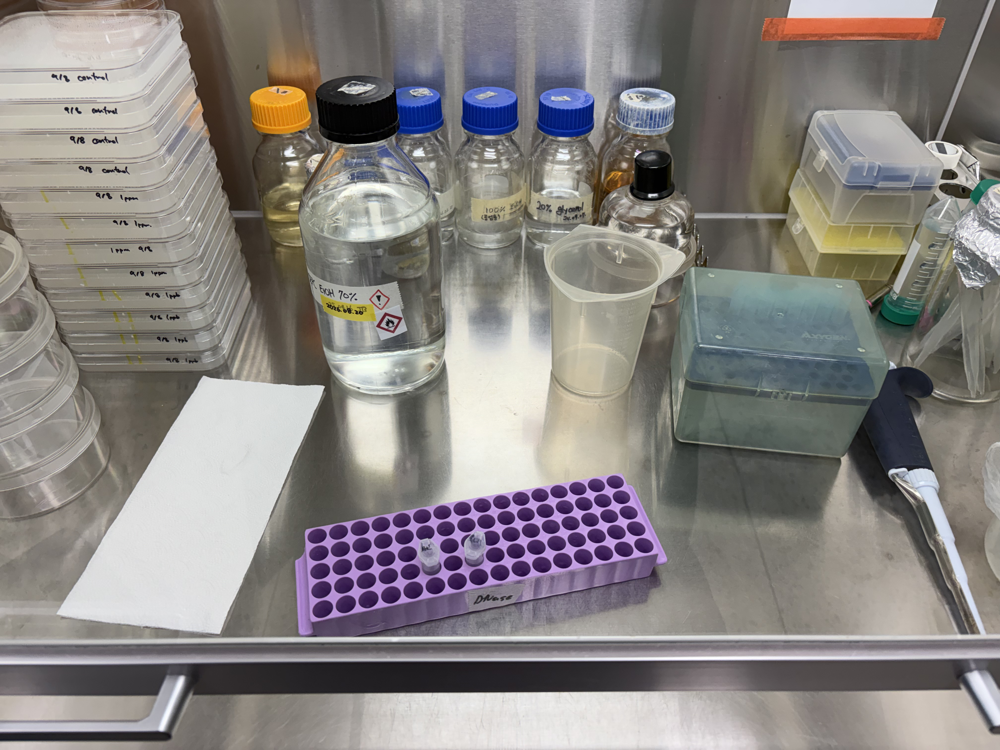
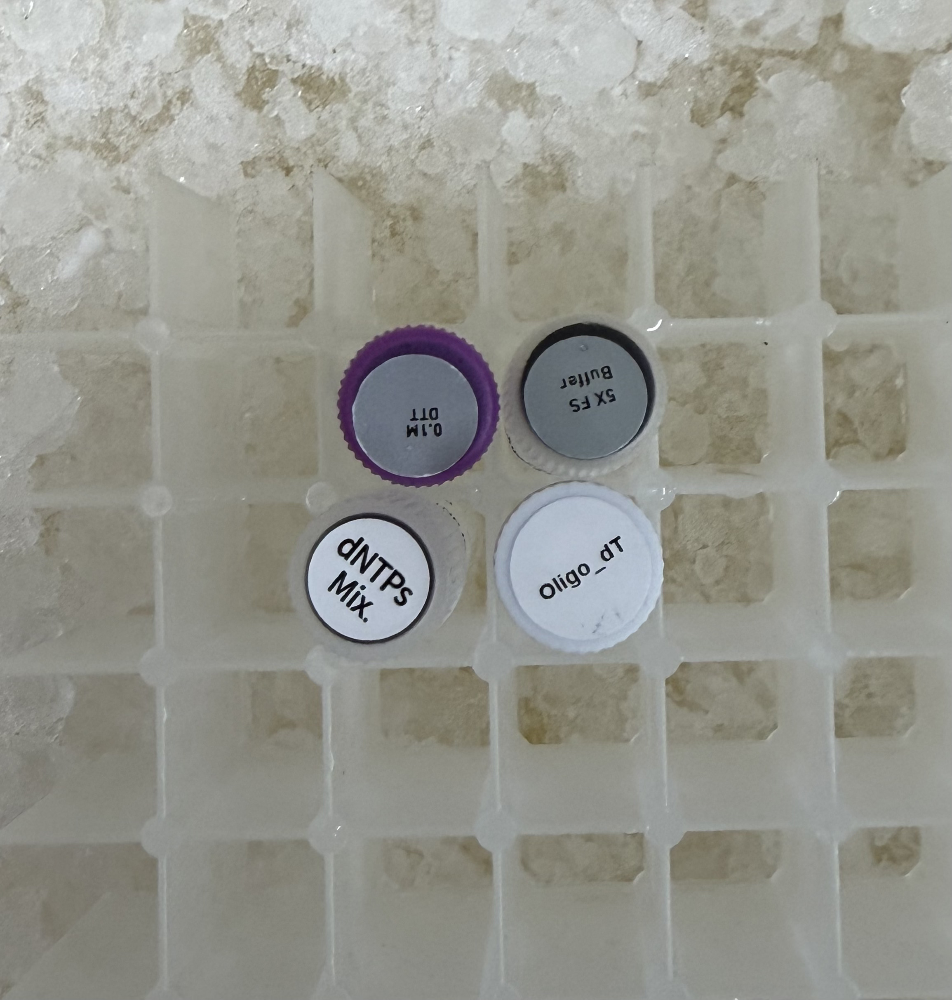
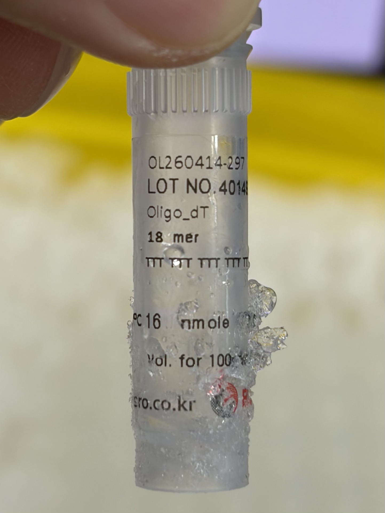
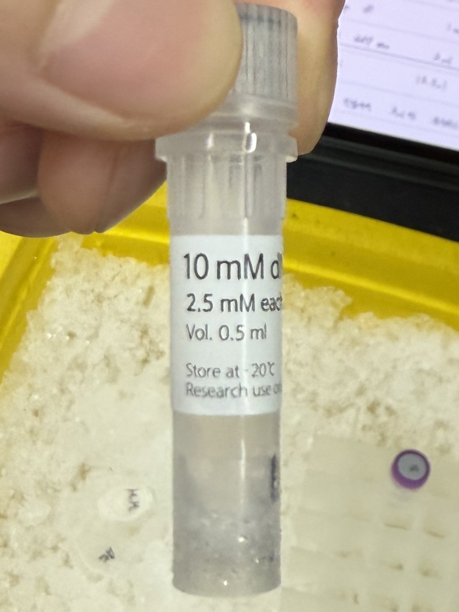
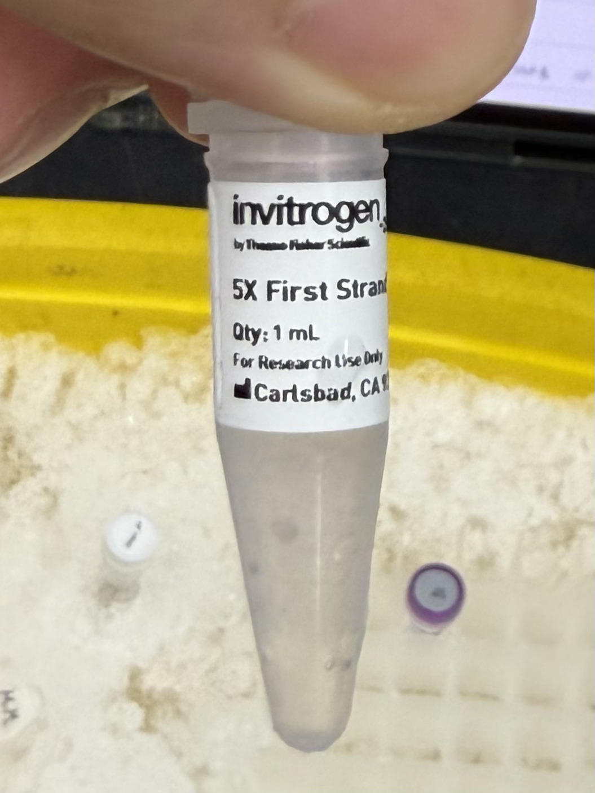
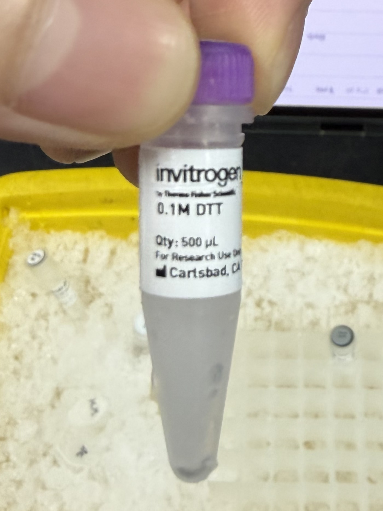
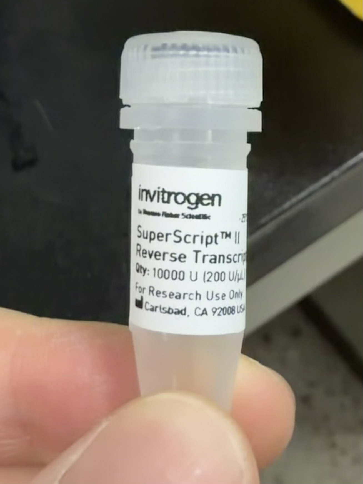
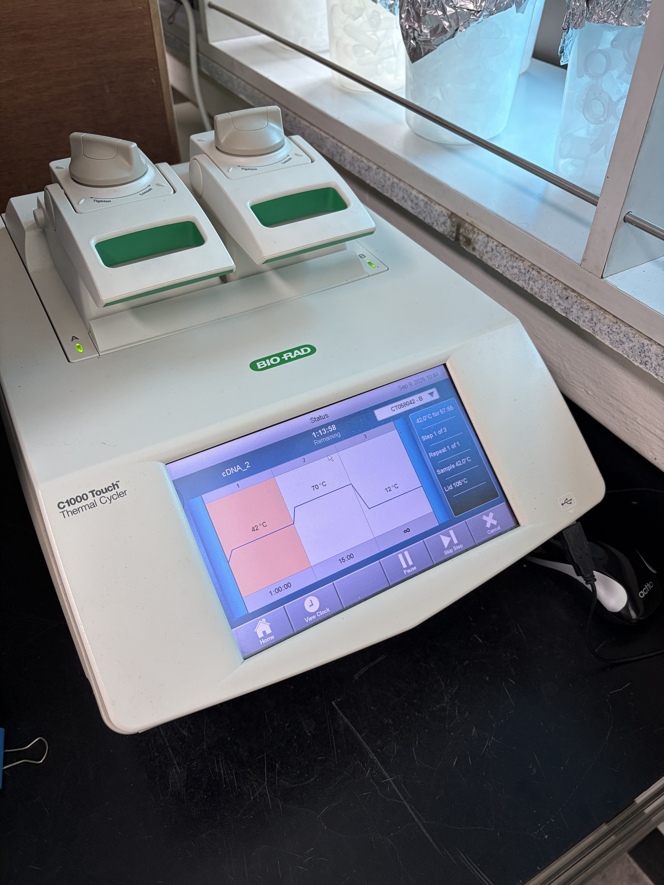
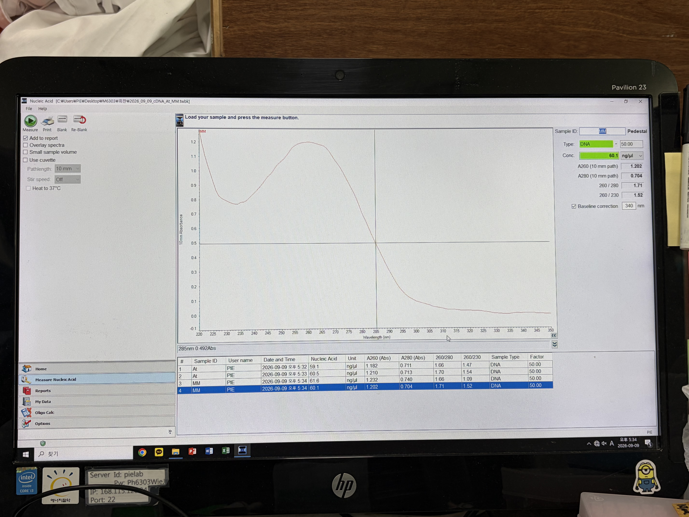

# cDNA Synthesis Log (2026-09-09)

### Background & Project Narrative

#### Mechanistic Context: AS-NMD Surveillance as an Immune Rheostat
In plant immune regulation, *SNC1* (Suppressor of *npr1-1*, Constitutive 1) functions as an endogenous substrate of the nonsense-mediated mRNA decay (NMD) pathway rather than an upstream regulator. While the genomic locus remains wild-type and free of nonsense mutations, *SNC1* pre-mRNA undergoes extensive alternative splicing (AS). Regulated splicing events—such as intron retention or alternative splice site selection—shift the reading frame to introduce premature termination codons (PTCs). 

Under physiological conditions, plant cells exploit alternative splicing-coupled nonsense-mediated decay (AS-NMD) as an essential post-transcriptional rheostat:
* The core NMD surveillance machinery (including UPF1, UPF2, UPF3, and SMG7) continuously scans and targets PTC-bearing *SNC1* isoforms for rapid cytoplasmic degradation.
* This targeted transcript turnover restricts toxic intracellular accumulation of nucleotide-binding leucine-rich repeat (NLR) receptors, preventing spontaneous autoimmunity and systemic necrosis.

#### cDNA-Derived Reporter Architecture & Intrinsic Decay Determinants
To quantitatively benchmark decay mechanics, this investigation shifts from tracking real-time splicing kinetics to assaying the intrinsic NMD-inducing capacity of predetermined sequences via an ectopic cDNA expression platform. Because the cloned cDNA inserts are pre-spliced and devoid of introns, cellular splicing choices are completely bypassed.

The cloned candidate sequences (including *SNC1* and two complementary test candidates) function strictly as mRNA stability determinants:
* The experimental system tests whether specific structural features—such as invariant PTCs, extended 3′ UTRs, or localized destabilizing elements—are sufficient to recruit the cytoplasmic NMD machinery.
* Transcript turnover is monitored purely as a function of mRNA sequence architecture rather than dynamic exon assembly or junction complex formation.

#### RUBY-Coupled Metabolic Readout
Decay kinetics are coupled directly to a non-destructive visual metabolic reporter via a downstream polycistronic **RUBY** cassette, which converts endogenous L-tyrosine into the visually distinct pigment betalain. Phenotypic color intensity correlates inversely with NMD efficacy:
* **High NMD Efficiency (Decay Triggered):** Efficient surveillance recruitment drives rapid transcript degradation. The drastically shortened transcript half-life precludes translation of the RUBY biosynthetic enzymes, leaving transformed tissue green (pigment-null).
* **Low NMD Efficiency / Decay Evasion:** Stable cytoplasmic transcripts undergo robust translation, driving enzymatic production of betalain and resulting in pronounced macroscopic red pigmentation.

#### Cross-Species Evolutionary Scope
Candidate sequences were prepared from both *Arabidopsis thaliana* ecotype Columbia-0 (*A. thaliana* Col-0, `At`) and tomato (*Solanum lycopersicum* cv. Moneymaker, `MM`). This comparative model tests whether NLR-derived surveillance triggers and structural decay signals maintain functional cross-species compatibility across Brassicaceae and Solanaceae, identifying conserved sequence elements for synthetic post-transcriptional circuit design.

### Experimental Design
First-strand cDNA synthesis was performed using post-DNase treated Total RNA samples to generate stable templates for cloning candidate decay determinants into the RUBY reporter cassette.

**Sample Grid & Batch Configuration:**
The reverse transcription batch consists of 2 unique sample groups processed in parallel:
* **At Group:** *Arabidopsis thaliana* ecotype Col-0 Total RNA (`At`)
* **MM Group:** *Solanum lycopersicum* cv. Moneymaker Total RNA (`MM`)

---

## Reference Protocol

### 1. DNase Treatment

#### Reaction Mixture

| Component | Volume |
| :--- | :---: |
| 10X Reaction Buffer (Salt) | 3 µL |
| 10X TURBO DNase | 2 µL |
| Total RNA | 25 µL |
| **Total Volume** | **30 µL** |

#### Protocol

* **1)** Mix gently by pipetting, then incubate at 37°C for 30 minutes to digest residual genomic DNA.
* **2)** Add 270 µL of DEPC-treated Distilled Water (D.W.) to bring the total volume up to 300 µL.
* **3)** Add 300 µL of PCI (Phenol:Chloroform:Isoamyl Alcohol = 25:24:1) (equal to the total aqueous volume) and mix thoroughly by inverting.
* **4)** Centrifuge at 13,000 rpm for 15 minutes at 4°C to achieve phase separation.
* **5)** Transfer 200 µL of the aqueous supernatant into a new 1.5 mL microcentrifuge tube, then add the following precipitation reagents:

| Precipitation Component | Volume |
| :--- | :---: |
| 3 M Sodium Acetate (pH 5.2, RNA grade) | 20 µL |
| Glycogen (10 mg/mL) | 1 µL |
| Absolute Ethanol (100%) | 500 µL |

* Mix thoroughly by inverting and incubate at -20°C overnight for complete nucleic acid precipitation.
* **6)** Centrifuge at 13,000 rpm for 15 minutes at 4°C to pellet the precipitated RNA.
* **7)** Carefully aspirate and discard the supernatant without disturbing the pellet, add 1 mL of 70% DEPC-treated ethanol, and centrifuge for 1 minute.
* **8)** Repeat step 7 (the ethanol wash step) once more to ensure thorough desaltification.
* **9)** Air-dry the ethanol-washed RNA pellet completely until evaporation is achieved, resuspend in 50 µL of DEPC-treated Distilled Water (D.W.), and store at -20°C.

### 2. cDNA Synthesis

#### Protocol

* **1)** Maintain DNase-treated Total RNA template and Oligo dT stock solutions chilled on ice.
* **2)** Prepare the annealing master cocktail containing Oligo dT and 10 mM dNTP mix. Aliquot 3.0 µL of the cocktail and 10.5 µL of Total RNA template into fresh PCR tubes:

**Step 1: Primer Annealing Reaction Mixture**

| Component | Volume |
| :--- | :---: |
| Total RNA (DNase-treated) | 10.5 µL |
| Oligo dT | 1.0 µL |
| 10 mM dNTP Mix | 2.0 µL |
| **Total Annealing Volume** | **13.5 µL** |

* **3)** Incubate in a thermal cycler at 65°C for 5 minutes to denature secondary structures and anneal primers, then immediately transfer the reaction tubes to ice.
* **4)** Assemble the Step 2 reverse transcription master mix on ice, incorporating RTase immediately prior to dispensing. Aliquot 6.5 µL of the master mix into each annealed sample tube to reach a total working volume of 20.0 µL:

**Step 2: Reverse Transcription Master Mix**

| Component | Volume |
| :--- | :---: |
| 5X First-Strand Buffer | 4.0 µL |
| 0.1 M DTT | 2.0 µL |
| RTase* | 0.5 µL |
| **Cocktail Volume Added** | **6.5 µL** |

*\*Note: Incorporate RTase into the cocktail immediately before aliquoting.*

* **5)** Execute the reverse transcription and enzyme inactivation program in the thermal cycler:
  * **cDNA Synthesis:** 42°C for 60 minutes
  * **Enzyme Inactivation:** 70°C for 15 minutes
* **6)** Dilute the synthesized cDNA reaction by adding 180 µL of sterile Distilled Water ($3^\circ\text{ DW}$) to each tube (final volume: 200 µL). Quantify nucleic acid concentration and purity using a NanoDrop spectrophotometer, and store aliquots at -20°C.

---

## Pre-Run Preparations

* **Consumables (Per Sample / Batch):** 
  * 1 × 1.5 mL microcentrifuge tube (Post-DNase RNA pellet recovery & resuspension)
  * 1 × 0.2 mL thin-wall PCR tube (Annealing & first-strand cDNA synthesis)
  * 2 × 1.5 mL sterile microcentrifuge tubes per batch (`Step 1` and `Step 2` Master Mix assembly)
* **Equipment:** 
  * Laminar flow clean bench
  * Bio-Rad C1000 Touch Thermal Cycler
  * Thermo Scientific NanoDrop 2000c Spectrophotometer
  * Vortex mixer
  * Ice bucket
* **Disinfection & Solvents:** 
  * 70% DEPC-treated Ethanol (RNA pellet desalting wash)
  * DEPC-treated Distilled Water (D.W., RNA resuspension)
  * Sterile Distilled Water ($3^\circ\text{ DW}$, cDNA dilution and optical blanking)

---

## Bench Execution Log & Deviations

1. **Post-Overnight Precipitation Pelleting and Clean Bench Setup**
   * Retrieved the post-DNase precipitation tubes from overnight storage at -20°C.
   * Centrifuged the samples at **13,000 RPM for 15 minutes at 4°C** to firmly pellet the precipitated RNA.
   * Sterilized the laminar flow clean bench work surface by thoroughly wiping it down with 70% Ethanol and laboratory wipes.
   * Transferred the centrifuged tubes directly into the decontaminated clean bench.
   * Carefully decanted the supernatant into the designated organic liquid waste container, taking care not to dislodge the pellet, and gently dabbed the inverted tube rims onto sterile laboratory wipes to blot residual liquid.
   

2. **Sequential 70% Ethanol Washes (Dual Desalting)**
   * Dispensed **1.0 mL of 70% DEPC-treated ethanol** into each tube to wash the RNA pellet and desalt the precipitation matrix.
   * Centrifuged the samples at **13,000 RPM for 1 minute at 4°C**.
   * Transferred tubes back into the clean bench, decanted the ethanol supernatant smoothly into the waste receptacle, and dabbed the rims onto laboratory wipes.
   * Repeated the wash sequence: added a second **1.0 mL** aliquot of 70% DEPC-treated ethanol, centrifuged at **13,000 RPM for 1 minute at 4°C**, decanted, and dabbed dry.

3. **Residual Ethanol Technical Spin and Micro-Aspiration**
   * **Technical Centrifugation Step:** Spun the empty tubes at **13,000 RPM for 1 minute at 4°C** to force all residual ethanol droplets adhering to the tube walls down to the bottom.
   * Returned the tubes to the clean bench.
   * Carefully aspirated and removed the aggregated residual ethanol at the tube base using a 100 µL pipette.
   * **Contamination & Yield Control:** Positioned the tip strictly away from the white RNA pellet along the opposing tube wall to prevent dislodging or aspirating nucleic acid material.
   * **Waste Disposal:** Discarded the accumulated decanted supernatant and ethanol wash fractions from the temporary collection container into the designated organic solvent waste receptacle.

4. **Pellet Air-Drying and Visual Clearance Assessment**
   * Maintained open tubes inside the laminar flow hood at room temperature to allow ethanol evaporation.
   * **Protocol Deviation (Extended Drying):** The standard 5-minute air-drying period was insufficient; the RNA pellets remained visibly opaque and white rather than transitioning to the expected translucent/clear state. Extended air-drying inside the hood for an **additional 5 minutes (10 minutes total drying time)** until pellets achieved complete optical transparency, confirming full solvent evaporation without over-drying.

5. **RNA Resuspension and Cold Stabilization**
   * Added **50 µL of DEPC-treated Distilled Water (D.W.)** directly onto each dried RNA pellet.
   * Fully dissolved and resuspended the nucleic acid pellets via gentle mechanical pipetting.
   * Immediately transferred and seated the resuspended RNA tubes into an ice bucket to preserve transcript integrity for downstream cDNA synthesis.

6. **cDNA Synthesis Reagent Retrieval and Cold Setup**
   * Retrieved key cDNA synthesis reagents from -20°C storage: **Oligo dT**, **10 mM dNTPs Mix**, **5X First-Strand Buffer**, and **0.1 M DTT**.
   * Transferred and seated all reagent vials immediately into the ice bucket to prevent thermal degradation.
   * Prepared two sterile, pre-autoclaved 1.5 mL microcentrifuge tubes labeled `Step 1` and `Step 2` for master mix assemblies.
   
   
   
   
   

7. **Step 1 Primer Annealing Master Mix Formulation and Aliquoting**
   * Thoroughly vortexed the thawed Oligo dT and 10 mM dNTPs Mix to ensure complete solute homogenization.
   * **Master Mix Assembly (with 1-Reaction Excess Overhead):** Prepared the Step 1 cocktail inside the designated `Step 1` tube for $N = 2$ experimental samples, scaling for 3 reactions ($N = 3$) to compensate for pipetting dead volume:
     * **Oligo dT:** 3.0 µL (1.0 µL/reaction)
     * **10 mM dNTPs Mix:** 6.0 µL (2.0 µL/reaction)
     * **Total Master Mix Volume:** 9.0 µL
   * Vortexed the `Step 1` tube thoroughly and pulse-spun in a benchtop centrifuge to collect all droplet volume at the tube base.
   * Labeled 2 fresh PCR tubes for the two active experimental samples.
   * Dispensed exactly **3.0 µL** of the prepared Step 1 cocktail into each PCR tube.
   * Added **10.5 µL** of the corresponding Total RNA sample into each tube, establishing a working pre-annealing volume of **13.5 µL** per reaction.

8. **Thermal Denaturation, Primer Annealing, and Concurrent Step 2 Pre-Mix Assembly**
   * Loaded the assembled reaction tubes into a **Bio-Rad C1000 Touch Thermal Cycler**.
   * Initiated the secondary structure denaturation and primer annealing thermal profile:
     * **Denaturation:** 65°C for 5 minutes
     * **Hold/Quench:** 12°C ($\infty$)
   * **Concurrent Step 2 Pre-Mix Assembly:** During the 5-minute 65°C incubation, assembled the base reverse transcription cocktail in the pre-labeled `Step 2` tube (scaled for $N = 3$ reactions to accommodate pipetting dead volume):
     * **5X First-Strand Buffer:** 12.0 µL (4.0 µL/reaction)
     * **0.1 M DTT:** 6.0 µL (2.0 µL/reaction)
     * *Note:* Reverse transcriptase (RTase) was deliberately withheld at this stage to prevent premature activity loss.
   * Thoroughly vortexed the `Step 2` tube to homogenize the buffer-reducing agent solution, pulse-spun in a benchtop centrifuge to collect all volume at the tube base, and immediately returned the tube to the ice bucket.
   * Following completion of the 5-minute denaturation program, immediately retrieved the PCR tubes and seated them directly in the ice bucket to quench thermal motion and stabilize primer-template annealing.

9. **Reverse Transcriptase Incorporation and Reaction Assembly**
   * Retrieved **SuperScript™ II Reverse Transcriptase (200 U/µL, Invitrogen)** from -20°C storage using a portable benchtop cooler to prevent temperature fluctuations.
   * **Enzyme Handling Technique:** Gently mixed the viscous glycerol enzyme stock by circular tip stirring and low-force pipetting to avoid shear stress and bubble formation.
   * Dispensed **1.5 µL of SuperScript II Reverse Transcriptase** into the pre-assembled `Step 2` tube (completing the $N = 3$ cocktail: 12.0 µL 5X Buffer + 6.0 µL 0.1 M DTT + 1.5 µL RTase = 19.5 µL total master mix).
   * Mixed the completed Step 2 master mix thoroughly by gentle pipetting on ice.
   * Retrieved the chilled PCR tubes containing the annealed RNA-primer mix (13.5 µL per tube).
   * Aliquoted **6.5 µL** of the finalized Step 2 master mix into each sample PCR tube, reaching the target total working volume of **20.0 µL**.
   * Gently mixed the complete reaction by pipetting and pulse-spun the tubes in a benchtop centrifuge to collect all droplets at the bottom.
   

10. **First-Strand cDNA Synthesis Thermal Incubation**
    * Loaded the reaction tubes into the **Bio-Rad C1000 Touch Thermal Cycler**.
    * Executed the reverse transcription and thermal inactivation program (`cDNA_2`):
      * **First-Strand cDNA Synthesis:** 42°C for 60 minutes
      * **Enzyme Inactivation:** 70°C for 15 minutes
      * **Final Hold:** 12°C ($\infty$)
    

11. **cDNA Dilution and Mechanical Homogenization**
    * Retrieved the sample PCR tubes from the thermal cycler upon completion of the reaction.
    * Dispensed **180 µL of sterile Distilled Water ($3^\circ\text{ DW}$)** into each reaction tube, bringing the total working volume to **200 µL** (10-fold dilution).
    * Thoroughly vortexed each tube to ensure complete solute homogenization.
    * *Technical Note:* Unlike fragile, shearing-sensitive high-molecular-weight genomic DNA or chemically labile total RNA, first-strand cDNA fragments tolerate vigorous mechanical vortexing without structural fragmentation or loss of integrity.
    * Pulse-spun the tubes in a benchtop centrifuge to collect all volume at the tube base.

12. **Spectrophotometric Quantification and Final Storage**
    * Quantified cDNA concentration and spectral purity using a **Thermo Scientific NanoDrop 2000c Spectrophotometer** (Blank: $3^\circ\text{ DW}$).
    * Conducted technical duplicate measurements for both samples (`At` and `MM`):

| Sample ID | Replicate | Concentration (ng/µL) | $A_{260}$ | $A_{280}$ | $A_{260}/A_{280}$ | $A_{260}/A_{230}$ |
| :--- | :---: | :---: | :---: | :---: | :---: | :---: |
| **At** | Run 1 | 59.1 | 1.182 | 0.711 | 1.66 | 1.47 |
| **At** | Run 2 | 60.5 | 1.210 | 0.713 | 1.70 | 1.54 |
| **MM** | Run 1 | 61.6 | 1.232 | 0.740 | 1.66 | 1.60 |
| **MM** | Run 2 | 60.1 | 1.202 | 0.704 | 1.71 | 1.52 |

   * Transferred the quantified, diluted cDNA samples to a -20°C freezer for stable, long-term storage prior to downstream qPCR or sequencing assays.
   