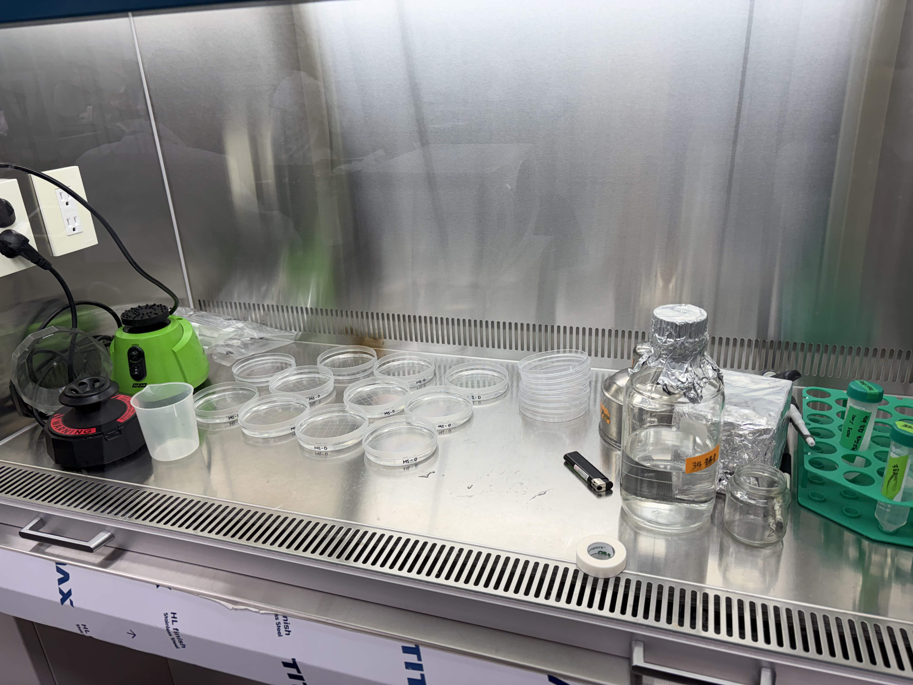
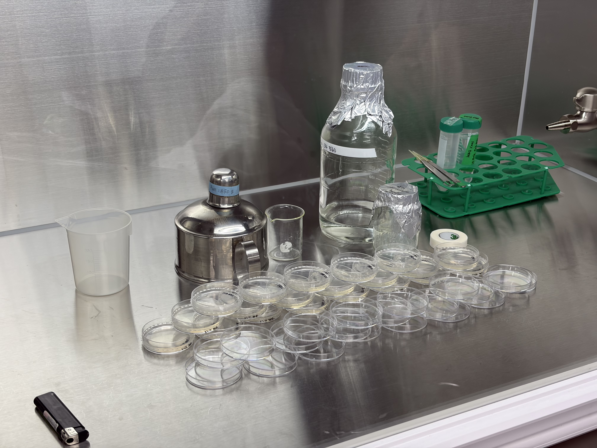
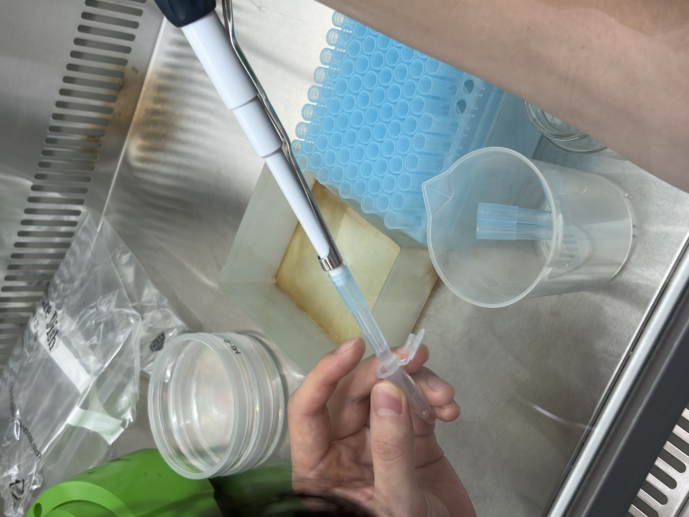
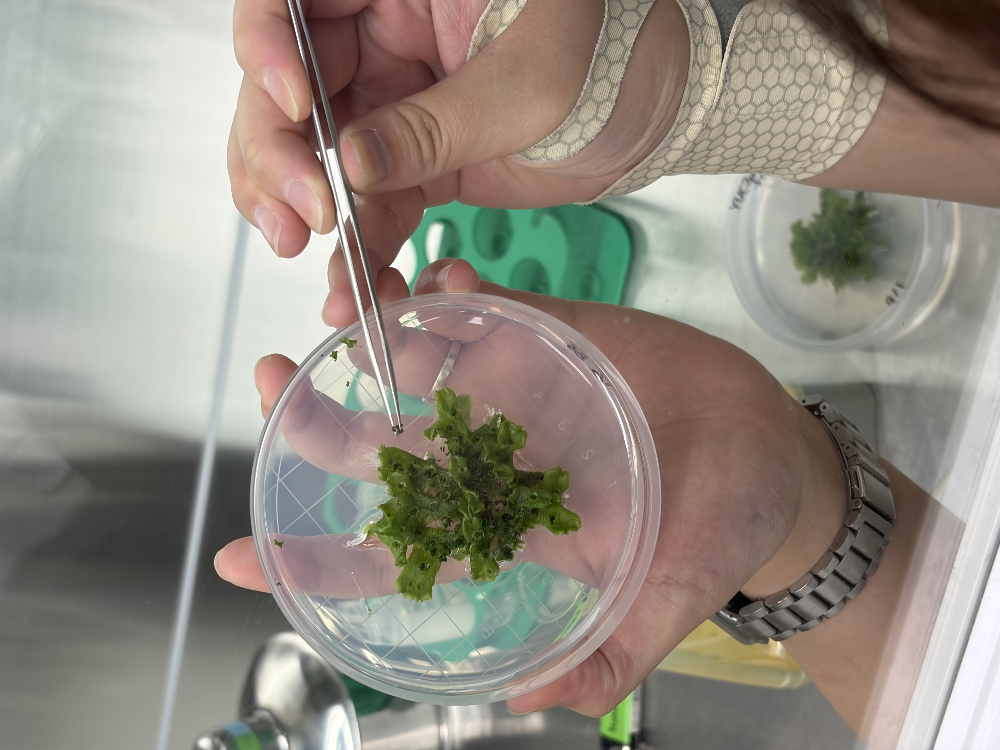
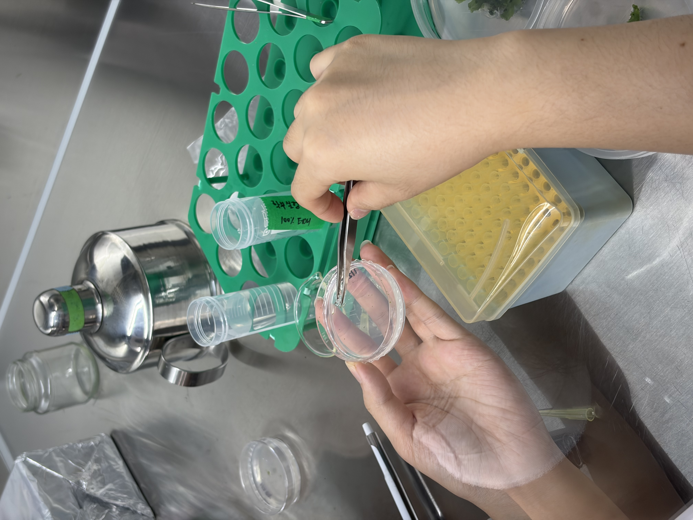

# Plant Physiology and Laboratory: Basal Media Formulation, Seed Disinfection, and Gemmae Propagation (Week 02 / 2026-09-14)

## Background & Project Narrative

### 1. Research Scope: Comparative Drought Stress Kinetics Across Divergent Lineages
* **Investigative Scope:** This study investigates the physiological, cellular, and morphogenetic adaptations of embryophytes subjected to hyperosmotic drought stress, comparing a model vascular angiosperm (*Arabidopsis thaliana*) against an early-diverging non-vascular bryophyte (*Marchantia polymorpha*).
* **Experimental Rationale:** Water deficit imposes severe mechanical and osmotic constraints on vegetative tissues. By coupling morphological baselines with cell-type-specific histochemical reporter lines, this investigation tracks the spatio-temporal dynamics of stem cell niche maintenance, mitotic cell division frequency, and localized auxin biosynthesis during environmental water limitation.

### 2. Biological Model Systems: Genetic Baselines
* **Arabidopsis thaliana (Ecotype Columbia-0 / Col-0):**
  * Serves as the canonical angiosperm wild-type (WT) reference.
  * Fully sequenced, well-annotated reference genome with an established developmental architecture, providing the physiological baseline for growth kinetics, stomatal dynamics, and stress acclimation.
* **Marchantia polymorpha (Accession Takarazuka-1 / Tak-1):**
  * Representative bryophyte (liverwort) functioning as a pivotal model for evolutionary developmental (evo-devo) plant biology, occupying an evolutionary position bridging green algae and tracheophytes.
  * Characterized by a haploid-dominant gametophytic lifecycle with minimal genetic redundancy ($n = 8\text{ autosomes} + 1\text{ sex chromosome} = 9$). Tak-1 constitutes the standard male reference accession (harboring the Y chromosome), contrasted with the female reference line Takarazuka-2 (Tak-2; harboring the X chromosome).
  * Exhibits high developmental totipotency and rapid clonal propagation through vegetative propagules (gemmae) produced within dorsal thallus gemma cups (cupules).

### 3. Meristematic Maintenance: The CLV3–WUS Negative Feedback Circuit
* **Shoot Apical Meristem (SAM) Structural Organization:**
  * Organized into discrete clonally distinct cell layers: tunica layers L1 (epidermal lineage) and L2 (sub-epidermal/mesophyll precursor) undergoing anticlinal divisions, and the corpus L3 undergoing multi-directional divisions.
  * Spatially partitioned into functional domains: the Central Zone (CZ; slow-dividing pluripotent stem cells), Peripheral Zone (PZ; rapidly dividing organogenic founder cells), and Rib Zone (RZ; progenitor cells contributing to internal stem vasculature).
* **The CLV3–WUS Regulatory Feedback Loop:**
  * Pluripotency is orchestrated by the homeodomain transcription factor WUSCHEL (WUS), which is expressed within the underlying Organizing Center (OC) of the RZ and translocated apically through plasmodesmata into the CZ to specify stem cell identity.
  * WUS directly activates the transcription of *CLAVATA3* (*CLV3*), which encodes a small, secreted signaling peptide in the stem cells of the CZ.
  * Secreted CLV3 peptide diffuses into the apoplast and binds to leucine-rich repeat receptor complexes (e.g., CLV1 homomers and CLV2/CRN heterodimers), triggering a signal transduction cascade that represses *WUS* transcription in the OC.
  * *Negative Feedback Mechanics:*
    * Elevated stem cell proliferation $\rightarrow$ increased secreted $[$CLV3$]$ $\rightarrow$ receptor-mediated repression of *WUS* $\rightarrow$ depletion of stem cell proliferation signal.
    * Reduced stem cell proliferation $\rightarrow$ decreased $[$CLV3$]$ $\rightarrow$ derepression of *WUS* $\rightarrow$ renewal and expansion of the stem cell pool.
* **CLV3p::GUS Reporter Rationale & Drought Phenotype Projection:**
  * Drives $\beta$-glucuronidase expression strictly under the transcriptional control of the *CLV3* promoter, demarcating active pluripotent stem cells within the CZ.
  * *Drought Stress Expectation:* Severe osmotic dehydration forces vegetative growth arrest, suppresses stem cell self-renewal, and prompts SAM dormancy. This leads to a marked transcriptional downregulation of *CLV3*, resulting in a pronounced reduction or complete loss of blue precipitate within the CZ.

### 4. Mitotic Kinetics: CYCB1;1p::GUS Cell Division Profiling
* **Cyclin-Dependent Kinase Activation at the G2/M Transition:**
  * *CYCLINB1;1* (*CYCB1;1*, locus `At4g37450`) encodes a plant B1-type mitotic cyclin.
  * Forms active heterodimeric complexes with cyclin-dependent kinases (CDKs; such as CDKA;1 and CDKB subtypes) to trigger phosphorylation cascades essential for mitotic entry past the G2/M cell cycle checkpoint.
  * CYCB1;1 accumulation is tightly restricted to late G2 and early mitosis through cell-cycle-dependent transcriptional activation, coupled with rapid targeted proteolysis via the anaphase-promoting complex/cyclosome (APC/C) ubiquitin-proteasome pathway during anaphase.
* **CYCB1;1p::GUS Reporter Rationale & Drought Phenotype Projection:**
  * The *CYCB1;1* promoter drives expression exclusively in cells preparing for or undergoing mitotic division, functioning as a real-time cellular proxy for the **mitotic index**.
  * *Drought Stress Expectation:* Hyperosmotic shock arrests cell cycle progression through abscisic acid (ABA)-dependent signaling, repressing CDKs and stabilizing cell cycle inhibitors. Consequently, dividing cells in root and shoot meristems undergo G2 arrest, resulting in complete transcriptional silencing of *CYCB1;1* and an absence of histochemical blue staining.

### 5. Local Auxin Sourcing: MpYUC2p::GUS Apical Notch Activity
* **Canonical Two-Step Auxin Biosynthesis:**
  * Indole-3-acetic acid (IAA) is synthesized via the primary tryptophan-dependent pathway:
    $$\text{L-Tryptophan} \xrightarrow{\text{TAA family}} \text{Indole-3-pyruvic acid (IPyA)} \xrightarrow{\text{YUCCA family}} \text{Indole-3-acetic acid (IAA)}$$
  * The oxidative decarboxylation of IPyA to IAA catalyzed by YUCCA (flavin-containing monooxygenases) serves as the primary rate-limiting step in endogenous auxin biosynthesis.
* **Evolutionary Simplicity in Marchantia polymorpha:**
  * Unlike the expanded, functionally redundant 11-member *YUC* gene family in *A. thaliana*, the *M. polymorpha* genome encodes only two paralogs: *MpYUC1* and *MpYUC2*.
  * *MpYUC2* serves as the predominant isoform driving de novo localized auxin biosynthesis at the apical notch meristem, establishing morphogenetic auxin gradients necessary for planar thallus bifurcation and growth.
* **MpYUC2p::GUS Reporter Rationale & Drought Phenotype Projection:**
  * Reflects localized de novo auxin production within the vegetative apical notch.
  * *Drought Stress Expectation:* Drought and desiccation downregulate *MpYUC2* transcription, disrupting localized auxin gradients at the apical meristem. This leads to growth arrest characterized by a sharp reduction or total clearance of histochemical blue staining at the apical notch.

### 6. Histochemical Reporter Mechanism: β-Glucuronidase (GUS) Catalysis
* **Enzyme Characteristics & Specificity:**
  * $\beta$-Glucuronidase (GUS) is encoded by the *Escherichia coli* *uidA* (or *gusA*) gene.
  * Higher plants, bryophytes, and most environmental fungi lack endogenous $\beta$-glucuronidase activity, providing near-zero background interference for promoter-trap and transcriptional reporter assays.
* **Chromogenic Cleavage and Oxidative Dimerization:**
  * *Primary Enzymatic Hydrolysis:* GUS catalyzes the hydrolytic cleavage of the colorless, water-soluble substrate 5-bromo-4-chloro-3-indolyl-$\beta$-D-glucuronic acid (X-Gluc) at the glycosidic bond, releasing free D-glucuronic acid and the soluble indoxyl intermediate 5-bromo-4-chloro-indoxyl:
    $$\text{X-Gluc} + \text{H}_2\text{O} \xrightarrow{\text{GUS}} \text{D-Glucuronic Acid} + \text{5-Bromo-4-chloro-indoxyl}$$
  * *Oxidative Coupling:* Two indoxyl monomers undergo rapid, non-enzymatic, oxygen-dependent oxidative dimerization:
    $$2 \times (\text{5-Bromo-4-chloro-indoxyl}) + \text{O}_2 \xrightarrow{-2\text{H}_2\text{O}} \text{5,5'-Dibromo-4,4'-dichloro-indigo}$$
  * *Signal Localization:* The resulting chromophore, 5,5'-dibromo-4,4'-dichloro-indigo (Cl-indigo), is an intensely brilliant blue, highly insoluble planar compound that precipitates immediately at the precise cellular site of enzymatic catalysis, allowing high-resolution in situ localization of target promoter activity.

### 7. Solidifying Hydrogels: Gellan Gum vs. Bacteriological Agar
* **Optical Transmittance and Spatial Culture Stacking:**
  * *Gellan Gum:* Forms an exceptionally transparent, optically clear hydrogel. High optical transmittance minimizes the attenuation of Photosynthetically Active Radiation (PAR), enabling multi-tier vertical plate stacking inside growth chambers without casting shaded microenvironments on underlying cohorts.
  * *Bacteriological Agar:* Yields a semi-translucent, turbid matrix that scatters incident photons. Optical impedance prevents multi-layer plate stacking, requiring single-layer horizontal staging to avoid uneven light intensity.
* **Matrix Rheology and Root Penetration Dynamics:**
  * *Gellan Gum:* Characterized by a soft, brittle network with low compressive shear modulus. The porous, friable architecture offers minimal mechanical impedance to advancing root caps, facilitating unimpeded root penetration and axial elongation into the medium; however, the gel fractures easily under external mechanical shock.
  * *Agar:* Forms an elastic, flexible, high-tensile hydrogel that strongly resists fracturing. However, its high physical firmness and dense cross-linked polysaccharide network present significant mechanical impedance, frequently forcing nascent root systems to crawl across the agar surface rather than penetrating the nutrient-rich matrix.

### 8. Seed Decontamination Strategies: Liquid Aqueous NaOCl vs. Vapor-Phase Chlorine Gas
* **Liquid Aqueous Disinfection (Sodium Hypochlorite / $\text{NaOCl}$):**
  * *Mechanism of Action:* Relies on direct liquid-phase immersion in aqueous sodium hypochlorite supplemented with a non-ionic surfactant (e.g., Triton X-100) to lower interfacial tension and dissolve seed coat wax.
  * *Imbibition & Inoculation Constraints:* Aqueous submersion initiates precocious seed imbibition during the decontamination and iterative washing sequence. Consequently, seeds must be plated onto media immediately post-sterilization and cannot be dehydrated back into storage.
  * *Embryonic Phytotoxicity Risk:* Direct contact with hypochlorite ions ($OCl^-$) and high chemical flux across the seed coat elevate the risk of embryonic chemical burns, cellular leakage, and reduced germination rates if exposure timing or concentration deviates from strict tolerances.
* **Vapor-Phase Chlorine Gas Sterilization ($\text{Cl}_2$ Gas):**
  * *Mechanism of Action:* Acidification of sodium hypochlorite with concentrated hydrochloric acid inside a hermetically sealed chamber evolves vapor-phase chlorine gas:
    $$\text{NaOCl} + 2\,\text{HCl} \longrightarrow \text{Cl}_2 \uparrow + \text{NaCl} + \text{H}_2\text{O}$$
    Gaseous $\text{Cl}_2$ hydrolyzes in ambient surface moisture films on the dry seed coat to generate oxidative hypochlorous acid ($\text{HOCl}$), neutralizing bacterial and fungal epiphyte spores via dry atmospheric oxidation.
  * *Dry Preservation & High-Throughput Scalability:* Because seeds remain completely dry throughout the vapor exposure window, they retain dormancy and can be vacuum-sealed for extended storage. The technique easily scales to simultaneously process hundreds of seed aliquots in open microcentrifuge tubes within a single desiccator vessel.
  * *Chemical Hazards & Infrastructure Requirements:* Chlorine gas is acutely toxic, corrosive, and presents severe pulmonary hazards upon inhalation. The protocol requires dedicated certified chemical fume hoods, airtight containment vessels, and mandatory controlled degassing periods prior to specimen handling.

## Experimental Design

### 1. Biological Material and Genetic Lines
* **Angiosperm Vascular Model (*Arabidopsis thaliana*):**
  * *Columbia-0 (Col-0):* Canonical wild-type reference baseline.
  * *CLV3p::GUS:* Transcriptional reporter monitoring shoot apical meristem (SAM) stem cell niche maintenance and organizing center dynamics.
  * *CYCB1p::GUS:* Mitotic reporter indexing cell cycle progression and G2/M-phase division frequency.
* **Bryophyte Non-Vascular Model (*Marchantia polymorpha*):**
  * *Tak-1 (Takarazuka-1):* Haploid male wild-type reference baseline.
  * *MpYUC2p::GUS:* Biosynthetic reporter tracking localized de novo auxin (IAA) production at the vegetative apical notch.

### 2. Experimental Matrix and Plating Architecture

| Organism | Genotype / Line | Solid Nutrient Medium | Gelling Agent | Vessel Specifications | Plating & Dispersal Format |
| :--- | :--- | :--- | :--- | :--- | :--- |
| ***A. thaliana*** | Col-0 (WT) | Full-strength MS + 2% Sucrose ($\text{pH } 6.3$) | $0.2\%\text{ w/v}$ Gellan Gum | Standard Petri dish ($\varnothing 90\,\text{mm}$) | Surface-sterilized seeds; 1 seed per grid square |
| ***A. thaliana*** | *CLV3p::GUS* | Full-strength MS + 2% Sucrose ($\text{pH } 6.3$) | $0.2\%\text{ w/v}$ Gellan Gum | Standard Petri dish ($\varnothing 90\,\text{mm}$) | Surface-sterilized seeds; 1 seed per grid square |
| ***A. thaliana*** | *CYCB1p::GUS* | Full-strength MS + 2% Sucrose ($\text{pH } 6.3$) | $0.2\%\text{ w/v}$ Gellan Gum | Standard Petri dish ($\varnothing 90\,\text{mm}$) | Surface-sterilized seeds; 1 seed per grid square |
| ***M. polymorpha*** | Tak-1 (WT) | Half-strength B5 ($1/2$ B5) + 1% Sucrose ($\text{pH } 6.3$) | $1.0\%\text{ w/v}$ Agar | Reduced Petri dish ($\varnothing 55\text{--}60\,\text{mm}$) | Gemmae isolated into $200\,\mu\text{L } 3^\circ\text{ DW}$; 5 glass beads orbital dispersion |
| ***M. polymorpha*** | *MpYUC2p::GUS* | Half-strength B5 ($1/2$ B5) + 1% Sucrose ($\text{pH } 6.3$) | $1.0\%\text{ w/v}$ Agar | Reduced Petri dish ($\varnothing 55\text{--}60\,\text{mm}$) | Gemmae isolated into $200\,\mu\text{L } 3^\circ\text{ DW}$; 5 glass beads orbital dispersion |

---

## Pre-Run Preparations

* **Consumables & Reagents:**
  * Standard Petri dishes ($\varnothing 90\,\text{mm}$) and reduced-dimension Petri dishes ($\varnothing 55\text{--}60\,\text{mm}$)
  * Sterile $1.5\,\text{mL}$ microcentrifuge tubes
  * Micropipette tips ($200\,\mu\text{L}$, $1000\,\mu\text{L}$)
  * Autoclaved borosilicate glass beads ($\varnothing 3\text{--}5\,\text{mm}$)
  * Seed disinfection mix: $5.0\%\text{ v/v } \text{NaOCl}$ supplemented with $0.05\%\text{ v/v}$ Triton X-100
  * Solvent and diluents: Sterile tertiary distilled water ($3^\circ\text{ DW} / \text{ddH}_2\text{O}$), 100% laboratory ethanol
  * 3M Micropore surgical tape for gas-permeable plate boundary sealing
* **Equipment & Instrumentation:**
  * Horizontal laminar flow clean bench with internal UV decontamination system
  * Benchtop vortex mixer and microcentrifuge (pulse-spin)
  * Dual stainless steel micro-forceps (Instrument A: bead handling; Instrument B: gemmae isolation)
  * Portable ethanol burner with open-flame ignition source for instrument sterilization
  * Plant growth incubator/chamber calibrated to $22\text{--}25^\circ\text{C}$

## Reference Protocol

### 1. Plant Tissue Culture Media Formulation

#### Basal Solid Media Formulations (1.0 L Working Batch)
| Component | Full-Strength MS Medium | Half-Strength Gamborg B5 ($1/2$ B5) Medium | Function / Technical Role |
| :--- | :--- | :--- | :--- |
| **Murashige & Skoog (MS) Basal Powder (Duchefa)** | $4.30\,\text{g/L}$ | — | Micro/macro-nutrients and basal vitamins |
| **Gamborg B5 Basal Powder w/ Vitamins (Duchefa)** | — | $1.58\,\text{g/L}$ | Half-strength mineral and vitamin source |
| **Sucrose** | $20.0\,\text{g/L}$ ($2.0\%\text{ w/v}$) | $10.0\,\text{g/L}$ ($1.0\%\text{ w/v}$) | Exogenous carbon substrate and osmolyte |
| **Distilled Water ($\text{ddH}_2\text{O}$)** | Initial dissolution in $\sim 900\,\text{mL}$; bring to $1.0\,\text{L}$ | Initial dissolution in $\sim 900\,\text{mL}$; bring to $1.0\,\text{L}$ | Solvent |
| **Potassium Hydroxide ($\text{KOH}$)** | Adjust to **$\text{pH } 6.3$** | Adjust to **$\text{pH } 6.3$** | Potentiometric pH equilibration reagent |
| **Gellan Gum** | $2.0\,\text{g/L}$ ($0.2\%\text{ w/v}$) | — | High-clarity linear polysaccharide gelling matrix |
| **Bacteriological Agar** | — | $10.0\,\text{g/L}$ ($1.0\%\text{ w/v}$) | Structural galactan hydrogel solidifying agent |

* **1)** Quantify basal powders and sucrose gravimetrically on an analytical balance using weighing dishes and spatulas.
* **2)** Transfer dry reagents into a beaker, add approximately $900\,\text{mL}$ of distilled water ($\text{ddH}_2\text{O}$), insert a magnetic stir bar, and solubilize completely on a magnetic stirrer.
* **3)** Transfer the dissolved solution into a graduated cylinder and adjust the final volume to exactly $1.0\,\text{L}$ using $\text{ddH}_2\text{O}$.
* **4)** Calibrate a benchtop pH meter and adjust the medium to **$\text{pH } 6.3$** via dropwise titration of aqueous potassium hydroxide ($\text{KOH}$) under continuous stirring.
* **5)** Transfer the conditioned liquid medium into Erlenmeyer culture flasks and add the designated solidifying agent ($2.0\,\text{g/L}$ Gellan gum for MS medium; $10.0\,\text{g/L}$ agar for $1/2$ B5 medium).
* **6)** Cap flasks with breathable closures/aluminum foil and autoclave at $121^\circ\text{C}$ (15 psi) for 20 minutes.
* **7)** Temper the molten agar medium in a laminar flow clean bench until cooled to $50\text{--}55^\circ\text{C}$, then dispense aseptically into sterile Petri dishes and allow complete gelation.

---

### 2. Arabidopsis thaliana Seed Surface Sterilization and Grid Plating

#### Seed Decontamination Working Solution (10.0 mL Batch)
| Reagent | Working Aliquot | Final Concentration / Role |
| :--- | :--- | :--- |
| **Sodium Hypochlorite ($\text{NaOCl}$ Bleach Stock)** | $500\,\mu\text{L}$ | $5.0\%\text{ v/v}$ stock ($0.2\text{--}0.25\%\text{ active Cl}_2$); oxidative biocide |
| **Triton X-100** | $5\,\mu\text{L}$ | $0.05\%\text{ v/v}$; non-ionic surfactant for cuticular wetting |
| **Sterile Distilled Water ($\text{ddH}_2\text{O}$)** | $9.495\,\text{mL}$ (Up to $10.0\,\text{mL}$) | Diluent base |

* **1)** Partition dry seeds of designated genotypes (Wild-Type Columbia-0 [Col-0], *CLV3p::GUS*, and *CYCB1p::GUS*) into individual sterile $1.5\,\text{mL}$ microcentrifuge tubes.
* **2)** Dispense $500\,\mu\text{L}$ of freshly compounded sterilization solution into each seed-containing microcentrifuge tube.
* **3)** Agitate tubes continuously on a vortex mixer for exactly **8 minutes** to achieve uniform cuticular wetting and eliminate surface contaminants without compromising embryonic viability.
* **4)** Pulse-spin or allow seeds to settle, aspirate and discard the toxic supernatant, and immediately wash the pellet with $1.0\,\text{mL}$ of sterile $\text{ddH}_2\text{O}$. Repeat for a total of **5 consecutive aseptic washing cycles** to remove residual hypochlorite.
* **5)** Resuspend sterilized seeds in a minimal volume of sterile $\text{ddH}_2\text{O}$ and draw into a micropipette.
* **6)** Aseptically inoculate individual seeds onto solid full-strength MS agar plates, positioning exactly **one seed per grid square** along an indexed coordinates matrix.
* **7)** Seal plates with gas-permeable tape, wrap in aluminum foil, and transfer to $4^\circ\text{C}$ in darkness for 48–72 hours for cold moist stratification to synchronize germination kinetics prior to growth chamber incubation.

---

### 3. Marchantia polymorpha Gemmae Isolation and Bead-Dispersal Pre-Culture

* **1)** Dispense $300\,\mu\text{L}$ of sterile $\text{ddH}_2\text{O}$ onto the central surface of a solid $1/2$ B5 agar plate.
* **2)** Aseptically introduce **5 sterile glass beads** onto the hydrated agar matrix.
* **3)** Harvest mature gemmae from dorsal thallus gemma cups of *Marchantia polymorpha* (Tak-1 wild-type and *YUC2p::GUS* reporter lines) using a sterile micropipette tip or micro-forceps, and transfer them directly into the surface water droplet.
* **4)** Gently agitate and roll the sterile glass beads across the agar surface in a radial orbital motion to disperse the gemmae evenly across the plate.
* **5)** Aseptically decant the glass beads into a waste reservoir.
* **6)** Seal the perimeter of each Petri dish using **3M Micropore surgical tape** (ensuring aerobic gas exchange while preventing ambient spore contamination and media desiccation).
* **7)** Transfer culture plates to a plant growth incubator maintained at $22^\circ\text{C}$ under continuous white light ($50\text{--}60\,\mu\text{mol}\cdot\text{m}^{-2}\cdot\text{s}^{-1}$) for vegetative pre-culture and thallus establishment.

## Bench Execution Log & Deviations

1. **Basal Culture Media Staging and Thermal Equilibration**
   * **Media Preparation & Protocol Deviation (Centralized Compounding & Autoclaving):**
     * Both full-strength Murashige & Skoog (MS) and half-strength Gamborg B5 ($1/2$ B5) media were compounded, pH-equilibrated, supplemented with gelling agents, and autoclaved ($121^\circ\text{C}$, 20 min) in advance by laboratory teaching assistants (TAs).
     * **Protocol Deviation (Operator Staging):** Primary gravimetric measurement and pH adjustment steps were bypassed at the student bench level; pre-autoclaved molten media flasks were received directly for aseptic plate fabrication.
   * **Thermal Equilibration (Tempering):**
     * Molten media flasks were maintained and verified at **$55\text{--}60^\circ\text{C}$** prior to dispensing.
     * **Technical Quality Control:** This thermal range preserved fluid motility, prevented premature polymer gelation (of both Gellan gum and agar), and minimized convective steam condensation on Petri dish lids post-pouring.

2. **Clean Bench Staging and Differential Vessel Allocation**
   * **Aseptic Workspace Preparation:**
     * Transferred the tempered media flasks into a sanitized laminar flow clean bench.
     * Unpacked and staged sterile plastic Petri dishes under positive pressure airflow alongside an ethanol burner and thermal ignition source for downstream instrument flame sterilization.
   * **Differential Vessel Allocation & Plate Pouring:**
     * **Full-Strength MS Medium (Host: *Arabidopsis thaliana*):** Dispensed into **standard-dimension Petri dishes** ($\sim 90\text{--}100\,\text{mm}$ diameter) to provide sufficient planar surface area for coordinate-indexed single-seed grid inoculation.
     
     * **Half-Strength B5 Medium (Host: *Marchantia polymorpha*):** Dispensed into **reduced-dimension Petri dishes** ($\sim 50\text{--}60\,\text{mm}$ diameter) optimized for localized glass bead agitation and gemmae pre-culture.
     
   * **Matrix Gelation and Condensation Mitigation:**
     * Allowed poured plates to cool undisturbed under sterile laminar flow until complete hydrogel polymerization was achieved.
     * Mitigated surface condensation under airflow prior to closing lids for downstream sterilization and inoculation workflows.

3. **Arabidopsis thaliana Seed Surface Sterilization**
   * **Biological Specimen Staging:**
     * Retrieved dry seeds of the transgenic reporter line *Arabidopsis thaliana* *CLV3p::GUS* in a sterile $1.5\,\text{mL}$ microcentrifuge tube.
   * **Oxidative Chemical Disinfection:**
     * Dispensed $500\,\mu\text{L}$ of freshly compounded sterilization solution ($5.0\%\text{ v/v } \text{NaOCl}$ supplemented with Triton X-100) directly into the seed aliquot (rectifying nominal bench notation recording $500\,\text{mL}$).
     * Subjected the microcentrifuge tube to continuous vortex agitation for **8 minutes** to maximize surfactant-assisted cuticular wetting and achieve thorough oxidative eradication of seed-borne contaminants.
     * Performed a brief pulse-centrifugation (spin-down) to sediment the seed mass, followed by rapid aspiration and disposal of the toxic hypochlorite supernatant.

4. **Iterative Desorption Washing Regime**
   * **Sequential Wash Protocol (5 Cycles):**
     * Executed **5 consecutive washing cycles** to thoroughly desorb and dilute trace hypochlorite and detergent, preventing embryonic phytotoxicity:
       * Aliquoted $500\,\mu\text{L}$ of sterile tertiary distilled water ($3^\circ\text{ DW} / \text{ddH}_2\text{O}$) onto the seed pellet.
       * Vortexed vigorously for approximately **1 minute** to drive diffusive clearance of residual oxidant from the seed coat.
       * Pulse-centrifuged briefly to consolidate the seeds at the tube bottom.
       * Completely aspirated and discarded the aqueous wash phase into a dedicated waste receptacle.
       * Re-iterated this sequence for a total of **5 complete wash cycles**.
     

5. **Micropipette-Guided Spatial Grid Inoculation**
   * **Seed Suspension & Inoculation Mechanics:**
     * Resuspended the decontaminated seed cohort in a minimal volume of sterile $3^\circ\text{ DW}$.
     * Using a $1000\,\mu\text{L}$ ($1\,\text{mL}$) micropipette with a sterile tip, carefully aspirated individual seeds within the liquid column.
     * Aseptically spotted seeds onto the solidified full-strength MS medium, micro-positioning exactly **one seed per delineated grid square** across the plate layout to facilitate standardized single-seed germination tracking.

6. **Substrate Hydration and Aseptic Tool Preparation**
   * **Agar Matrix Pre-Hydration & Protocol Deviation:**
     * Retrieved the pre-poured half-strength Gamborg B5 ($1/2$ B5) reduced-dimension Petri dishes.
     * Aliquoted **$200\,\mu\text{L}$ of sterile tertiary distilled water ($3^\circ\text{ DW}$)** onto the center of the solidified agar surface.
     * **Protocol Deviation (Hydration Volume Reduction):** Dispensed $200\,\mu\text{L}$ of sterile diluent, deviating from the reference protocol baseline ($300\,\mu\text{L}$) to optimize surface tension and prevent excessive hydrodynamic pooling during propagule plating.
   * **Ethanol Flame Decontamination:**
     * Sterilized stainless steel micro-forceps by complete immersion in 100% laboratory ethanol followed by brief open-flame incineration.
     * Allowed flame-sterilized instruments to undergo adequate air cooling within the clean bench to eliminate residual heat prior to physical contact with biological specimens.
   * **Technical Quality Control (Dedicated Dual-Instrument Segregation):**
     * Implemented strict segregation between two discrete sets of forceps:
       * *Instrument A (Bead-Handling Forceps):* Exclusively allocated for transferring and evacuating non-biological glass beads.
       * *Instrument B (Specimen Micro-Forceps):* Reserved strictly for micro-harvesting viable gemmae.
     * **Technical Rationale:** Prevents inadvertent thermal shock, residual alcohol transfer, and mechanical damage to fragile vegetative tissue during manipulation.

7. **Marchantia polymorpha Gemmae Isolation and Orbital Bead Dispersion**
   * **Dispersal Bead Staging:**
     * Using Instrument A, aseptically transferred **5 autoclaved borosilicate glass beads** onto the pre-hydrated $1/2$ B5 agar matrix.
   * **Target Propagule Micro-Harvesting:**
     * Positioned donor thalli of *Marchantia polymorpha* ecotype **Tak-1** under aseptic laminar flow.
     * Using Instrument B, carefully excised and picked mature vegetative gemmae directly from the dorsal thallus gemma cups (cupules), transferring the clustered propagules directly into the central $200\,\mu\text{L}$ aqueous droplet on the agar plate.
     
   * **Orbital Hydrodynamic Dispersion:**
     * Replaced the Petri dish lid and subjected the plate to gentle, continuous manual orbital tilting.
     * Allowed the 5 glass beads to roll systematically across the agar surface, using fluid drag and gentle mechanical contact to disperse the clustered gemmae into a uniform monolayer across the culture plane.
   * **Bead Clearance and Microenvironment Sealing:**
     * Inverted the lid slightly under laminar airflow, retrieved all 5 glass beads using Instrument A, and evacuated them into an autoclavable waste container without gouging the agar surface.
     
     * Closed the Petri dish and applied a circumferential seal along the dish interface using gas-permeable tape to maintain saturating internal relative humidity while permitting continuous aerobic respiratory exchange.