# Arabidopsis thaliana Bacterial Infection Log (2026-09-15)

## Background & Project Narrative

### 1. Research Scope and Hormonal Modulation Framework
* **Project Objective:** This investigation evaluates the physiological and immune defense modulation of *Arabidopsis thaliana* exposed to the endocrine-disrupting xenobiotic Bisphenol A (BPA; 1 ppb and 1 ppm vs. untreated control) following bacterial challenge.
* **Experimental Baseline:** Pathogen proliferation, foliar disease severity, and in planta colonization kinetics are quantified to establish baseline host resistance. In this procedural run, *Pseudomonas syringae* pv. *syringae* B728a (*Pss* B728a; Rifampicin-resistant, 28°C) was evaluated following an operational stock substitution for *P. syringae* pv. *tomato* DC3000 (*Pst* DC3000), validating technical controls, non-wounding abaxial stomatal delivery, and quantitative colony counting protocols ahead of scheduled BPA-treatment cohorts.

### 2. Seed Physiology: Storage Stability, Dormancy Dynamics, and Cold Stratification
* **Storage Stability & Relative Humidity (RH):** High ambient temperatures and elevated relative humidity accelerate metabolic respiration, non-enzymatic cellular decay, and embryo deterioration. Sealed storage at 4°C under low relative humidity suppresses premature enzymatic activation and preserves long-term seed viability.
* **Dormancy Classifications:**
  * *Primary Dormancy:* An innate physiological block established during seed maturation on the parent plant to prevent precocious viviparous germination prior to seed dispersal.
  * *Secondary Dormancy:* An adaptive quiescence induced when non-dormant, imbibed seeds encounter unfavorable conditions (e.g., extreme temperatures or moisture deficits), arresting development until optimal conditions recur.
* **Hormonal Regulation (ABA vs. GA Antagonism):**
  * Seed dormancy is maintained by the dynamic, antagonistic balance between Abscisic Acid (ABA) and Gibberellic Acid (GA).
  * High endogenous ABA levels repress cell cycle progression and maintain dormancy, whereas GA signaling stimulates endosperm weakening, seed coat rupture, and embryonic root emergence.
* **Cold Moist Stratification Rationale:**
  * Submerging seeds in sterile distilled water at 4°C in total darkness for 72 hours mimics winter environmental cues.
  * Thermal chilling promotes the transcriptional upregulation of ABA catabolic enzymes (e.g., *CYP707A* family) and activates GA biosynthetic cascades. The resulting decline in the ABA:GA ratio breaks physiological dormancy and synchronizes metabolic reactivation, ensuring uniform germination kinetics and uniform growth across experimental cohorts.

### 3. Pathogen Biology: Strain Differentiation, Selective Pressure, and Cryopreservation
* **Strain Comparison (*Pst* DC3000 vs. *Pss* B728a):**
  * *P. syringae* pv. *tomato* DC3000: Specialized hemibiotrophic pathogen of Brassicaceae (*Arabidopsis*) and Solanaceae (tomato). Produces coronatine (COR), a polyketide phytotoxin mimicking jasmonoyl-isoleucine (JA-Ile) that actively drives stomatal reopening and suppresses salicylic acid (SA)-mediated basal immunity to colonize the apoplast.
  * *P. syringae* pv. *syringae* B728a: Adapted foliar epiphyte and causal agent of brown spot in legumes (*Phaseolus vulgaris*). Possesses strong surface survival adaptations (ice nucleation activity, syringomycin and syringopeptin secretion). While less specialized for the *Arabidopsis* apoplast than DC3000, forced syringe infiltration bypasses external barriers, establishing consistent colonization suitable for baseline technical validation.
* **Glycerol Function:**
  * *Cryostorage at -80°C:* Acts as an intracellularly penetrating cryoprotectant that prevents ice crystal lattice nucleation and vitrifies water, preserving bacterial membrane integrity and preventing osmotic lysis during freeze-thaw cycles.
  * *King's B (KB) Formulation:* Functions as a non-acidifying, non-repressive primary carbon and energy substrate, accelerating respiratory turnover in pseudomonads.
* **Rifampicin Mechanism of Action:**
  * Binds specifically to the $\beta$-subunit of bacterial DNA-dependent RNA polymerase (encoded by *rpoB*), sterically blocking phosphodiester bond formation and halting nascent mRNA transcript elongation.
  * Resistant laboratory strains harbor missense mutations in *rpoB* that abrogate antibiotic binding, permitting selective suppression of environmental epiphytic contaminants on solid media ($34.0\,\mu\text{g/mL}$).

### 4. Media Chemistry and Culture Mechanics: LB vs. KB and Two-Step Activation
* **LB vs. King's B (KB) Formulation:**
  * *Lysogeny Broth (LB):* General-purpose complex media (Tryptone, Yeast Extract, NaCl) optimized for enteric organisms, with high sodium chloride and unadjusted mineral ratios.
  * *King's B (KB) Medium:* Specifically formulated for fluorescent *Pseudomonas* species (Proteose Peptone, $\text{K}_2\text{HPO}_4$, $\text{MgSO}_4$, Glycerol). Magnesium ($\text{Mg}^{2+}$) promotes ribosomal and outer membrane integrity, while controlled phosphate and iron-limited conditions stimulate the synthesis of yellow-green fluorescent siderophores (pyoverdine and pyochelin), optimizing metabolic fitness and cellular stability.
* **Two-Step Culture Preparation Rationale:**
  * *Step 1 (Primary Overnight Broth):* Revitalizes dormant cells from glycerol stocks or single colonies into a high-density liquid phase. Because *Pseudomonas* is an obligate aerobe, continuous orbital shaking (200–230 RPM) is mandatory to sustain dissolved oxygen saturation and prevent hypoxic stress.
  * *Step 2 (3-Hour Subculture Reactivation):* Diluting the saturated overnight starter into fresh media transitions cells from late stationary phase into the mid-exponential (log) growth phase. Mid-log cells exhibit maximal physiological viability and primed expression of the Type III Secretion System (T3SS / *hrp* regulon) machinery required for effector protein translocation into the host apoplast.

### 5. Inoculum Density Rationale: Kinetic Dynamic Range vs. Hypersensitive Collapse
* **Low Initial Inoculum Density ($\text{OD}_{600} = 0.0001$):** 
  * A normalized working density of $\text{OD}_{600} = 0.0001$ delivers an initial apoplastic density of $\sim 5 \times 10^4\text{--}1 \times 10^5\,\text{CFU/mL}$ ($\sim 10^2\text{--}10^3\,\text{CFU/disc}$).
  * This low baseline provides an empirical dynamic range spanning 3 to 4 orders of magnitude, enabling accurate quantification of exponential bacterial multiplication kinetics over 3 days post-inoculation (3 dpi).
* **Prevention of Non-Specific Necrosis:** Inoculating at high optical densities ($\text{OD}_{600} \ge 0.01\text{--}0.1$) delivers excessive Pathogen-Associated Molecular Patterns (PAMPs) and Type III effectors, triggering rapid effector-triggered immunity (ETI) or non-specific hypersensitive response (HR) necrosis within 24 hours. The resulting rapid foliar desiccation prevents accurate quantification of bacterial replication rates and masks subtle chemical-mediated alterations in host immunity.

## Experimental Design

### 1. Biological System and Environmental Controls
* **Host Model:** *Arabidopsis thaliana* ecotype Columbia-0 (Col-0), cultivated for 28 days post-sowing to establish mature, fully expanded vegetative rosettes prior to bacterial challenge.
* **Cultivation Regime:** Maintained in a controlled growth chamber at 25°C under an accelerated 12-hour photoperiod (12 h light / 12 h dark) with non-saturating soil moisture.
* **Target Foliar Loci:** Three fully expanded mature rosette leaves per plant (morphology-selected, strictly excluding embryonic cotyledons and juvenile 1st/2nd leaves) subjected to non-wounding abaxial stomatal infiltration.

### 2. Pathogen Challenge and Project Framework
* **Challenge Strain:** *Pseudomonas syringae* pv. *syringae* B728a (*Pss* B728a; Rifampicin-resistant, working selection at $34.0\,\mu\text{g/mL}$), evaluated at an apoplastic delivery concentration of $\text{OD}_{600} = 0.0001$ ($\sim 5 \times 10^4\text{--}1 \times 10^5\,\text{CFU/mL}$) in $10\text{ mM MgSO}_4$.
* **Project Role:** Establishes the unmodulated baseline bacterial proliferation kinetics, colonization capacity, and visual symptom severity in untreated wild-type plants prior to comparative evaluation against xenobiotic endocrine disruptor cohorts (Bisphenol A; 1 ppb and 1 ppm).

### 3. Replicate Allocation and Plating Layout Matrix

| Cohort Group | Replicates ($N$) | Treatment / Condition | Challenge Pathogen | Inoculum Working Density | Sampling Metric | Plating Dilution Range |
| :--- | :--- | :--- | :--- | :--- | :--- | :--- |
| **Wild-Type Baseline (WT1–WT8)** | 8 (Median-screened) | Untreated Baseline (0 ppm BPA) | *Pss* B728a (Rif-resistant) | $\text{OD}_{600} = 0.0001$ in $10\text{ mM MgSO}_4$ | 3 dpi foliar disc ($0.49\text{ cm}^2$) | $10^{-2}, 10^{-3}, 10^{-4}$ |
| *BPA Low-Dose (Projected)* | 8 | 1 ppb Bisphenol A | *Pst* DC3000 / *Pss* B728a | $\text{OD}_{600} = 0.0001$ in $10\text{ mM MgSO}_4$ | 3 dpi foliar disc ($0.49\text{ cm}^2$) | $10^{-2}, 10^{-3}, 10^{-4}$ |
| *BPA High-Dose (Projected)* | 8 | 1 ppm Bisphenol A | *Pst* DC3000 / *Pss* B728a | $\text{OD}_{600} = 0.0001$ in $10\text{ mM MgSO}_4$ | 3 dpi foliar disc ($0.49\text{ cm}^2$) | $10^{-2}, 10^{-3}, 10^{-4}$ |

#### Radial Sextant Plating Grid Layout (4 Selective LB+Rif Plates)
| Plate ID | Sector 1 ($60^\circ$) | Sector 2 ($60^\circ$) | Sector 3 ($60^\circ$) | Sector 4 ($60^\circ$) | Sector 5 ($60^\circ$) | Sector 6 ($60^\circ$) |
| :--- | :--- | :--- | :--- | :--- | :--- | :--- |
| **Plate 1** | WT1 ($10^{-2}$) | WT1 ($10^{-3}$) | WT1 ($10^{-4}$) | WT2 ($10^{-2}$) | WT2 ($10^{-3}$) | WT2 ($10^{-4}$) |
| **Plate 2** | WT3 ($10^{-2}$) | WT3 ($10^{-3}$) | WT3 ($10^{-4}$) | WT4 ($10^{-2}$) | WT4 ($10^{-3}$) | WT4 ($10^{-4}$) |
| **Plate 3** | WT5 ($10^{-2}$) | WT5 ($10^{-3}$) | WT5 ($10^{-4}$) | WT6 ($10^{-2}$) | WT6 ($10^{-3}$) | WT6 ($10^{-4}$) |
| **Plate 4** | WT7 ($10^{-2}$) | WT7 ($10^{-3}$) | WT7 ($10^{-4}$) | WT8 ($10^{-2}$) | WT8 ($10^{-3}$) | WT8 ($10^{-4}$) |

---

## Pre-Run Preparations

* **Consumables (Per Sample):** 
  * 1 × 1.5 mL microcentrifuge tube (Tissue homogenization and primary $200\,\mu\text{L}$ extraction)
  * 4 × Wells of a 96-well dilution microplate (Columns 1–4; $10^{-1}$ to $10^{-4}$ serial dilutions)
  * 3 × Radial agar sectors ($0.5$ solid LB+Rif plate per replicate; $10^{-2}$, $10^{-3}$, and $10^{-4}$ spot plating)
  * 1 × Motorized pestle tip (Autoclaved)
  * 0.125 × Needleless 1.0 mL slip-tip syringe (Single reusable syringe recharged across the 8-replicate cohort to prevent inventory ambiguity; 1 syringe total per 8 samples)
* **Equipment:** 
  * Plant growth chamber (Maintained at 25°C, 12 h photoperiod)
  * Orbital shaking incubator (Vision Scientific Co., Ltd., Model VS-8480S)
  * Laminar flow clean bench with UV decontamination system
  * NanoDrop spectrophotometer (Cell Culture mode with 10 mm pathlength cuvette module)
  * Benchtop microcentrifuge (Operational at 13,000 RPM)
  * Motorized handheld homogenizer/drill
  * 8-channel automated pipette (Brand Transferpette® -8, 20–200 µL)
  * Cylindrical leaf biopsy punch ($0.49\text{ cm}^2$) and stainless steel forceps
  * Non-perforated transparent humidity domes and high-tension iron binder clips

## Reference Protocol

### 1. Bacterial Culture Setup and Inoculum Preparation

#### Liquid KB Medium Formulation (Per Single Tube)
| Component | Stock Concentration | Working Volume | Final Concentration / Role |
| :--- | :--- | :--- | :--- |
| King's B (KB) Liquid Broth | 1X | 5.0 mL | Base nutrient medium |
| $\text{MgSO}_4$ | 10 mM | 16.0 µL | Osmotic stabilizer / growth supplement |
| Glycerol | 20% (v/v) | 125.0 µL | Carbon source / cryoprotectant base |
| Rifampicin (Rif) | Working Stock | 5.0 µL | Selective antibiotic pressure |
| **Total Culture Volume** | — | **~5.15 mL** | **Per glass culture tube** |

* **1)** Streak *Pseudomonas syringae* pv. *tomato* DC3000 (*Pst* DC3000) from frozen glycerol stocks onto solid King's B (KB) agar plates supplemented with rifampicin; incubate at 28°C for 2–3 days until discrete colonies appear.
* **2)** Dispense 5.0 mL of liquid KB broth, 16 µL of 10 mM $\text{MgSO}_4$, 125 µL of 20% glycerol, and 5 µL of rifampicin into each of two sterile glass culture test tubes.
* **3)** Inoculate a single isolated *Pst* DC3000 colony into the primary test tube using a sterile micropipette tip and vortex briefly to disperse cell aggregates.
* **4)** Incubate primary culture in an orbital shaking incubator at 28°C, 200 rpm for 16 hours.
* **5)** Transfer exactly 1.0 mL of the 16-hour primary culture into the second prepared culture tube containing fresh media.
* **6)** Subculture at 28°C, 200 rpm for 3 hours to drive cells into the mid-exponential growth phase.
* **7)** Transfer 4.0 mL of the subcultured bacterial suspension into sterile microcentrifuge tubes and pellet cells via centrifugation at 12,000 rpm for 5 minutes at room temperature (RT).
* **8)** Completely aspirate and discard the culture supernatant, then resuspend the cell pellet in 1.0 mL of sterile 10 mM $\text{MgSO}_4$.

### 2. Spectrophotometric Normalization and Inoculum Adjustment

* **1)** Prepare an analytical 1:10 dilution of the bacterial resuspension in 10 mM $\text{MgSO}_4$ ($100\,\mu\text{L}\text{ cells} + 900\,\mu\text{L } 10\text{ mM MgSO}_4$).
* **2)** Measure optical density at 600 nm ($\text{OD}_{600}$) using a UV-Vis spectrophotometer zeroed against 10 mM $\text{MgSO}_4$.
* **3)** Calculate the required dilution factor using the measured $\text{OD}_{600}$ and normalize the primary bacterial suspension in 10 mM $\text{MgSO}_4$ to a target working density of $\text{OD}_{600} = 0.0001$ ($\sim 5 \times 10^4\text{--}1 \times 10^5\text{ CFU/mL}$).

### 3. Host Plant Pre-Conditioning and Abaxial Syringe Infiltration

* **1)** Cultivate *Arabidopsis thaliana* wild-type (WT) and experimental cohorts under standard short-day conditions (8 h light / 16 h dark, 22°C) for approximately 28 days (4 weeks) until mature rosette stage.
* **2)** Withhold watering on the day of inoculation to promote stomatal stability.
* **3)** Identify and index leaves 3, 4, and 5 on each designated rosette using a fine laboratory marker.
* **4)** Draw the normalized bacterial suspension ($\text{OD}_{600} = 0.0001$) into a sterile, needleless 1.0 mL tuberculin slip-tip syringe.
* **5)** Invert the target leaf, support the adaxial surface with a gloved finger, press the syringe orifice flush against the abaxial epidermis, and gently depress the plunger to pressure-infiltrate bacterial solution through the stomata until uniform water-soaking is achieved across the entire lamina.
* **6)** Allow infiltrated leaves to dry completely under ambient growth room conditions.
* **7)** Apply thorough bottom-watering to the plant trays once leaf surfaces are visually dry.
* **8)** Place non-perforated transparent humidity domes over the plant trays and seal tightly using binder clips to establish near-saturated relative humidity (>90% RH).
* **9)** Incubate infiltrated plants in the growth chamber for 3 days post-inoculation (dpi) to facilitate bacterial colonization and symptom development.

### 4. Tissue Sampling, Surface Sterilization, and Homogenization

* **1)** Inspect marked leaves across replicates and rank them by visual chlorotic/necrotic symptom severity.
* **2)** Screen and select 8 to 12 representative leaves corresponding to median symptom severity profiles.
* **3)** Excise uniform circular leaf discs ($0.49\text{ cm}^2$ area) using an autoclaved cork borer or biopsy punch.
* **4)** Submerge leaf discs in 70% ethanol for 5 seconds to surface-sterilize epiphytic contaminants.
* **5)** Immediately transfer discs onto sterile paper wipes and thoroughly blot dry to remove all residual ethanol.
* **6)** Transfer each sterile leaf disc into an individual 1.5 mL microcentrifuge tube containing 200 µL of sterile 10 mM $\text{MgSO}_4$.
* **7)** Mount an autoclaved micro-pestle onto a motorized handheld homogenizer, sanitize the tip with 70% ethanol, and completely pulverize the leaf disc until a homogeneous lysate slurry is achieved without intact vascular debris.
* **8)** Thoroughly decontaminate the pestle with 70% ethanol wipes between individual samples to prevent sample carryover.

### 5. Microtiter Serial Dilution and Quantitative Spot Plating

#### Microtiter Plate 10-Fold Serial Dilution Schema
| Column ID | Dilution Factor | Volume of 10 mM $\text{MgSO}_4$ | Sample Inoculum Volume | Source Column |
| :--- | :--- | :--- | :--- | :--- |
| **Col 1** | $10^{-1}$ | 180.0 µL | 20.0 µL | Undiluted Leaf Lysate (Step 4.6) |
| **Col 2** | $10^{-2}$ | 180.0 µL | 20.0 µL | Column 1 ($10^{-1}$) |
| **Col 3** | $10^{-3}$ | 180.0 µL | 20.0 µL | Column 2 ($10^{-2}$) |
| **Col 4** | $10^{-4}$ | 180.0 µL | 20.0 µL | Column 3 ($10^{-3}$) |
| **Col 5** | $10^{-5}$ | 180.0 µL | 20.0 µL | Column 4 ($10^{-4}$) |
| **Col 6** | $10^{-6}$ | 180.0 µL | 20.0 µL | Column 5 ($10^{-5}$) |
| **Col 7** | $10^{-7}$ | 180.0 µL | 20.0 µL | Column 6 ($10^{-6}$) |
| **Col 8** | $10^{-8}$ | 180.0 µL | 20.0 µL | Column 7 ($10^{-7}$) |

* **1)** Pre-equilibrate solid LB agar plates (poured $\ge 3$ days prior to allow surface dehydration) to room temperature.
* **2)** Decontaminate reagent reservoirs, 96-well dilution microplates, and multichannel pipette tip boxes under UV irradiation for $\ge 30$ minutes prior to plating.
* **3)** Aliquot 180 µL of sterile 10 mM $\text{MgSO}_4$ into designated columns of a sterile 96-well round-bottom microplate using an automated multichannel pipette and sterile reagent reservoir.
* **4)** Transfer 20 µL of homogenized leaf sample into Column 1 ($10^{-1}$ dilution) and pipette up and down 10 times to mix.
* **5)** Systematically perform serial 10-fold dilutions across columns up to $10^{-8}$ by sequentially aspirating 20 µL from the preceding column and mixing into 180 µL of diluent in the adjacent column using a multichannel pipette.
* **6)** Subdivide solid LB agar plates into 6 discrete radial sectors (allowing 2 biological replicates evaluated across 3 dilution tiers per plate).
* **7)** Spot 20 µL drops from the target dilution range (typically $10^{-2}$ to $10^{-4}$, adjusted according to visual disease severity) onto corresponding plate sectors.
* **8)** Allow spots to fully absorb into the agar matrix at room temperature, seal plates with Parafilm, invert, and incubate at 28°C for 24–48 hours until discrete colony-forming units (CFUs) develop.

### 6. Colony Enumeration and Pathogen Load Quantification

* **1)** Inspect plated sectors and select the dilution tier yielding countable, non-overlapping colonies (30–300 CFUs/spot or distinct micro-colonies).
* **2)** Enumerate colonies and convert to bacterial titer normalized to leaf surface area ($\text{CFU}/\text{cm}^2$) using the standard formula:
$$\text{Bacterial Density } (\text{CFU}/\text{cm}^2) = \frac{\text{Colonies Counted} \times \text{Dilution Factor} \times \left(\frac{\text{Total Extraction Volume}}{\text{Plated Volume}}\right)}{\text{Leaf Disc Area } (\text{cm}^2)}$$
$$\text{where Total Extraction Volume} = 200\,\mu\text{L}, \quad \text{Plated Volume} = 20\,\mu\text{L}, \quad \text{Leaf Disc Area} = 0.49\,\text{cm}^2$$
* **3)** Log-transform titer values ($\log_{10}(\text{CFU}/\text{cm}^2)$) for normality and plot pathogen colonization distributions across treatment cohorts.

## Bench Execution Log & Deviations

1. **Host Plant Sowing and Growth Chamber Acclimation (Day -28 / 2026-08-18)**
   * **Seed Sowing:** Sowed *Arabidopsis thaliana* ecotype Columbia-0 (Col-0) seeds onto pre-moistened potting soil substrate to establish experimental host cohorts.
   * **Environmental Parameters:** Transferred sowed trays into a controlled growth chamber set to a **12-hour photoperiod (12 h light / 12 h dark)** at a constant temperature of **25°C**.
   * **Protocol Deviation (Photoperiod & Thermal Conditions):** Plants were cultivated under a 12-hour photoperiod at 25°C, deviating from the reference protocol baseline (8-hour short-day photoperiod at 22°C), accelerating vegetative rosette expansion prior to bacterial challenge.

2. **Selective Solid Media Preparation: LB Agar with Rifampicin (2026-09-07)**
   * **Basal LB Formulation (1.0 L Batch):** Weighed and dissolved $10.0\,\text{g}$ Tryptone, $5.0\,\text{g}$ Yeast Extract, and $5.0\,\text{g}$ NaCl in $\sim 900\,\text{mL}$ of distilled water ($\text{ddH}_2\text{O}$), adjusted the final volume to $1.0\,\text{L}$, and added $15.0\,\text{g}$ of bacteriological agar ($1.5\%\text{ w/v}$).
   * **Sterilization:** Autoclaved the basal LB agar slurry at $121^\circ\text{C}$ (15 psi) for 20 minutes in an Erlenmeyer flask, followed by cooling in a laminar flow clean bench until warm to the touch ($\sim 50\text{--}55^\circ\text{C}$).
   * **Antibiotic Supplementation & Working Concentration Verification:** 
     * Retrieved Rifampicin stock solution ($34.0\,\text{mg/mL}$ dissolved in 100% methanol, stored at $-20^\circ\text{C}$).
     * Aseptically aliquoted $1.0\,\text{mL}$ of Rifampicin stock directly into the tempered molten LB agar.
     * **Technical Calculation Verification:** Diluting $1.0\,\text{mL}$ of $34.0\,\text{mg/mL}$ stock into a $1.0\,\text{L}$ volume establishes a final working concentration of **$34.0\,\mu\text{g/mL}$** (correcting initial notation indicating $34\,\text{mg/mL}$).
     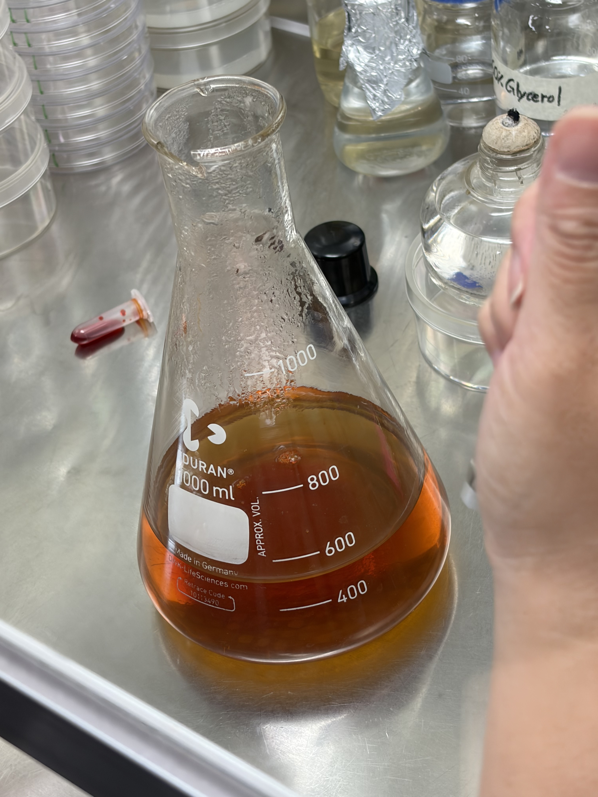
   * **Plate Pouring & Storage:** Poured the antibiotic-supplemented molten agar into sterile plastic Petri dishes under aseptic clean-bench conditions. Allowed plates to solidify, sealed them in clean plastic sleeves, and stored them in an **inverted (upside-down) orientation at 4°C** to prevent condensation from dripping onto the dehydrated agar surface.
     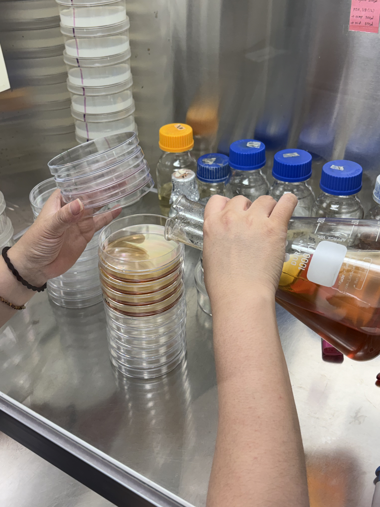

3. **Selective Media Preparation: Solid and Liquid King's B (KB) Formulations (2026-09-07)**
   * **Basal Component Solubilization (1.0 L Batch):** Weighed and dissolved $10.0\,\text{g}$ Proteose Peptone and $1.5\,\text{g }\text{K}_2\text{HPO}_4$(Dipotassium Hydrogenphosphate) in $\text{ddH}_2\text{O}$.
   * **Solid vs. Liquid Partitioning:** 
     * *Solid KB Media:* Supplemented with $15.0\,\text{g}$ bacteriological agar ($1.5\%\text{ w/v}$).
     * *Liquid KB Broth:* Prepared without agar matrix.
   * **Autoclave Sterilization:** Autoclaved both formulations at $121^\circ\text{C}$ for 20 minutes and tempered them to $50\text{--}55^\circ\text{C}$.
   * **Post-Autoclave Supplementation:** Aseptically introduced thermolabile and filter-sterilized additives to each 1.0 L preparation:
     * $25.0\,\text{mL}$ of 20% (v/v) sterile Glycerol (final concentration: $0.5\%\text{ v/v}$).
     * $3.2\,\text{mL}$ of $1.0\,\text{M }\text{MgSO}_4$ (final concentration: $3.2\,\text{mM}$).
     * $1.0\,\text{mL}$ of Rifampicin stock ($34.0\,\text{mg/mL}$ in 100% MeOH; final working concentration: **$34.0\,\mu\text{g/mL}$**).
   * **Solid Plate Fabrication:** Poured solid KB+Rif plates under laminar flow, allowed complete gelation, and stored inverted at 4°C within sealed plastic sleeves. Stored liquid KB+Rif broth at 4°C protected from light.

4. **Bacterial Strain Retrieval and Unplanned Strain Substitution (2026-09-11)**
   * **Cryogenic Retrieval:** Retrieved a bacterial glycerol cryostock vial stored at $-80^\circ\text{C}$.
   * **Protocol Deviation (Pathogenic Strain Substitution):** 
     * *Intended Pathogen:* *Pseudomonas syringae* pv. *tomato* DC3000 (Rifampicin-resistant; brassica/tomato specialist).
     * *Actual Inoculum Used:* *Pseudomonas syringae* pv. *syringae* B728a (*Pss* B728a; Rifampicin-resistant; bean epiphyte/pathogen).
     * *Deviation Rationale & Impact:* Due to an inadvertent cryogenic stock retrieval error by a senior researcher, strain *Pss* B728a was retrieved instead of *Pst* DC3000. The trial was continued with *Pss* B728a to assess compatibility and baseline infectivity under the same selective antibiotic conditions ($34.0\,\mu\text{g/mL}$ Rifampicin at 28°C).

5. **Solid Plate Revitalization and Bacterial Propagation (2026-09-11)**
   * **Aseptic Streak Inoculation:** Using a sterile $1000\,\mu\text{L}$ micropipette tip, scraped an aliquot of frozen cell mass directly from the *Pss* B728a glycerol stock and executed an isolation streak across the surface of a pre-warmed solid KB agar plate containing $34.0\,\mu\text{g/mL}$ Rifampicin.
     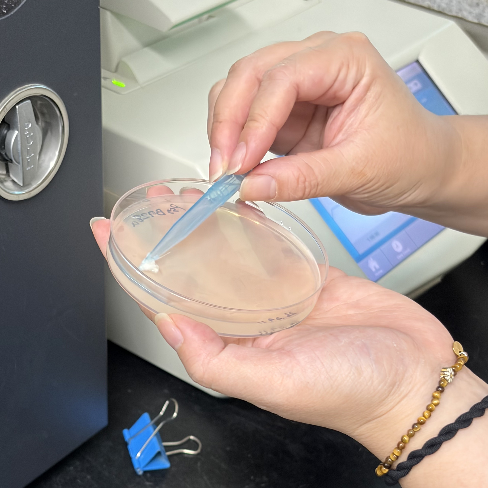
   * **Parafilm Barrier Sealing:** Wrapped the circumferential dish interface with Parafilm to prevent agar matrix dehydration and atmospheric contamination during extended incubation.
     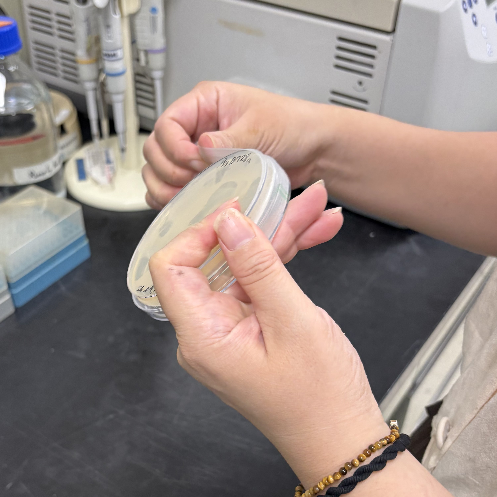
   * **Incubation Parameters:** Transferred the sealed KB plate into a constant-temperature microbiological incubator set at **28°C** for 48–72 hours to obtain discrete, well-isolated single colonies for secondary liquid subculture.

6. **Laminar Flow Hood Decontamination and Selective Broth Setup (2026-09-14)**
   * **Workspace Disinfection:** Sanitized internal surfaces of the laminar flow clean bench using 70% ethanol wipes, followed by a **5-minute UV irradiation cycle** to establish aseptic conditions prior to opening sterile consumables.
   * **Culture Vessel Allocation:** Prepared two sterile glass culture test tubes designated for liquid starter cultures (one active primary culture vessel and one reserve vessel).
   * **Selective Medium Reconstitution:** Aseptically compounded the liquid growth medium directly within each glass tube to reach a total working volume of **5.0 mL**:
     * $16.0\,\mu\text{L}$ of $10\,\text{mM }\text{MgSO}_4$
     * $125.0\,\mu\text{L}$ of 20% (v/v) Glycerol
     * $5.0\,\mu\text{L}$ of Rifampicin stock
     * Liquid King's B (KB) broth added to bring the final volume to exactly $5.0\,\text{mL}$ per tube.

7. **Single-Colony Inoculation and Shaking Subculture (2026-09-14)**
   * **Colony Harvesting:** Retrieved the solid KB+Rif agar plate containing revitalized *Pseudomonas syringae* pv. *syringae* B728a (incubated since 2026-09-11), confirming well-defined, discrete colonial morphology.
     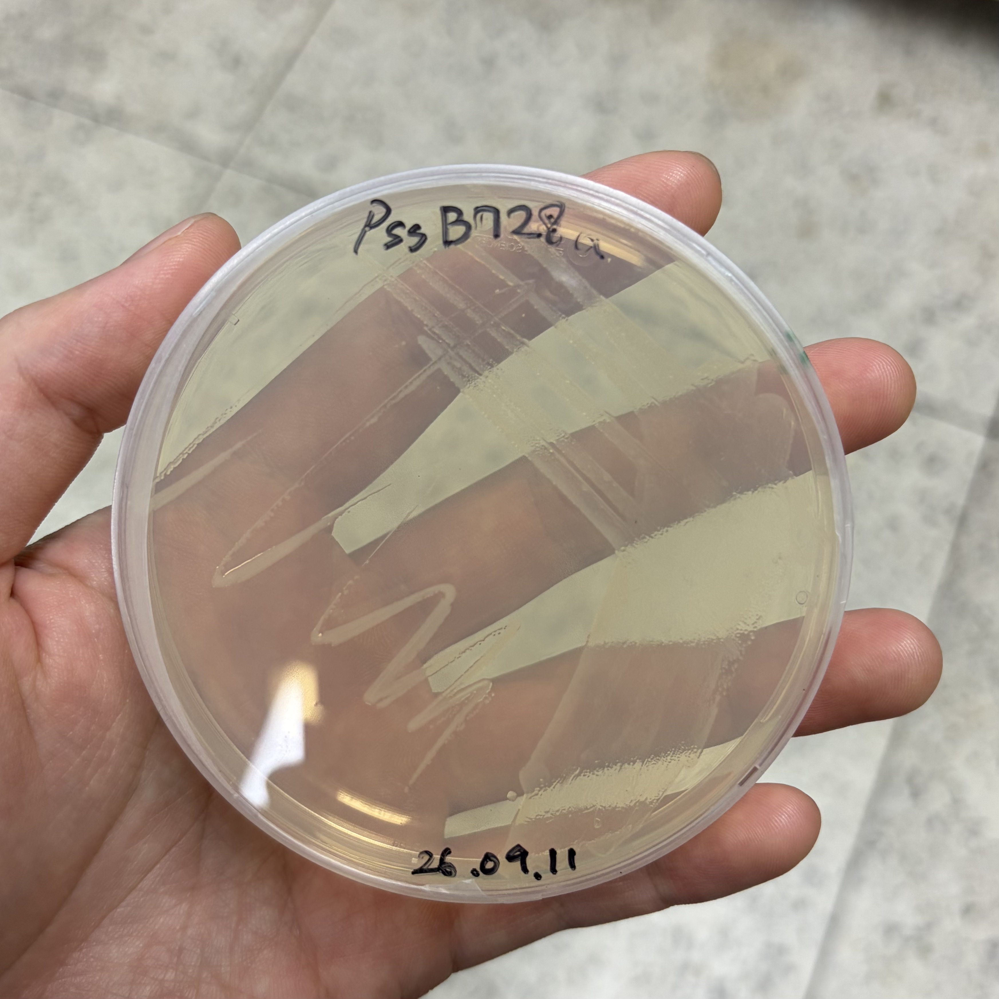
   * **Aseptic Inoculation:** Using a sterile $200\,\mu\text{L}$ micropipette tip, picked a single, discrete *Pss* B728a colony and immersed the tip directly into one of the prepared 5.0 mL glass tubes.
   * **Suspension Homogenization:** Vortexed the inoculated tube vigorously to break up bacterial aggregates and ensure uniform dispersion throughout the nutrient broth.
   * **Incubation Parameters & Hardware Verification:** Loaded both glass tubes into a floor-model orbital shaking incubator (Vision Scientific Co., Ltd., Model VS-8480S).
     * **Temperature Telemetry:** Incubator setpoint established at $\text{SV} = 28.0^\circ\text{C}$ with real-time monitored process value operating at $\text{PV} = 27.8^\circ\text{C}$.
     * **Protocol Deviation (Elevated Agitation Rate & Telemetry):** Set agitation dial to 230 RPM (deviating from the reference protocol baseline of 200 RPM) to enhance dissolved oxygen transfer; digital tachometer read stabilized at **227 RPM**.
     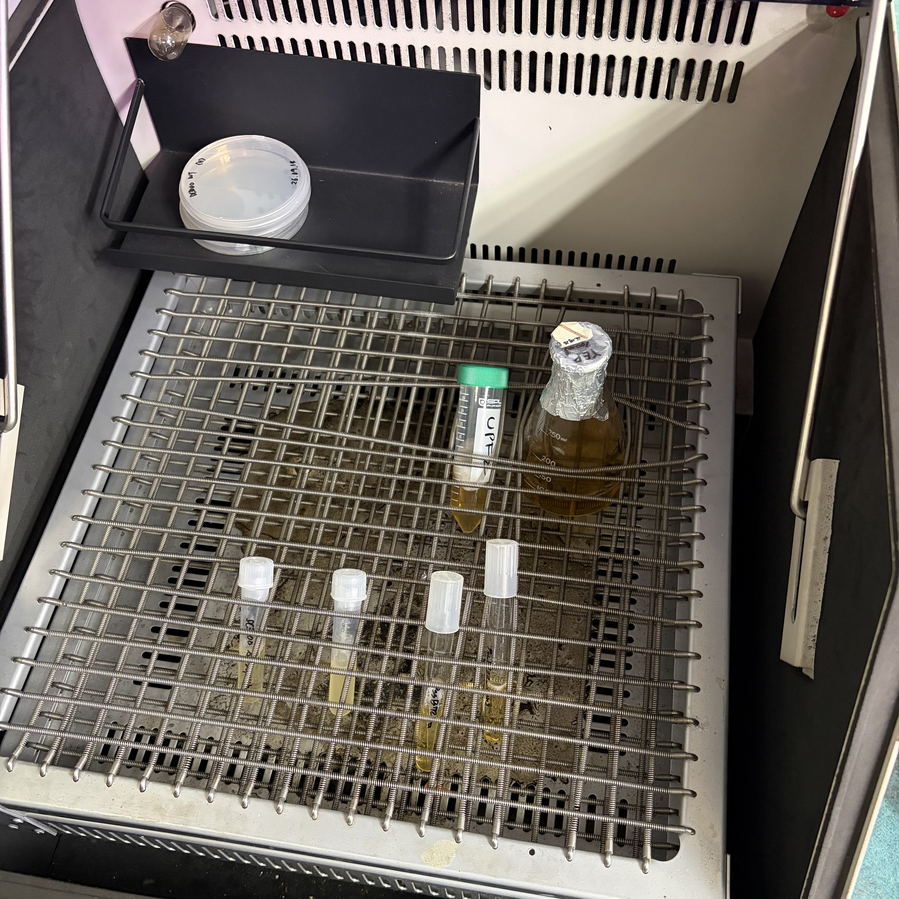
     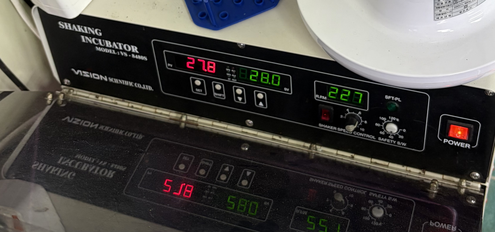

8. **Host Plant Leaf Indexing and Stomatal Pre-Conditioning (2026-09-14)**
   * **Watering Restriction:** Strictly withheld water prior to leaf indexing in accordance with stomatal stabilization requirements, preventing premature stomatal aperture changes or foliar turgor imbalances.
   * **Canonical Reference Criteria:** Standard operating procedures dictate the exclusion of the two embryonic cotyledons and the earliest juvenile true leaves (leaves 1 and 2), followed by permanent marking of the petioles of true leaves 3, 4, and 5.
   * **Protocol Deviation (Phenotypic Morphology-Based Leaf Selection):** 
     * Indexed the **three largest, fully expanded mature rosette leaves** per plant using an indelible laboratory marker on the petiole base, rather than strictly relying on numerical phyllotactic sequence.
     * **Technical Rationale & Quality Control:** This morphological criterion was applied to ensure uniform surface area, mechanical resilience, and optimal stomatal density for syringe infiltration across slight individual developmental variations. Embryonic cotyledons and juvenile 1st/2nd leaves were strictly excluded from selection.
    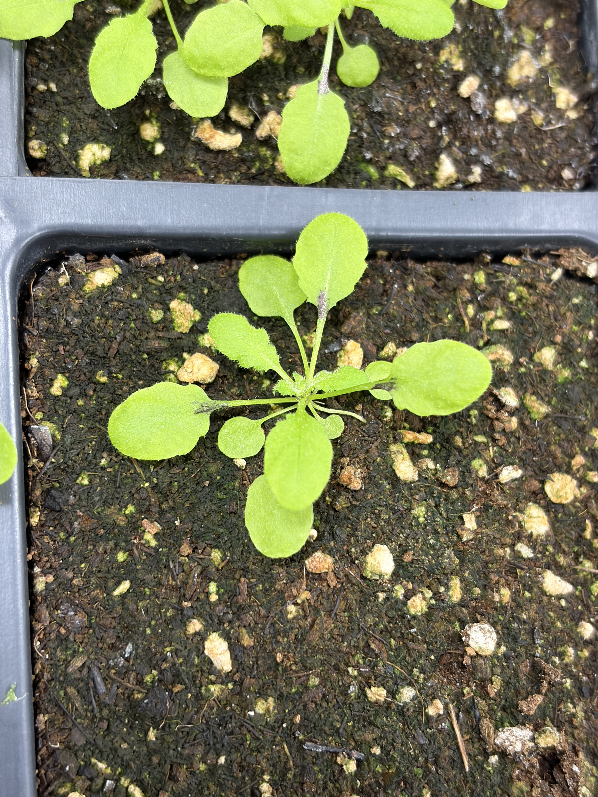
   * **Post-Marking Baseline Hydration:** Administered a minimal volume of water to the soil base to maintain baseline root viability without inducing leaf guttation or over-hydration ahead of bacterial infiltration.

9. **Mid-Exponential Phase Subculture and Reactivation (2026-09-15 / 09:00)**
   * **Culture Evaluation:** Inspected the primary starter culture test tube after 16 hours of overnight incubation to confirm robust saturation, deep yellow carotenoid turbidity, and active cell growth.
   * **Subculture Inoculation:** Transferred the tubes to the laminar flow hood and aseptically pipetted **1.0 mL** of the primary *Pss* B728a culture into the second prepared glass test tube containing fresh selective liquid KB medium.
     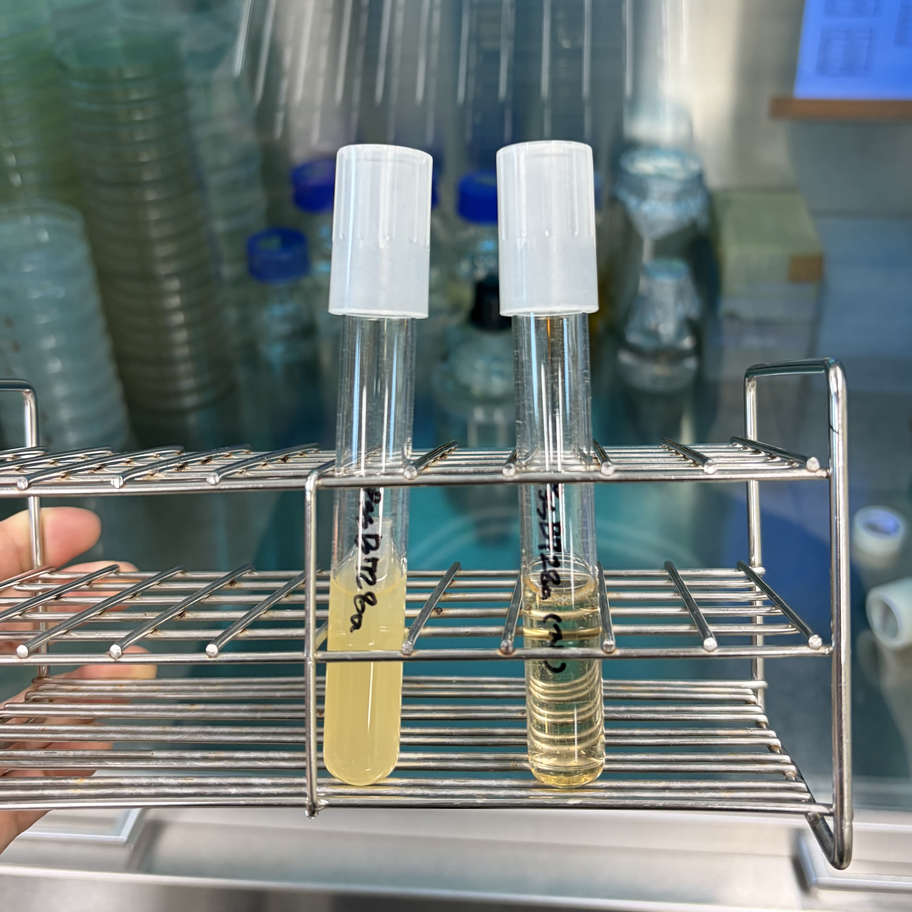
   * **Suspension Homogenization:** Vortexed the tube thoroughly to ensure uniform cell dispersion.
   * **Reactivation Parameters:** Incubated the subculture in the shaking incubator at **28°C and 230 RPM for 3 hours** to transition the bacterial population into the active, mid-exponential growth phase.

10. **Bacterial Cell Harvesting and Sequential Pellet Consolidation (2026-09-15 / 12:00)**
    * **Buffer and Consumables Allocation:** 
      * Retrieved the reactivated glass culture tube following the 3-hour subculture period.
      * Prepared 150 mL of sterile $10\text{ mM MgSO}_4$ buffer in an autoclaved glass media bottle.
      * Labeled four sterile 1.5 mL microcentrifuge tubes (Tubes 1–4).
    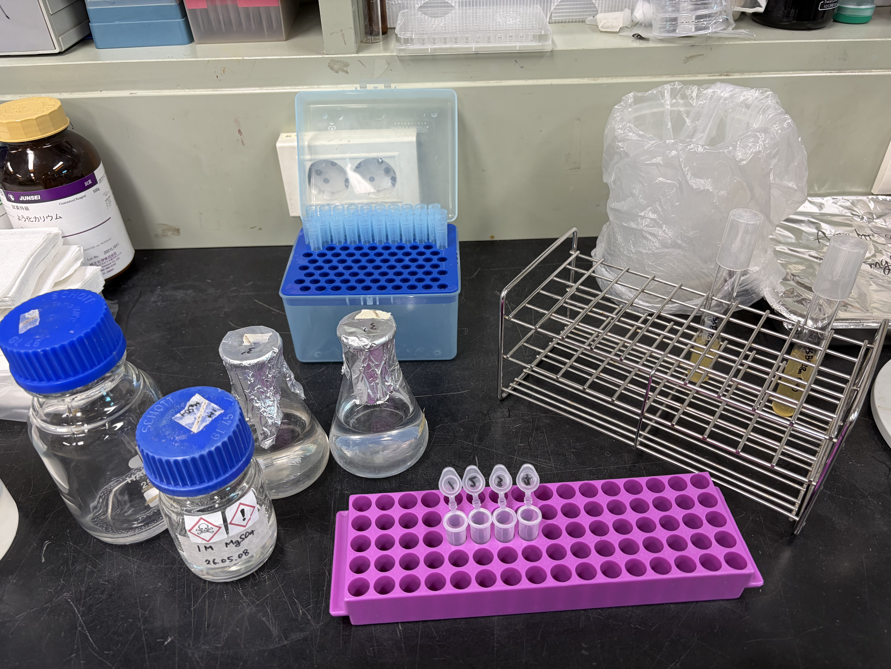
    * **Centrifugal Cell Pelleting:** Aliquoted 1.0 mL of reactivated bacterial broth into each of the four tubes (4.0 mL total harvested volume) and centrifuged at **13,000 RPM at room temperature (RT) for 5 minutes**.
      * **Protocol Deviation (Centrifugal Speed Optimization):** Spun at 13,000 RPM (increased from 12,000 RPM in the reference protocol) to ensure complete sedimentation and stable pellet compaction.
    * **Supernatant Clearance:** Decanted and aspirated the spent culture supernatant from all four tubes using a micropipette without disturbing the bacterial pellets.
    * **Sequential Pellet Consolidation Protocol:**
      * Dispensed 1.0 mL of sterile $10\text{ mM MgSO}_4$ buffer into Tube 1 and resuspended the pellet completely by gentle pipetting.
      * Transferred the entire 1.0 mL cell suspension from Tube 1 directly into Tube 2 to resuspend the second pellet.
      * Repeated this process sequentially through Tube 3 and Tube 4 to pool the bacterial biomass from all four tubes into a single 1.0 mL concentrated cell suspension.
      * Vortexed the consolidated suspension thoroughly to eliminate cell clumps and ensure complete homogeneity.
    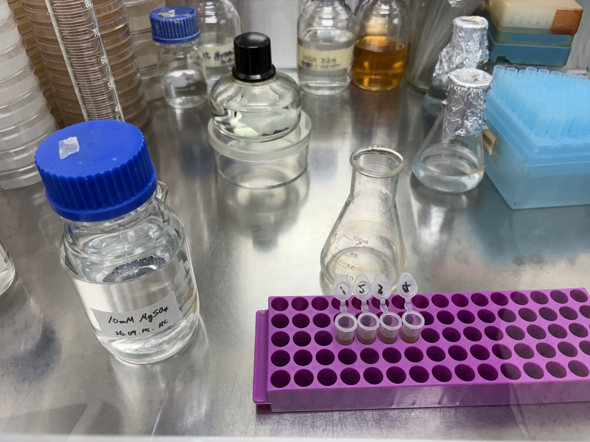

11. **Spectrophotometric Quantification and Inoculum Working Solution Formulation (2026-09-15 / 12:00)**
    * **Analytical 1:10 Dilution Setup:** 
      * Labeled the consolidated cell stock tube as **`4 St`** and a fresh dilution tube as **`1/10 st`**.
      * Aliquoted $900\,\mu\text{L}$ of sterile $10\text{ mM MgSO}_4$ and $100\,\mu\text{L}$ of the concentrated cell suspension into tube `1/10 st`, followed by thorough vortexing.
      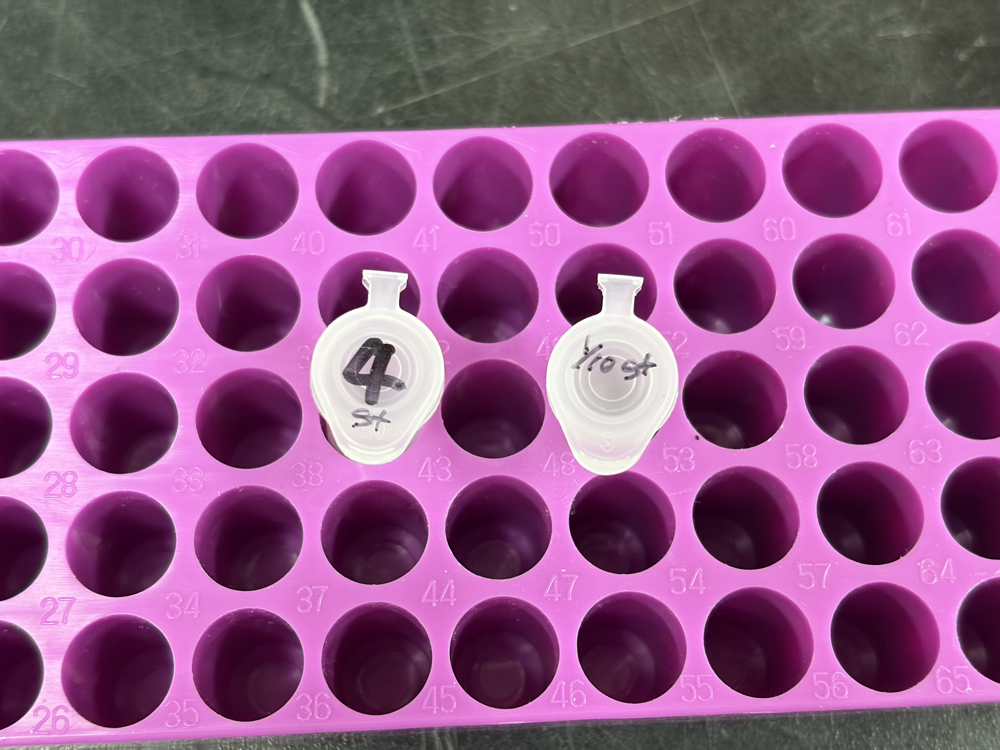
    * **Optical Density Quantification ($\text{OD}_{600}$):** 
      * Configured the NanoDrop spectrophotometer to Cell Culture mode and enabled the 10 mm pathlength cuvette module.
      * Loaded $1.0\text{ mL}$ of sterile $10\text{ mM MgSO}_4$ into a standard cuvette to baseline (blank) the instrument.
      * Transferred the 1.0 mL 1:10 diluted bacterial suspension into an analytical cuvette and recorded absorbance at 600 nm.
      * **Measured Absorbance & Console Verification:** At 12:36, confirmed an optical density of **$\text{OD}_{600} = 0.614$** on the instrument console for the 1:10 dilution (corresponding to an undiluted equivalent $\text{OD}_{600} \approx 6.14$).
        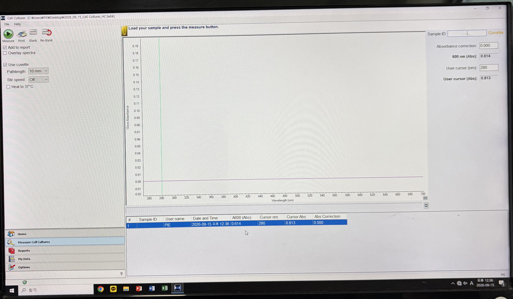
      * Post-measurement, recovered the sample volume from the cuvette back into its 1.5 mL microcentrifuge tube.
    * **Inoculum Normalization Calculation:** 
      * Target parameters: Final optical density $\text{OD}_{600} = 0.0001$ in a final volume of $50.0\text{ mL}$ ($50,000\,\mu\text{L}$) sterile $10\text{ mM MgSO}_4$.
      * Derived required volume ($V_1$) of the measured 1:10 diluted bacterial suspension:
        $$V_1 = \left(\frac{\text{OD}_{600,\text{ target}}}{\text{OD}_{600,\text{ measured}}}\right) \times V_{\text{total}} = \left(\frac{0.0001}{0.614}\right) \times 50,000\,\mu\text{L} \approx 8.14\,\mu\text{L}$$
    * **Working Solution Assembly:** 
      * Measured $50.0\text{ mL}$ of sterile $10\text{ mM MgSO}_4$ into a sterile 50 mL Falcon tube.
      * Aspirated and discarded $8.14\,\mu\text{L}$ of buffer to maintain volumetric accuracy.
      * Aliquoted $8.14\,\mu\text{L}$ of the 1:10 diluted bacterial suspension directly into the Falcon tube.
      * Inverted and vortexed the Falcon tube thoroughly to generate the normalized working inoculum ($\text{OD}_{600} = 0.0001$, $\sim 5 \times 10^4\text{--}1 \times 10^5\text{ CFU/mL}$) ready for foliar infiltration.

12. **Apoplastic Infiltration and Non-Wounding Stomatal Delivery (2026-09-15)**
    * **Syringe Loading:** Charged a sterile, needleless 1.0 mL (1 cc) slip-tip syringe with 1.0 mL of the normalized *Pss* B728a inoculum ($\text{OD}_{600} = 0.0001$) prepared in the 50 mL Falcon tube.
    * **Abaxial Pressure Sealing:** 
      * Positioned each plant to access the three pre-marked mature rosette leaves.
      * Firmly yet gently counter-supported the adaxial (adaxial/upper) leaf lamina with a clean, gloved index finger.
      * Pressed the tip of the needleless syringe flush against the abaxial (abaxial/lower) epidermis over areas with high stomatal density, applying minimal tactile force to establish a liquid-tight seal without compressing the mesophyll or bruising the leaf tissue.
    * **Apoplastic Infiltration Execution:** Carefully depressed the syringe plunger with steady, gentle hydrostatic pressure to drive the bacterial suspension through open stomata directly into the apoplast.
    * **Technical Control & Wounding Prevention:** Monitored the spread of the fluid wavefront to ensure complete, uniform water-soaking across the entire leaf lamina while strictly avoiding any mechanical tearing, epidermal crushing, or vascular puncture that could trigger non-specific wound-induced defense signaling.
    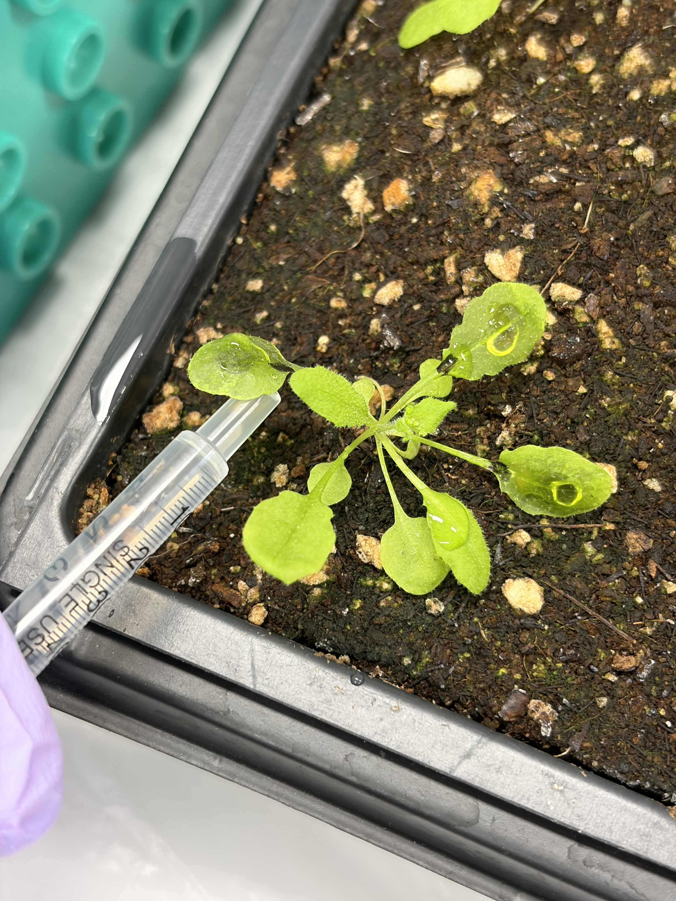

13. **Post-Infiltration Desiccation, Hydration, and High-Humidity Incubation (2026-09-15)**
    * **Ambient Leaf Lamina Desiccation:** Transferred infiltrated *Arabidopsis* plants to an ambient room-temperature (RT) workspace to allow water-soaked apoplastic fluid and surface moisture to evaporate.
      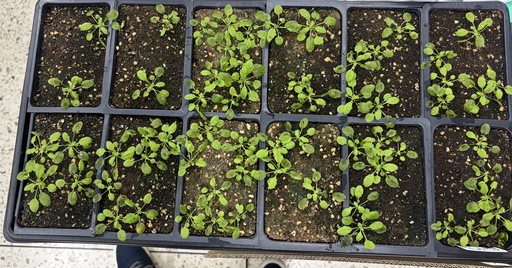
    * **Protocol Deviation (Extended Desiccation Window):**
      * *Reference Expectation:* Foliar surface desiccation and apoplastic fluid absorption typically resolve in approximately 3 hours.
      * *Observed Execution:* Complete clearance of macroscopic surface water-soaking required **5 hours** under ambient ambient laboratory conditions. Plants were maintained at RT for the full 5-hour window until leaf cuticles were entirely dry to the touch prior to enclosure.
    * **Substrate Hydration:** Following complete leaf drying, applied thorough soil-drench irrigation (bottom watering) to full saturation to support plant vascular turgor during pathogen incubation.
    * **Saturated Microenvironment Fabrication (~100% RH):**
      * Placed non-perforated transparent plastic humidity covers over each pot assembly.
      * Clamped the base perimeter firmly using high-tension iron binder clips along the perimeter flanges to establish a hermetically sealed chamber, ensuring saturating relative humidity (**~100% RH**) to stimulate stomatal opening and promote bacterial intercellular proliferation.
      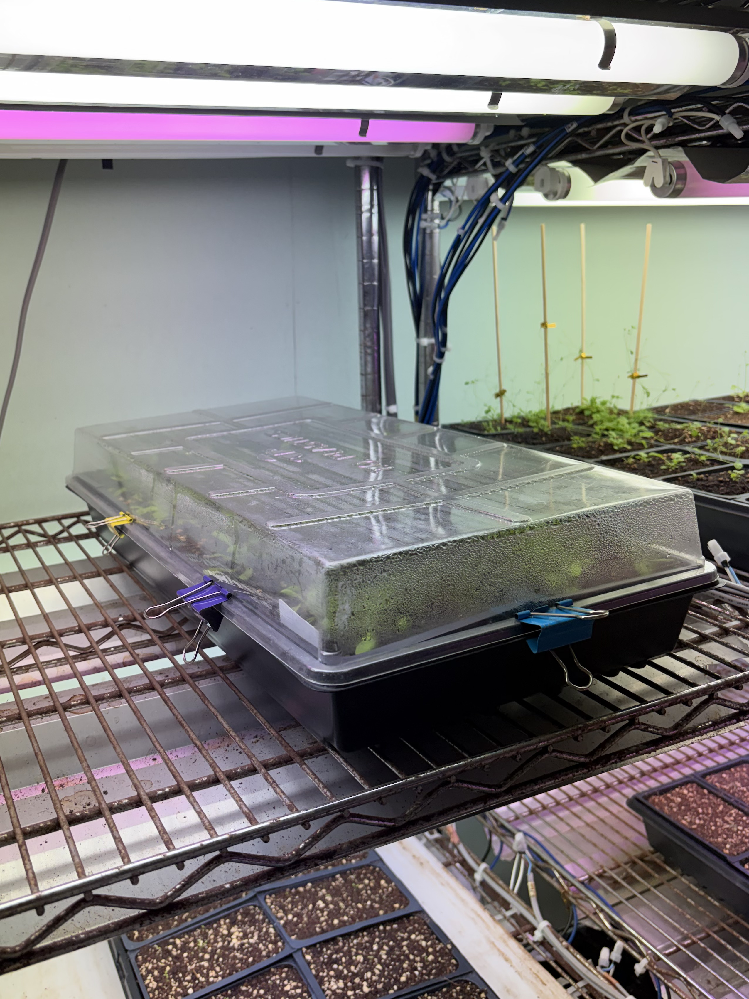
    * **Incubation Parameters:** Transferred the sealed plant assemblies into the growth chamber maintained at **25°C under a 12-hour photoperiod (12 h light / 12 h dark)** for **3 days (72 hours post-inoculation / 3 dpi)** to monitor chlorosis and necrotic lesion symptom development.

14. **Aseptic Consumables Preparation and Reagent UV Decontamination (Day 3 / 2026-09-18)**
    * **Buffer Preparation:** Prepared and autoclaved 100 mL of sterile $10\text{ mM MgSO}_4$ in a laboratory glass media bottle.
    * **UV Irradiation:** Positioned a pristine reagent reservoir, a sterile 96-well dilution microplate, and automated multichannel pipette tips inside a clean bench under direct **UV irradiation for $\ge 30$ minutes**.
    * **Vessel Loading:** Aliquoted $200\,\mu\text{L}$ of sterile $10\text{ mM MgSO}_4$ into each of eight pre-labeled 1.5 mL microcentrifuge tubes (Samples 1–8).
    * **Sterilization Bath Setup:** Aliquoted 100% laboratory ethanol into a sterile 50 mL Falcon tube for continuous instrument decontamination.

15. **Phenotypic Exclusion Screening, Median Cohort Selection, and Leaf Disc Excision**
    * **Pathology-Specific Leaf Screening:** Excised inoculated leaves using ethanol-flamed stainless steel forceps, systematically excluding leaves exhibiting mechanical tears, wrinkling, or syringe-induced epidermal abrasion. Only leaves displaying authentic pathogenesis resulting from bacterial infiltration were retained.
      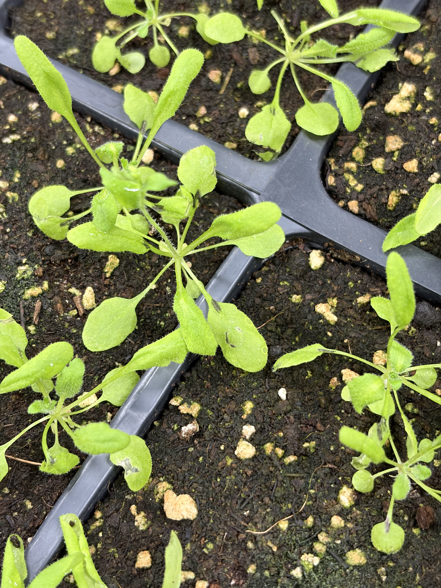
    * **Black Background Contrast Array:** Arranged excised leaves across a non-reflective black contrast surface to maximize optical discrimination of chlorotic and water-soaked lesions. Positioned torn, bruised, or atypical outliers in a discarded staging area in the upper-left quadrant.
      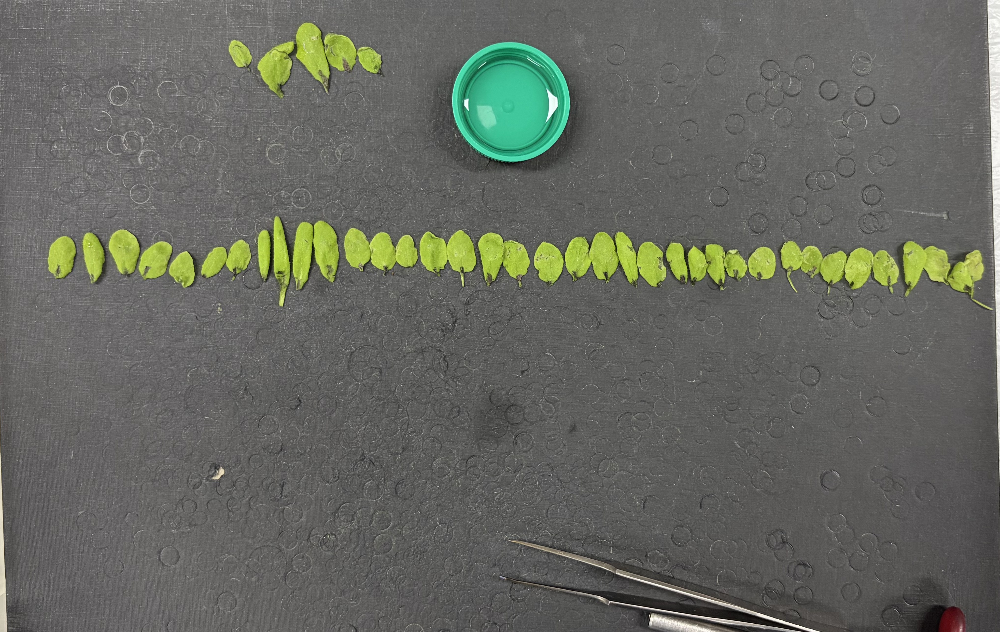
    * **Median Cohort Selection:** Ranked all qualifying leaves along a linear visual symptom severity gradient (spanning mild chlorosis on the left to advanced necrosis on the right). Segregated the **median eight leaves (Samples 1–8)** into an isolated middle row, eliminating extreme phenotypic outliers from both tails of the distribution.
      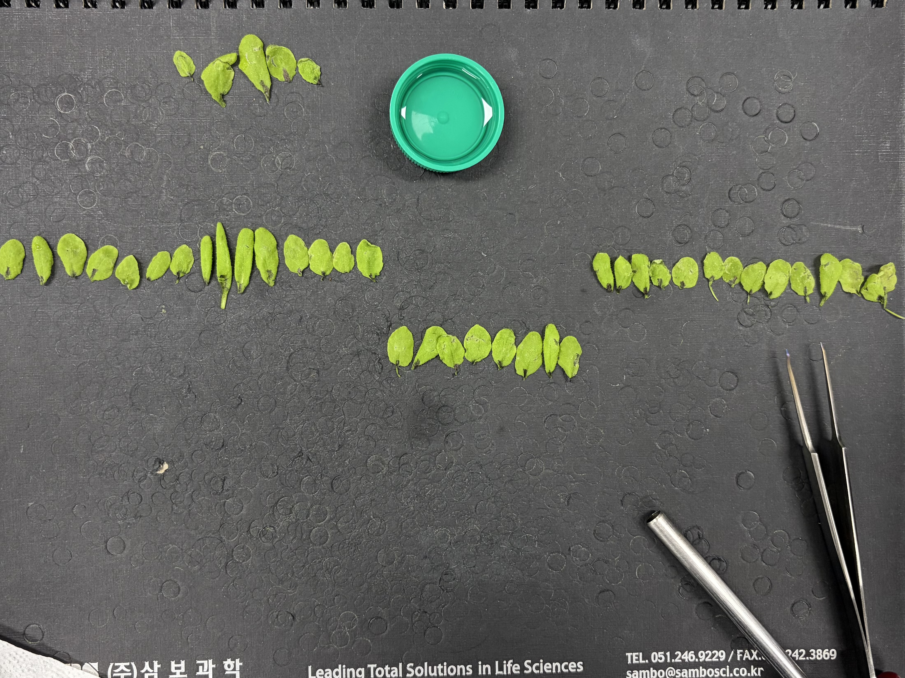
    * **Standardized Disc Punching:** Sanitized a cylindrical biopsy punch with 100% ethanol and excised uniform circular leaf discs ($0.49\text{ cm}^2$) from the central lamina of each selected median leaf, preserving margin integrity and avoiding petiole vascular bundles.
      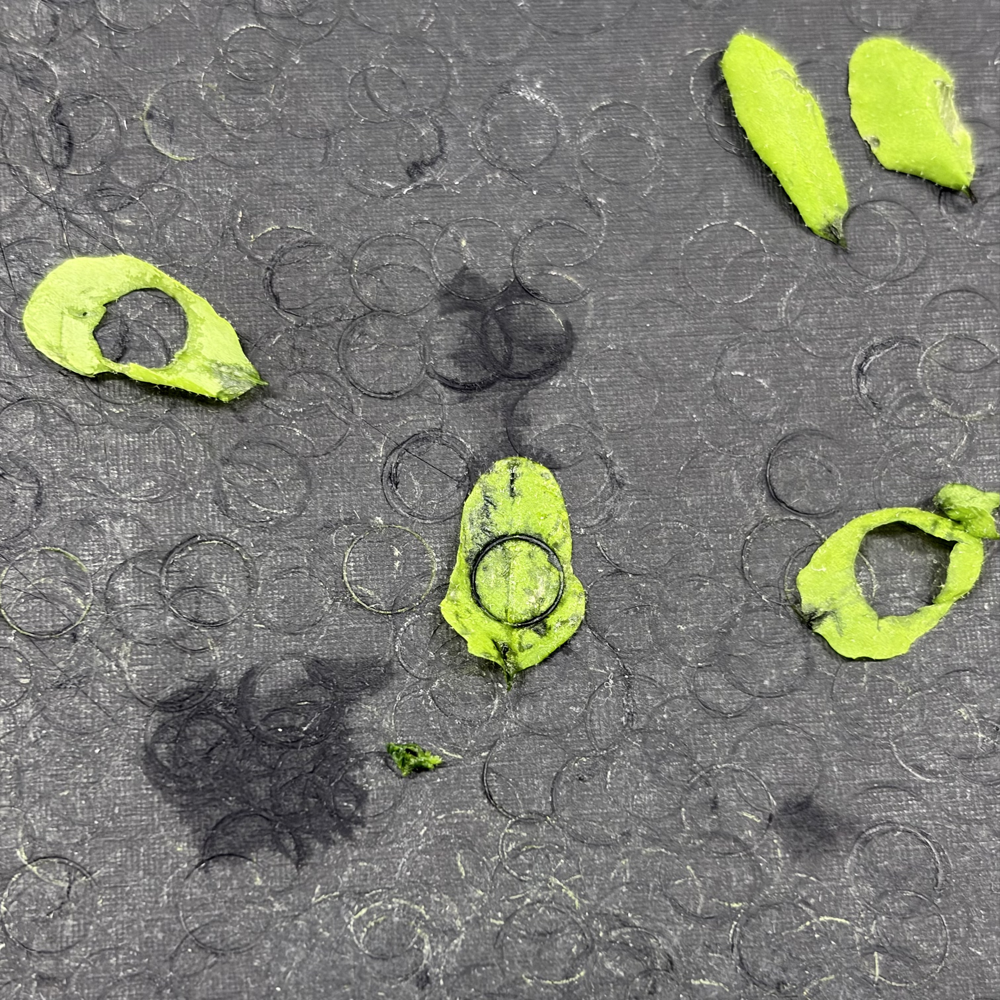

16. **Surface Sterilization and Mechanical Tissue Homogenization**
    * **Disinfectant Immersion & Protocol Deviation (Reduced Submersion Duration):**
      * Submerged each punched leaf disc directly into 100% ethanol for exactly **2 seconds**.
      * **Protocol Deviation (Exposure Time Reduction):** Shortened ethanol exposure to 2 seconds (deviating from the 5-second baseline in the reference protocol) to prevent deep solvent infiltration into damaged apoplastic intercellular spaces while thoroughly neutralizing epiphytic contaminants.
    * **Solvent Desorption:** Immediately blotted discs dry on sterile laboratory napkins to remove all residual ethanol and transferred each disc directly into its designated 1.5 mL tube containing $200\,\mu\text{L}$ of $10\text{ mM MgSO}_4$.
    * **Mechanical Homogenization:** Fitted an autoclaved micro-pestle onto a motorized handheld drill, decontaminated the assembly with ethanol between samples, and thoroughly pulverized all eight leaf discs into fine cellular lysates, applying short rotational bursts to prevent friction-induced thermal degradation.

17. **Microtiter 10-Fold Serial Dilution Execution**
    * **Reagent Reservoir Charging:** Transferred the sterile $10\text{ mM MgSO}_4$ buffer into the UV-decontaminated reagent reservoir.
    * **Diluent Aliquoting & Multichannel Pipetting:** Using an 8-channel automated pipette (Brand Transferpette® -8, 20–200 µL), dispensed exactly $180\,\mu\text{L}$ of $10\text{ mM MgSO}_4$ across Columns 1 through 4 of the 96-well microplate (Rows A–H corresponding to Samples 1–8).
      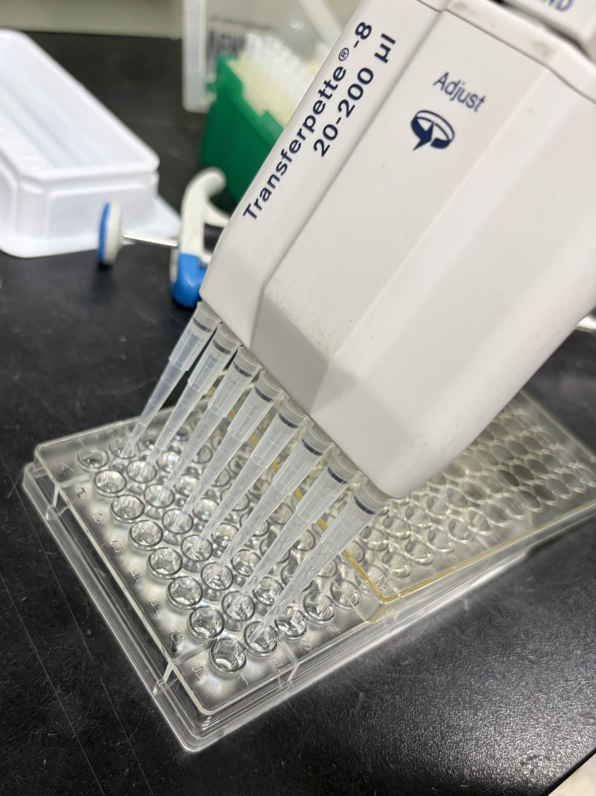
    * **Primary Dilution ($10^{-1}$ / Column 1):** Aliquoted $20\,\mu\text{L}$ of undiluted leaf lysate from each microcentrifuge tube into its corresponding well in Column 1 and mixed thoroughly by pipetting up and down 10 times.
    * **Serial Dilution Cascading ($10^{-2}$ to $10^{-4}$ / Columns 2–4):**
      * Using the 8-channel multichannel pipette, aspirated $20\,\mu\text{L}$ from Column 1 ($10^{-1}$) and dispensed it into Column 2 ($10^{-2}$ dilution; 100-fold), followed by 10 repeated mixing cycles.
      * Transferred $20\,\mu\text{L}$ from Column 2 into Column 3 ($10^{-3}$ dilution; 1,000-fold) with repeated mixing.
      * Transferred $20\,\mu\text{L}$ from Column 3 into Column 4 ($10^{-4}$ dilution; 10,000-fold) with repeated mixing to establish a calibrated 4-tier dilution series across all 8 biological replicates.

18. **Radial Sextant Plating and Non-Destructive Agar Inoculation**
    * **Plate Sectoring & Spatial Demarcation:** 
      * Retrieved four pre-poured solid LB agar plates supplemented with $34.0\,\mu\text{g/mL}$ Rifampicin.
      * Subdivided the bottom of each circular plate into six equal radial sectors ($60^\circ$ wedges) using an indelible laboratory marker.
      * Labeled sectors to evaluate two biological replicates across three dilution levels per plate (e.g., representative Plate 3 labeled **WT5** with dilution tiers 2, 3, 4 and **WT6** with dilution tiers 2, 3, 4).
      * **Boundary Delineation Strategy:** Positioned the sectors such that the boundary interface between the two distinct samples juxtaposed the highest dilution tier ($10^{-4}$) against the lowest dilution tier ($10^{-2}$), establishing stark colony density differences to immediately identify any inadvertent boundary crossing.
      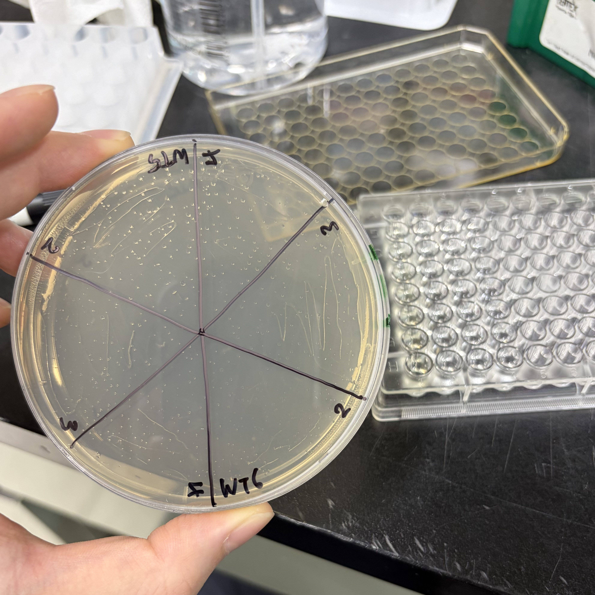
    * **Spot Plating & Agar Integrity Control:**
      * Aliquoted $20\,\mu\text{L}$ from each designated well in Columns 2, 3, and 4 onto its matching agar sector.
      * Spread the droplet evenly within the sector boundary using a gentle zig-zag surface-gliding motion with the pipette tip.
      * **Technical Quality Control (Matrix Preservation):** Maintained minimal contact angle and zero downward vertical force to prevent scratching, puncture, or gouging of the agar matrix. Any physical crevice traps bacterial cells, causing localized hyper-dense vertical micro-colonies that prevent accurate individual CFU counting.

19. **Schedule-Constrained Kinetic Deceleration and Ambient Incubation (2026-09-18 to 2026-09-20)**
    * **Logistical Constraint:** Plating was executed on Friday (2026-09-18). Due to weekend facility scheduling, colony enumeration could not be conducted at the standard 24–36 hour interval, requiring an extended incubation period of approximately 52–54 hours until Sunday evening (2026-09-20 at 22:00).
    * **Protocol Deviation (Temperature-Mediated Growth Deceleration):** 
      * *Standard Incubation Reference:* 28°C constant temperature incubator for 24–48 hours.
      * *Action & Rationale:* Placed the sealed, inverted LB+Rif plates in a dark, temperature-controlled ambient workspace maintained at **room temperature (RT; ~21–23°C)** rather than the standard 28°C incubator.
      * *Kinetic Impact:* Operating below the optimal thermal growth curve of *Pseudomonas syringae* pv. *syringae* B728a deliberately decelerated bacterial metabolic turnover and binary fission rates, preventing confluent lawn formation and preserving discrete, countable colonies across the extended 54-hour window ahead of the 2026-09-20 22:00 enumeration checkpoint.

20. **Colony Enumeration, Pathogen Load Quantification, and Titer Standardization (2026-09-20 / 22:00)**
    * **Enumeration Inspection:** Retrieved the four radial sextant LB+Rif plates following the 52-hour room-temperature kinetic deceleration window. Evaluated all sectors under oblique transmitted light to record colony-forming units (CFUs) across the serial dilution series ($10^{-2}$, $10^{-3}$, and $10^{-4}$).
    * **Tier Selection Standards:** Colony counts were selected from the optimal dynamic resolution tier (canonical statistical counting window: 30–300 CFUs/spot). For samples falling below 30 CFUs at all dilutions (WT1, WT2, WT3, WT8), the lowest dilution ($10^{-2}$) was designated as the definitive analytical count. For samples with confluent or overcrowded growth at $10^{-2}$ (>300 CFUs; WT6, WT7), counts from the $10^{-3}$ dilution were utilized for titer conversion.
    * **Titer Calculation Formula:** Pathogen density per unit leaf area ($\text{CFU}/\text{cm}^2$) was determined according to:
      $$\text{Bacterial Density } (\text{CFU}/\text{cm}^2) = \frac{N \times 10^D \times \left(\frac{V_{\text{total}}}{V_{\text{plated}}}\right)}{A_{\text{disc}}}$$
      $$\text{where } N = \text{Colonies Counted}, \; D = \text{Dilution Tier Index (2, 3, or 4)}, \; V_{\text{total}} = 200\,\mu\text{L}, \; V_{\text{plated}} = 20\,\mu\text{L}, \; A_{\text{disc}} = 0.49\,\text{cm}^2$$
      $$\text{Simplified Working Multiplier: } \text{CFU}/\text{cm}^2 = \frac{N \times 10^D \times 10}{0.49} \approx N \times 10^D \times 20.408$$

#### Raw Colony Enumeration Data Matrix

| Sample ID | Dilution $10^{-2}$ (Col 2) | Dilution $10^{-3}$ (Col 3) | Dilution $10^{-4}$ (Col 4) | Analytical Tier Selected |
| :--- | :--- | :--- | :--- | :--- |
| **WT1** | 20 | 0 | 0 | $10^{-2}$ ($N = 20$) |
| **WT2** | 11 | 0 | 0 | $10^{-2}$ ($N = 11$) |
| **WT3** | 15 | 2 | 0 | $10^{-2}$ ($N = 15$) |
| **WT4** | 130 | 23 | 0 | $10^{-2}$ ($N = 130$) |
| **WT5** | 191 | 31 | 1 | $10^{-2}$ ($N = 191$) |
| **WT6** | 571 *(overcrowded)* | 86 | 5 | $10^{-3}$ ($N = 86$) |
| **WT7** | 323 *(overcrowded)* | 40 | 5 | $10^{-3}$ ($N = 40$) |
| **WT8** | 23 | 3 | 0 | $10^{-2}$ ($N = 23$) |

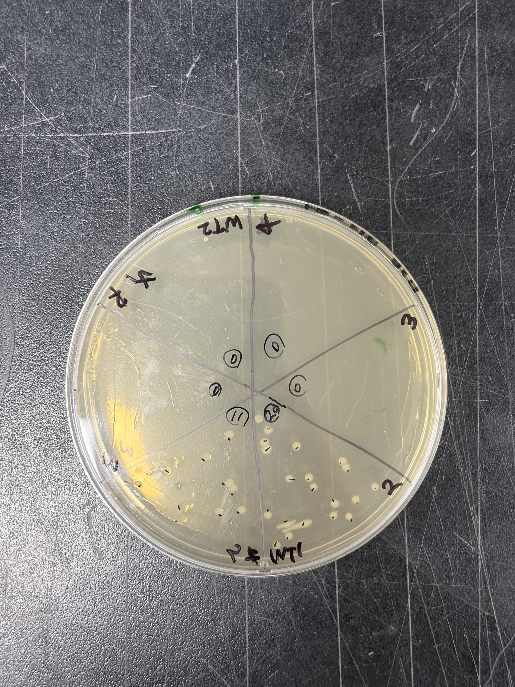
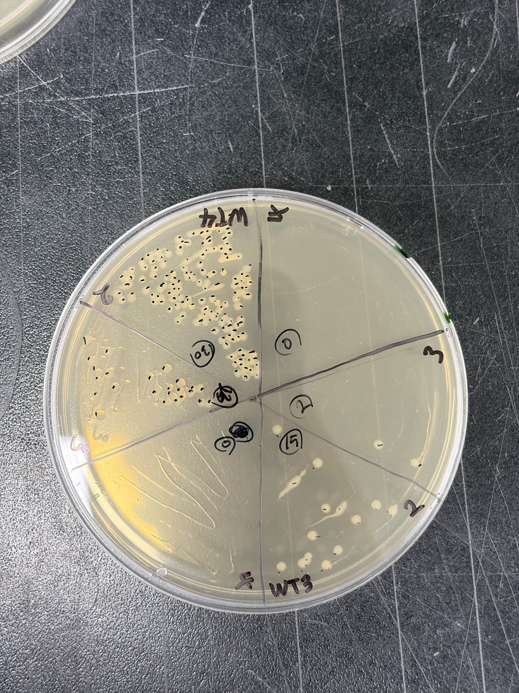
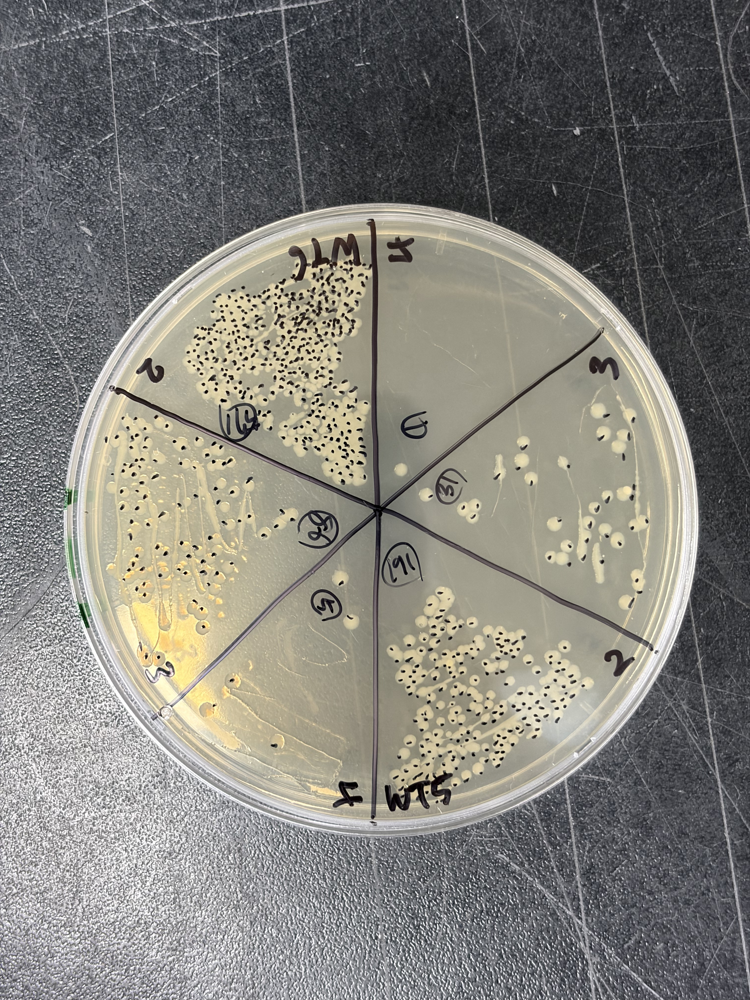
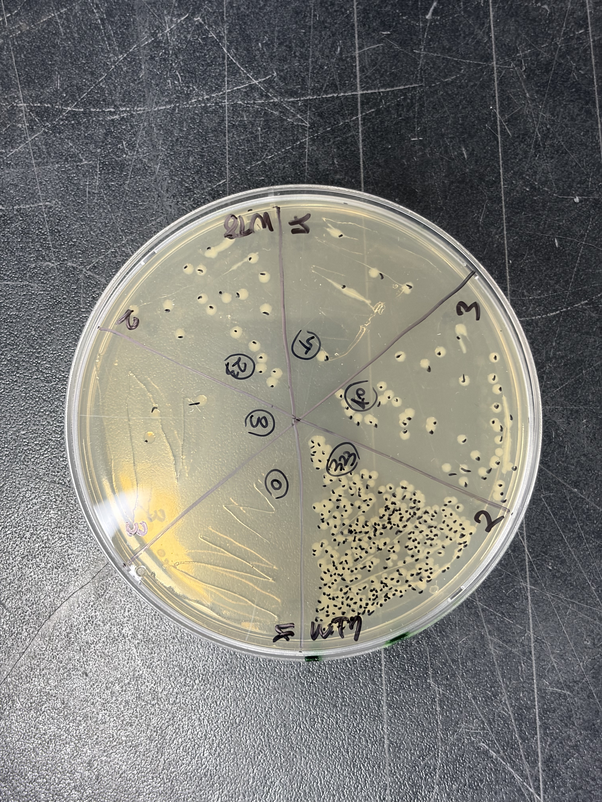

---

#### Quantitative Pathogen Colonization and Normalized Titer Summary

| Sample ID | Selected Count ($N$) | Dilution Factor ($10^D$) | Total Pathogen Load ($\text{CFU/disc}$) | Bacterial Density ($\text{CFU}/\text{cm}^2$) | $\log_{10}(\text{CFU}/\text{cm}^2)$ | Biological Phenotype / Technical Remarks |
| :--- | :--- | :--- | :--- | :--- | :--- | :--- |
| **WT1** | 20 | $10^2$ | $2.00 \times 10^4$ | $4.08 \times 10^4$ | **4.61** | Low colonization; count $<30$ |
| **WT2** | 11 | $10^2$ | $1.10 \times 10^4$ | $2.24 \times 10^4$ | **4.35** | Minimum recorded colonization |
| **WT3** | 15 | $10^2$ | $1.50 \times 10^4$ | $3.06 \times 10^4$ | **4.49** | Low colonization; consistent with WT1/WT2 |
| **WT4** | 130 | $10^2$ | $1.30 \times 10^5$ | $2.65 \times 10^5$ | **5.42** | Moderate colonization; optimal counting window |
| **WT5** | 191 | $10^2$ | $1.91 \times 10^5$ | $3.90 \times 10^5$ | **5.59** | Robust colonization; optimal counting window |
| **WT6** | 86 | $10^3$ | $8.60 \times 10^5$ | $1.76 \times 10^6$ | **6.24** | Maximum recorded colonization; $10^{-2}$ confluent |
| **WT7** | 40 | $10^3$ | $4.00 \times 10^5$ | $8.16 \times 10^5$ | **5.91** | High colonization; $10^{-2}$ overcrowded ($N=323$) |
| **WT8** | 23 | $10^2$ | $2.30 \times 10^4$ | $4.69 \times 10^4$ | **4.67** | Low colonization; count $<30$ |

* **Technical Data Evaluation:**
  * **Dynamic Colonization Range:** Pathogen titers spanned across approximately two orders of magnitude, ranging from $2.24 \times 10^4\,\text{CFU}/\text{cm}^2$ (WT2; $\log_{10} = 4.35$) to $1.76 \times 10^6\,\text{CFU}/\text{cm}^2$ (WT6; $\log_{10} = 6.24$), yielding a cohort mean of $\sim 5.16 \pm 0.72 \log_{10}(\text{CFU}/\text{cm}^2)$.
  * **Bimodal Distribution Profile:** Replicates segregated into two discrete biological response clusters:
    * *Cluster A (Low Bacterial Persistence / High Basal Immunity):* WT1, WT2, WT3, and WT8 ($\log_{10}$ range: $4.35\text{--}4.67$).
    * *Cluster B (High Bacterial Proliferation / Symptomatic Infection):* WT4, WT5, WT6, and WT7 ($\log_{10}$ range: $5.42\text{--}6.24$).
  * **Inter-Dilution Scaling Consistency:** Across samples spanning multiple countable tiers, serial dilution linearity aligned closely with theoretical 10-fold dilution steps (e.g., WT6 demonstrated 571 CFUs at $10^{-2}$ and 86 CFUs at $10^{-3}$; WT4 showed 130 CFUs at $10^{-2}$ and 23 CFUs at $10^{-3}$), confirming uniform cell suspension and pipetting fidelity during microtiter serial transfers.